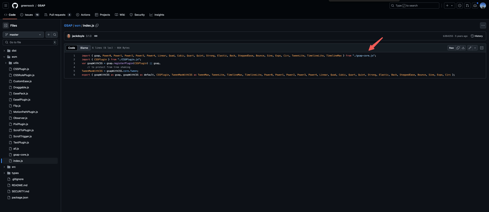
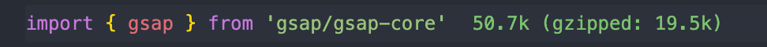

## 包的选择

https://gsap.com/docs/v3/Installation/?tab=npm&module=esm&method=private+registry&tier=free&club=true&require=false&trial=true&plugins=ScrollTrigger#faqs


## gsap 和 gsap/gsap-core

`gsap/gsap-core` 是一个更轻量级的包，只包含 `GSAP` 的核心功能，而直接 `gsap`，除了 `gsap-core`，还有 `CSSPlugin`，官网并未对`CSSPlugin` 有过多描述，但还是有必要的，所以建议直接使用 `gsap` 包






## gsap

esm，所以平时开发，用这种方式

```js
import { gsap } from 'gsap'

import { ScrollTrigger } from 'gsap/ScrollTrigger'

gsap.registerPlugin(ScrollTrigger)
```

umd

```js
import { gsap } from 'gsap'
import { ScrollTrigger } from 'gsap/dist/ScrollTrigger'

gsap.registerPlugin(ScrollTrigger, RoughEase)
```
