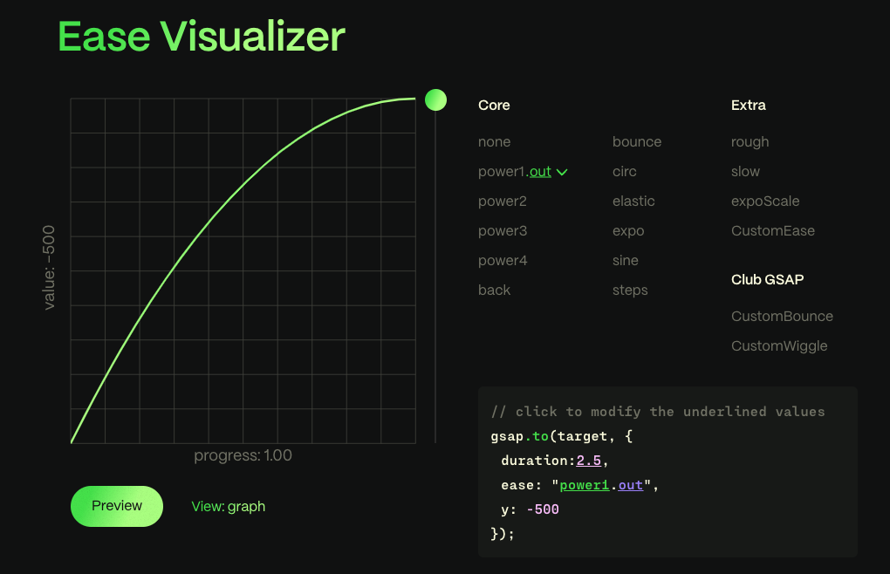
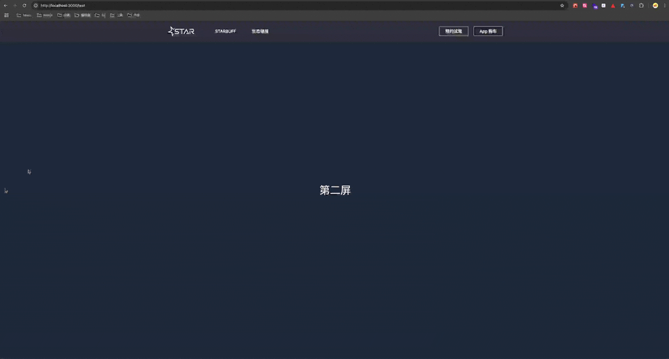
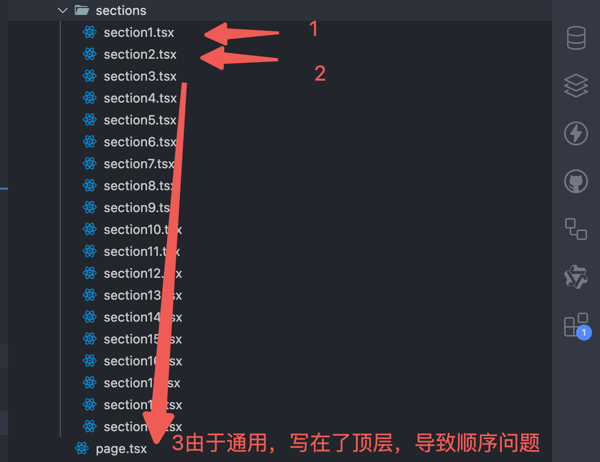
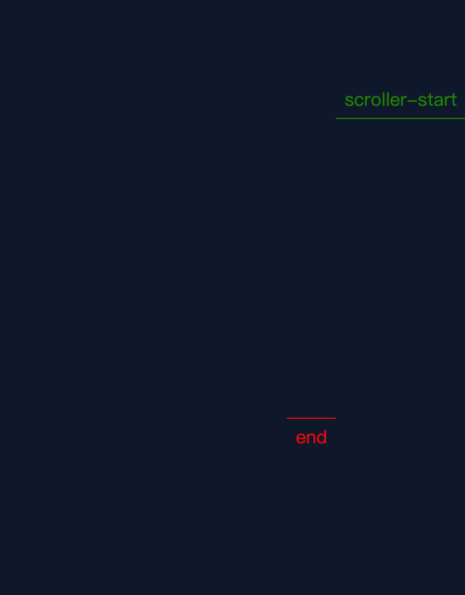
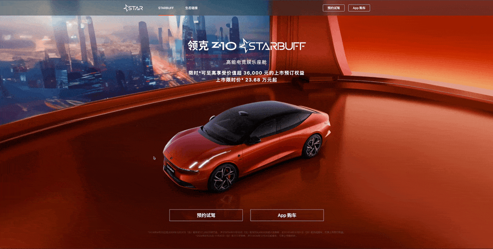
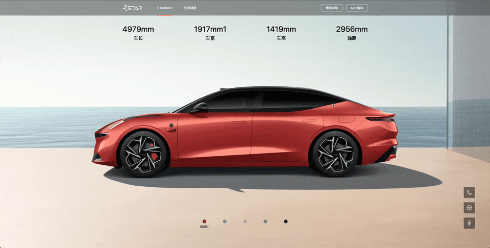

## 动画开发小记

- gsap 代码片段
- gsap 中的一些默认值
- gsap 中的 position 参数
- gsap 种的媒体查询
- gsap 使用 pin 后的布局偏移
- gsap pin 需要有顺序
- gsap scrollTrigger 的几个函数
- gsap 实现数字递增动画
- framer motion 神器 AnimatePresence

## gsap 代码片段

普通的 `gsap.to` 和 `gsap.from` 比较简单就不用代码片段了，我这里设置了滚动动画的代码片段也就是用 scrollTrigger 插件的时候，一般有两种写法，我是喜欢 [Advanced example](https://gsap.com/docs/v3/Plugins/ScrollTrigger/?page=1#advanced-example) 这种写法，还有一种是 [Standalone/Custom example](https://gsap.com/docs/v3/Plugins/ScrollTrigger/?page=1#standalonecustom-example)

定义项目级的代码片段，输入 `up` 生成 gsap 的代码片段



## gsap 中的一些默认值

`gsap` 有挺多属性方法，记住一些常用属性默认值，不用重新设置，让代码更简洁

| 属性名     | 默认值                |
| ---------- | --------------------- |
| start      | 默认值是'top bottom'  |
| end        | 默认值是'bottom top'  |
| duration   | 默认值是 0.5s         |
| ease       | 默认值是 "power1.out" |
| pinSpacing | 默认值是 true         |

## gsap 中的 position 参数

要实现一些复杂的动画，用 gpt 的时候，它老是会给一些 `>` 和 `<` 的方法，这其实跟时间轴有关

```js
.to( target, vars, **position** )
```

`<` 表示上一个动画的开始时间。将 < 视为返回到上一个动画开头的指针。

```js
tl.to('.class', { x: 100 }, '<')
```

`>` - 上一个动画的结尾\*\*。将 > 视为指向上一个动画结尾的指针。

```js
tl.to('.class', { x: 100 }, '>')
```

一个复杂字符串，其中 `+=` 和 `-=` 前缀表示相对值。当数字跟在`<`或`>`后面时，它被解释为相对数字，因此`<2`与`<+=2`相同。例子：

`+=1` - 时间轴末尾后 1 秒（产生间隙）

`-=1` - 时间轴结束前 1 秒（重叠）

`myLabel+=2` - 标签`myLabel`后 2 秒

`<+=3` - 上一个动画开始后 3 秒

`<3` - 与`<+=3` 相同(`<`或`>`后面隐含`+=`)

`>-0.5` - 上一个动画结束前 0.5 秒。这就像说`上一个动画的结束加上 -0.5`

## gsap 种的媒体查询

现在的网站越来越多响应式，对于动画的响应式，也挺重要，gsap 也提供了媒体查询，我会用来适配不同的屏幕，大于 1280 的才做动画，小于 1280 则不用动画，因为遇到的设计稿常常是 pc 横图，可以充满屏幕方便做动画，而 h5 也是小横图，是不太方便做动画的，而且个人感觉手机上的性能可能还不太好去做复杂的动画

```js
useGSAP(() => {
  let mm = gsap.matchMedia()

  mm.add('(min-width: 1280px)', () => {
    const t1 = gsap.timeline({
      scrollTrigger: {}
    })

    t1.to('.item', {})
  })
})
```

## gsap 使用 pin 后的布局偏移

首先说明这是个可以忽略的问题

这是目前没看到解决方案的一个点，在刷新页面的时候，页面位置会变化，虽然影响不大，这获取是 gsap 用了 pin 后 动态计算位置的问题

比如以下代码：

```js
'use client'

import { useGSAP } from '@gsap/react'
import { gsap } from 'gsap'

const Page = () => {
  useGSAP(() => {
    const t1 = gsap.timeline({
      scrollTrigger: {
        trigger: '.section1',
        pin: true,
        scrub: 1,
        toggleActions: 'play none none reverse'
      }
    })

    t1.from('.title1', {
      opacity: 0.5
    })
  })

  useGSAP(() => {
    const t1 = gsap.timeline({
      scrollTrigger: {
        trigger: '.section2',
        toggleActions: 'play none none reverse',
        pin: true,
        scrub: 1
      }
    })

    t1.from('.title2', {
      opacity: 0.5
    })
  })

  return (
    <div>
      <div className="section1 flex h-screen bg-slate-900">
        <h1 className="title1 m-auto text-[40px]">第一屏</h1>
      </div>
      <div className="section2 flex h-screen bg-slate-800">
        <h1 className="title2 m-auto text-[40px]">第一屏</h1>
      </div>
    </div>
  )
}

export default Page
```

可以看到在第二屏刷新却回到了第一屏的位置



## gsap pin 需要有顺序

用 pin 的时候，gsap 会动态计算高度，所以图片和元素高度一定要有，其次是顺序，如果顺序不对，pin 后的元素会错位

比如抽离的 hook 和写在组件的 hook 没有随着 section

比如长页面的时候，pin 的位置没有随着 section



用 `markers:true` 可以看到设置的 start 和 end 位置：



但是 start 和 end 的线跟你写的位置不符的时候，就可能是顺序问题

## gsap scrollTrigger 的几个函数

这几个函数很重要！有了这几个函数，更方便的实现复杂的动画，如下：

```js
gsap.timeline({
  scrollTrigger: {
    toggleActions: 'play none none reverse',
    onEnter: () => {},
    onLeave: () => {},
    onEnterBack: () => {},
    onLeaveBack: () => {},
    onUpdate: (self) => {
      console.log(self.progress)
    }
  }
})
```

我保留了 `toggleActions`，因为它的值可以控制动画的播放，同时也和 `onEnter onLeave onEnterBack onLeaveBack` 触发时间一致，用 `markers:true` 多去看看，就能实现下面这种定位效果：



下面是一段伪代码做参考：

```js
useGSAP(() => {
  let mm = gsap.matchMedia()

  const onEnter = () => {
    gsap.set('.section1', {
      position: 'fixed'
    })
  }

  const onLeave = () => {
    gsap.set('.section1', {
      position: 'relative'
    })
  }

  const onEnterBack = () => {
    gsap.set('.section1', {
      position: 'fixed'
    })
  }

  const onLeaveBack = () => {
    gsap.set('.section1', {
      position: 'relative'
    })
  }

  mm.add('(min-width: 1280px)', () => {
    gsap.timeline({
      scrollTrigger: {
        trigger: '.section1',
        start: 'top top',
        end: `+=${window.innerHeight}`,
        scrub: 1,
        toggleActions: 'play none none reverse',
        onEnter: onEnter,
        onLeave: onLeave,
        onEnterBack: onEnterBack,
        onLeaveBack: onLeaveBack,
        onUpdate: (self) => {
          gsap.to('.section1-mask', {
            opacity: self.progress
          })
          gsap.to('.section1', {
            y: -self.progress * 100
          })
        }
      }
    })
  })
})
```

onUpdate 也很有用，这里用它拿到 progress 进度，就可以自己切换轮播图，如下面效果，只用鼠标滚轮，不用鼠标拖动：


下面是一段伪代码做参考：

```js
useEffect(() => {
  swiperRef.current.slideToLoop(cur, 1500, false)
}, [cur])

useGSAP(() => {
  let mm = gsap.matchMedia()

  mm.add('(min-width: 1280px)', () => {
    gsap.timeline({
      scrollTrigger: {
        trigger: '.section15',
        pin: true,
        scrub: 1,
        end: '+=4000',
        toggleActions: 'play none none reverse',
        onUpdate: (self) => {
          if (self.progress <= 0.25) {
            setCur(0)
          } else if (self.progress > 0.25 && self.progress <= 0.5) {
            setCur(1)
          } else if (self.progress > 0.5 && self.progress <= 0.75) {
            setCur(2)
          } else {
            setCur(3)
          }
        }
      }
    })
  })
})
```

想要实现这样的轮播，还需要注意元素不能太少，否则最右边会有空白，然后可以用 z-index 和过渡让轮播图更丝滑

## gsap 实现数字递增动画

用 gsap 实现数字递增不要太简单，这里实现一个增强版： pin + 数字滚动动画，跟随鼠标滚动数字递增

主要依靠两个属性，一个是`textContent`表示文本内容，这里用来放数字，还有一个 `roundProps` 可以取整，就不会出现 `3.1314` 这种情况

鼠标下滑，数字递增，但因为数字是多个，且都从 0 开始的话会显得太快而且 1 和 10 和 100 和 1000 它们间距是不同的，考虑到这些情况，需要给数字从小于 50 的时候递增

下面是一段伪代码做参考：

```js
const t1 = gsap.timeline({
  scrollTrigger: {
    trigger: '.item',
    end: '+=5000',
    pin: true,
    scrub: 1,
    toggleActions: 'play none none reverse'
  }
})

const section3_count = document.querySelectorAll('.count')

section3_count.forEach((item) => {
  if (!item.textContent) return
  const textContent = parseInt(item.textContent)
  t1.from(item, {
    textContent: textContent - 50,
    duration: 1,
    roundProps: 'textContent'
  })
})
```



## framer motion 神器 AnimatePresence

我们常常会切换 dom，比如`{cur==index?<Component1>:<Component2>}`，如果这样写，是很生硬的，没有过渡效果，要想有过渡效果，我们得先把元素的 `opacity` 慢慢变为 `0` 后最好给它 `display:none`，但这样每次自己写是挺麻烦的

framer motion 提供了 `AnimatePresence` 这个组件，可以解决这个问题

下面是一段伪代码做参考：

```js
<AnimatePresence mode="wait">
  {isOpen && (
    <motion.div
      key={'menu'}
      initial={{ height: 0, opacity: 0 }}
      animate={{ height: '100vh', opacity: 1 }}
      exit={{ height: 0, opacity: 0 }}
      transition={{ duration: 0.5 }}
    >
      <div></div>
    </motion.div>
  )}
</AnimatePresence>
```

就可以实现比如 h5 的下拉动画：


