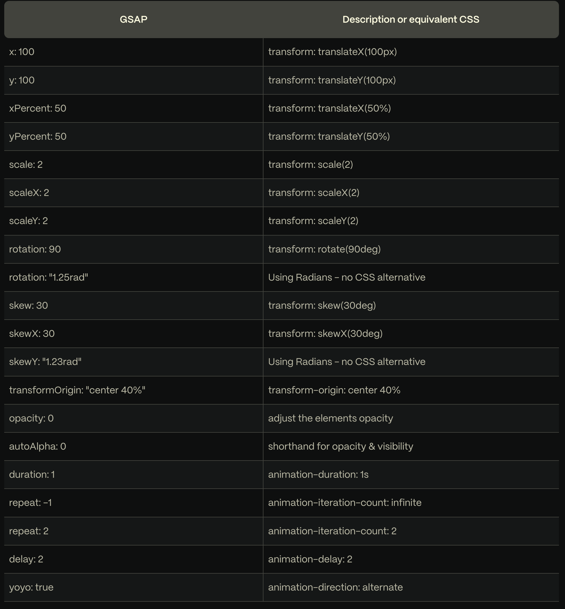
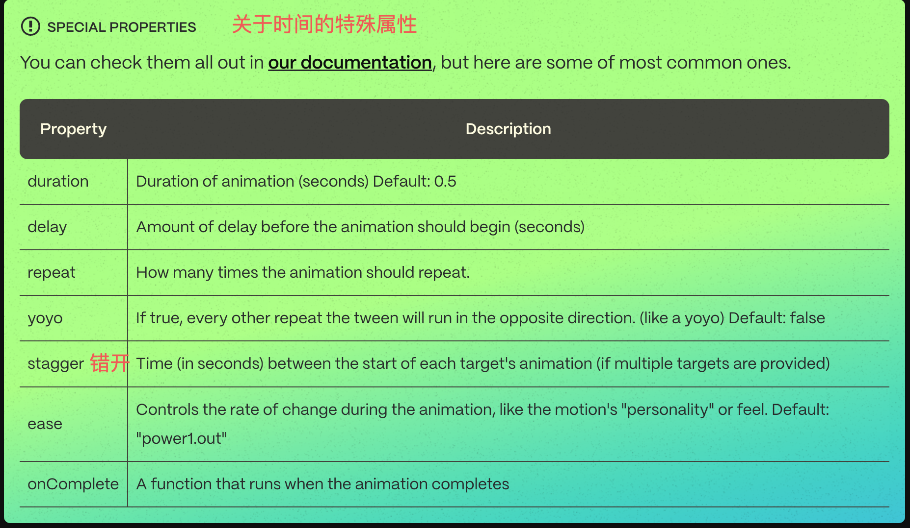

# 如何用 GSAP 写出丝滑的动画

- 使用 transform 和 opacity
- 避免 CPU 密集型 CSS 属性
- 灵活使用时间相关的属性
- 灵活使用 pin
- 适当的阴影
- 左右布局和上下布局的技巧
- 背景大图动画技巧
- 多个模块错位动画
- 图片的裁剪动画
- 数字滚动动画
- scrub

设计考虑因素
元素大小：

如果元素较大（例如宽度或高度超过屏幕的一半），较小的 y 值（如 20）可能会显得更加自然。
如果元素较小（例如宽度或高度小于屏幕的三分之一），较大的 y 值（如 50 或更多）可能会更有视觉冲击力。
页面布局：

如果页面整体布局较为紧凑，较小的 y 值（如 20）可能更适合，以避免元素之间过度重叠。
如果页面布局较为宽松，较大的 y 值（如 50 或更多）可能更合适，以增加视觉上的层次感。
用户体验：

较小的 y 值（如 20）通常会让动画看起来更加平滑和自然，适合大多数场景。
较大的 y 值（如 50 或更多）可能会让用户感到更强烈的视觉冲击，适合强调某些关键元素。
具体建议
当前 y 值为 20：

这个值比较适中，适用于大多数元素大小和布局。
如果你的元素大小适中（例如宽度或高度在 300px 到 500px 之间），20 的 y 值已经足够平滑且自然。
尝试不同的 y 值：

可以尝试将 y 值调整为 30 或 40，观察效果是否更好。
如果发现 30 或 40 更符合预期，可以适当调整。

## 使用 transform 和 opacity

如果可能，请对动画使用 `transforms` 和 `opacity，而不是` “top”、“left” 或 “margin” 等布局属性，它有如下好处：

1. 硬件加速：浏览器通常会对 transform 和 opacity 属性进行优化，利用 GPU (图形处理单元) 来提高动画性能。这意味着动画可以更加流畅，尤其是在移动设备上。
2. 重绘与回流：修改 top、left 或 margin 会导致浏览器重新计算布局（回流）和重绘元素。而使用 transform 只会触发重绘，不会引起回流，因此动画性能更好。

每次去写 `transform:translateX(100px)` 多少有点麻烦， 好在官方为了我们简化了 transforms 的写法

比如 `transform: rotate(360deg) translateX(10px) translateY(50%)` 可以简写为 `{ rotation: 360, x: 10, yPercent: 50 }`

下面是所有支持简写的属性，左边是简写，右边是完整写法：

尽管 GSAP 几乎可以对每个 CSS 属性进行动画处理，但我们建议尽可能坚持使用转换和不透明度。像 filter 和 boxShadow 这样的属性是 CPU 密集型的，浏览器渲染起来会占用大量 CPU。请谨慎制作动画，并确保在低端设备上进行测试。

## 灵活使用时间相关的属性

duration 太短看不出来 ease 的效果

`Easing` 可能是运动设计中最重要的部分

对于大多数 `ease`，您将能够指定类型。有三种类型的缓动：in、out 和 inOut。这些控制了缓和过程中的势头。

像 `“power1.out”` 这样的缓出动画最适合 UI 过渡;它们启动速度很快，这有助于 UI 感觉响应迅速，然后在结束时缓和，从而产生自然的摩擦感。

`ease: "power1.in"`
开始慢，结束快，就像一个重物下落

`ease: "power1.out"`
开始快，结束慢，就像一个滚动的球慢慢停止

ease: "power1.inOut"
开始慢，结束慢，就像汽车加速和减速一样

## 灵活使用 pin
