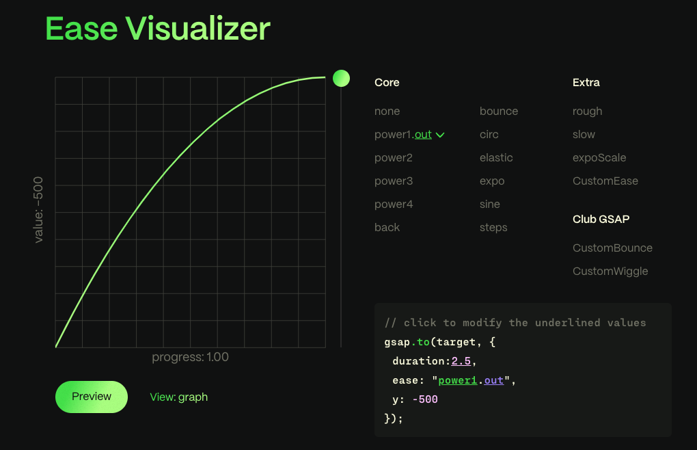

## GSAP 动画从性能到核心概念

- 性能差的属性（点名 filter）
- 性能好的属性（点名 transform）
- 动画的偏移量
- 动画的时间
- GSAP ScrollTrigger 插件

## 性能差的属性

先来说一下做动画性能比较差的属性。

这是用写动画能丝滑的前提，因为 CPU 密集型 CSS 属性（重点点名 `filter`），用了它就容易有性能问题，浏览器渲染起来会占用大量 CPU，所以我们应该在写完项目后测试动画性能。

`filter:blur(5px)`，`filter:backdrop-filter:blur(5px)`，这个数值越大越容易引起卡顿。

同理，其它 css 属性比如 `boxShadow` 计算复杂的渐变也会造成性能问题。

## 性能好的属性

说了性能较差的属性，那有没有性能好的属性呢？当然 css 也有好的性能属性。

如果可能，请对动画使用 `transforms` 和 `opacity`，而不是 “top”、“left” 或 “margin” 等布局属性，它有如下好处：

1. 硬件加速：浏览器通常会对 transform 和 opacity 属性进行优化，利用 GPU (图形处理单元) 来提高动画性能。这意味着动画可以更加流畅，尤其是在移动设备上。
2. 重绘与回流：修改 top、left 或 margin 会导致浏览器重新计算布局（回流）和重绘元素。而使用 transform 只会触发重绘，不会引起回流，因此动画性能更好。

gsap 支持简写，比如：

```js
gsap.to('.box', {
  transform: rotate(360deg) translateX(10px) translateY(50%)
})
```

可以简写成：

```js
gsap.to('.box', {
  { rotation: 360, x: 10, yPercent: 50 }
})
```

下面是所有支持简写的属性，左边是简写，右边是完整写法：


## 动画的偏移量

我们知道了使用 `transform` 会更丝滑，那么如何合理地设置 `transform` 补间动画的偏移量呢？偏移量多一点和少一点如何抉择？

我们先看一下偏移量偏移量多点的例子，这是 100 的偏移量：


再看一下偏移量少一点的例子，这是 20 的偏移量：


可以看出当模块大的时候，偏移量多一点，动画会更有冲击力和动态感的效果。

同理模块小的时候，偏移量少一点，动画会显得简洁和专业，这里就不举例了。

当然这个结果也不总是对，有时候用 xPercent 和 yPercent 来设置百分比偏移量更合适，还要考虑实际开发因素。

## 动画的时间

除了补间动画，我们还知道 GSAP（以时间轴为维度的补间动画） 还有一个概念是时间轴，那我们怎么合理设置动画的时间呢？

下面是 GSAP 关于时间的属性：


这里举例常用的 `ease`、`duration`、`stagger`、。

我们先说第一个 `ease`，`ease` 就是我们熟知的动画曲线，官网贴心的提供了一个[可视化设置动画曲线](https://gsap.com/resources/getting-started/Easing)的地方。



`ease` 最常用的值是 power1.out、power1.out、power1.out。

`ease: "power1.out"`： 开始快，结束慢，就像一个滚动的球慢慢停止，默认值。

`ease: "power1.in"`：开始慢，结束快，就像一个重物下落。

`ease: "power1.inOut"`：开始慢，结束慢，就像汽车加速和减速一样。

像 `power1.out` 这样的动画曲线最适合 UI 过渡;它们启动速度很快，这有助于 UI 感觉响应迅速，然后在结束时缓和，从而产生自然的摩擦感。

再说第二个属性`duration`，也就是动画持续时间。

`duration` 默认时间是 0.5s，需要注意的是 duration 太短 `ease` 的效果不是很明显。

当 `duration` 为 0s 时候相当于 `gsap.set`

最后一个属性是 `stagger`，它表示一个错位时间，是一个十分有用的属性，在多个相同的模块做相同的动画的时候（比如下面的例子其实是 `querySelectAll(.box)` 然后都加上动画），我们可以使用 `stagger` 来设置错位时间，来让动画依次执行有错落有致的感觉。如下面的例子：

```js
gsap.to('.box', {
  {y: 10, stagger:0.1 }
})
```


## GSAP ScrollTrigger 插件

GSAP 三个重要的点，一个是补间动画，一个是动画时间，还有一个就是强大的插件，`ScrollTrigger` 就是最有用插件之一，用于做滚动动画。

我们先看一下写法：

```js
import { ScrollTrigger } from 'gsap/dist/ScrollTrigger'
import { gsap } from 'gsap'
import { useGSAP } from '@gsap/react'

gsap.registerPlugin(ScrollTrigger, useGSAP)

let tl = gsap.timeline({
  scrollTrigger: {
    trigger: '.container',
    pin: true,
    start: 'top top',
    end: '+=500',
    scrub: 1,
    markers: true // 标识线，可以用于查看start 和 end的重叠情况
  }
})

tl.addLabel('start')
tl.from('.box p', { scale: 0.3, rotation: 45 })
tl.from('.box', { backgroundColor: '#28a92b' })
```

首先是 `ScrollTrigger` 的注册，然后是 `gsap.timeline` 的创建，最后是 `ScrollTrigger` 的配置，下面我整理了

常用的配置项和说明：

| 属性名   | 作用                                                                                                                                       |
| -------- | ------------------------------------------------------------------------------------------------------------------------------------------ |
| trigger  | 触发器元素，值是一个元素的类或者引用                                                                                                       |
| pin      | 把元素钉在页面，原理是给元素加一个父级，并加上 padding，这个 padding 的值为 end 的值                                                       |
| start    | ScrollTrigger 的起始滚动位置，可以百分比也可以 top center bootom，第一个值是触发器元素的值，第二个值是屏幕的值，两个值在页面重叠时触发动画 |
| end      | ScrollTrigger 的结束滚动位置，可以是一个数值+=500，也可以同上，重叠时结束动画                                                              |
| scrub    | 将动画的进度直接链接到滚动条，可以设置为 boolean 或者 number，设置为 true 或者 1 可以让动画更加丝滑                                        |
| addLabel | 在时间轴上打上标识，后面可以根据这个标识来决定后续动画的触发时机                                                                           |
