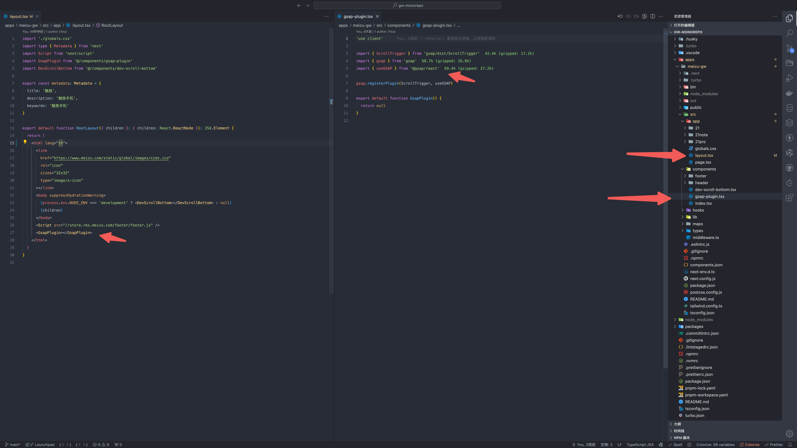

React 中更简单的使用 gsap 的方式 useGSAP

## 前言

`gsap` 是一个框架无关的动画库，在`vue`，`react`中都可以使用，它提供了一个 `@gsap/react` 包，里面的 `useGSAP` 让我们在 `react` 中使用 `gsap` 更加简单

<!-- 这是一个在 react 中使用 `GSAP` 的 `hook`，会更方便的清理动画，也更好的适配 `Next.js` `SSR` -->

## useGSP 一次注册多次使用

首先需要像插件一样注册



在 `Next.js` 注册好后放到 `layout.tsx` 中，就可以一次注册多次使用了，如果要用的别的插件也可以在这里注册好，比如 `ScrollTrigger`

```js
'use client'

import { ScrollTrigger } from 'gsap/dist/ScrollTrigger'
import { gsap } from 'gsap'
import { useGSAP } from '@gsap/react'

gsap.registerPlugin(ScrollTrigger, useGSAP)

export default function GsapPlugin() {
  return null
}
```

## Next.js SSR 中使用动画

`framer-motion` 中有一个 `useIsomorphicLayoutEffect`，可以兼容 `ssr`

```js
import { useIsomorphicLayoutEffect } from 'framer-motion'
```

但是 `GSAP` 没有，所以需要自己实现

```js
export const useIsomorphicLayoutEffect =
  typeof window !== 'undefined' ? useLayoutEffect : useEffect
```

有了 `useGSAP` 后，它封装了 `useIsomorphicLayoutEffect`，所以直接用 `useGSAP`

```js
import gsap from 'gsap'
import { useGSAP } from '@gsap/react'

useGSAP(
  () => {
    gsap.to('.box', { x: 100 })
  },
  { dependencies: [] } // 相当于useEffect的依赖项
)
```

当然，`dependencies` 的默认值就是`[]`，所以只需要传入第一个参数就好了

```js
import gsap from 'gsap'
import { useGSAP } from '@gsap/react'

useGSAP(() => {
  gsap.to('.box', { x: 100 })
})
```

在依赖项变化的时候，它不会重置动画，需要和`revertOnUpdate: true`一起使用，但平时写动画基本不会用到，具体可以看 [Reacting to changes in state](https://gsap.com/resources/react-basics/#reacting-to-changes-in-state)

## 作用域

对`.item`做一个简单的动画，我们可以这样，并且它会给页面所有的 `item` 加上动画

```js
gsap.to('.item', { x: 100 })
```

如果我们想限制一下，对`.wrapper` 下 `.item`的类，那就可以用 `scope`， `scope`可以把所有 `GSAP` 选择器范围都将限定为该容器的后代

```js
import { useRef } from 'react'
import gsap from 'gsap'
import { useGSAP } from '@gsap/react'

const container = useRef()

useGSAP(
  () => {
    gsap.to('.box', { x: 360 })
  },
  { scope: container }
)

<div class='wrapper' ref={container}>>
  <div class='item'></div>
</div>
```

## 动画清理

参考 [JS Frameworks](https://gsap.com/resources/frameworks)

`GSAP` 的动画会一直存在，所以需要 [清理动画](https://react.dev/learn/synchronizing-with-effects#step-3-add-cleanup-if-needed)，防止内存泄漏和其它问题。

对于单个动画

```js
useEffect(() => {
  const t1 = gsap.from('.box', {
    y: 200,
    opacity: 0
  })
  return () => {
    t1.revert()
  }
}, [])
```

对于多个动画，`gsap` 提供了 `gsap.context()`

```js
useEffect(() => {
  const ctx = gsap.context(() => {
    gsap.to(el, { rotation: 360, repeat: -1 })

    let tl = gsap.timeline()

    tl.to(box, { x: 200 })
    tl.to(box, { y: 500, duration: 2 })
    tl.to(box, { rotation: 180, repeat: 2 })
  })
  return () => {
    ctx.revert()
  }
}, [])
```

可以看到`gsap.context()`不太优雅，多了一层函数，感觉在套娃，而`useGSAP`会自动清理动画，所以在 `react` 中使用 `useGSAP` 会更简单

## 非初始化执行的动画清理

`useGSAP` 会自动清理动画，但是如果是点击事件，则可能内存泄漏

```js
const container = useRef()

useGSAP(
  () => {
    // ✅
    gsap.to('.good', { x: 100 })
  },
  { scope: container }
)

// ❌ 这是不安全的，会存在内存泄漏
const onClickBad = () => {
  gsap.to('.bad', { y: 100 })
}

return (
  <div ref={container}>
    <div className="good"></div>
    <button onClick={onClickBad} className="bad"></button>
  </div>
)
```

可以通过 `contextSafe` 来解决

```js
const container = useRef()

const { contextSafe } = useGSAP({ scope: container })

// ✅
const onClickGood = contextSafe(() => {
  gsap.to('.good', { rotation: 180 })
})

return (
  <div ref={container}>
    <button onClick={onClickGood} className="good"></button>
  </div>
)
```

还有一种方案可能没有那么优雅，可以看官网[方案二](https://gsap.com/resources/React/#2-using-the-2nd-argument-for-inside-usegsap-hook)
