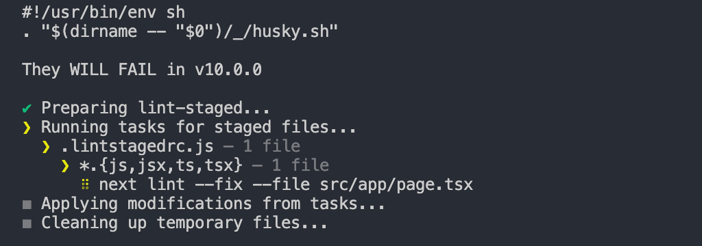

## 项目环境

node 版本只能大于等于 `20.9.0`

必须使用 `pnpm` 下载依赖，它有以下好处：

1. 减少磁盘空间，因为 `pnpm` 使用了硬链接，每次下载包的时候，包里的文件都会硬链接到磁盘某一位置来复用包
2. 速度更快，`pnpm` 比 `npm` 快了近 2 倍，因为 `pnpm` 使用了软链接，`.pnpm` 目录下的互相引用都是链接文件，在解析和获取的时候因为只需要判断磁盘是否有这个包，就直接决定是否下载依赖（传统方法会全解析完后再下载依赖，是串型阻塞的）
3. 没有幽灵依赖问题，因为 `pnpm` 创建的 `node_modules` 默认不是扁平结构

## 代码检查

使用 `eslint` 检查代码规范，使用 `prettier` 格式化代码，使用 `commitlint` 检查提交信息，使用 `lint-staged` 监听暂存区 git 提交事件，使用 `husky` 监听代码提交事件，在提交前检查代码规范。

结果就是 `git commit -m message` 的时候会检查 git 暂存区的代码



项目中配置了自动格式化，在保存文件的时候会自动统一风格问题和修复代码问题

需要注意的是 [commit 规范](https://www.conventionalcommits.org/en/v1.0.0/)

```bash
feat：新增功能。
fix：修复错误。
docs：文档变更（不影响源代码）。
style：代码格式化变更（不影响代码运行结果）。
refactor：重构代码（不包括修复错误或新增功能）。
perf：性能改进。
test：增加测试。
chore：构建过程或辅助工具的变更。
ci：持续集成相关的变更。
```

TODO:这里有个废弃的用法 `husky install`

## config 配置文件

收敛到一个文件，方便维护，减少重复代码

## 错误兜底

## SEO

## 公共函数
