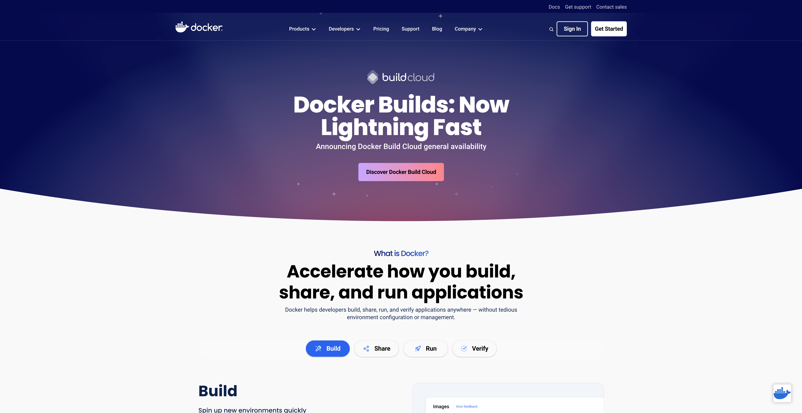
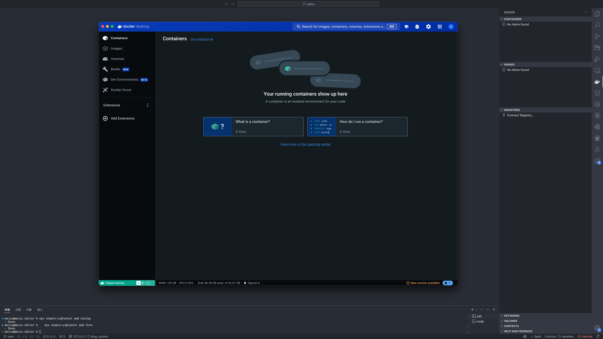
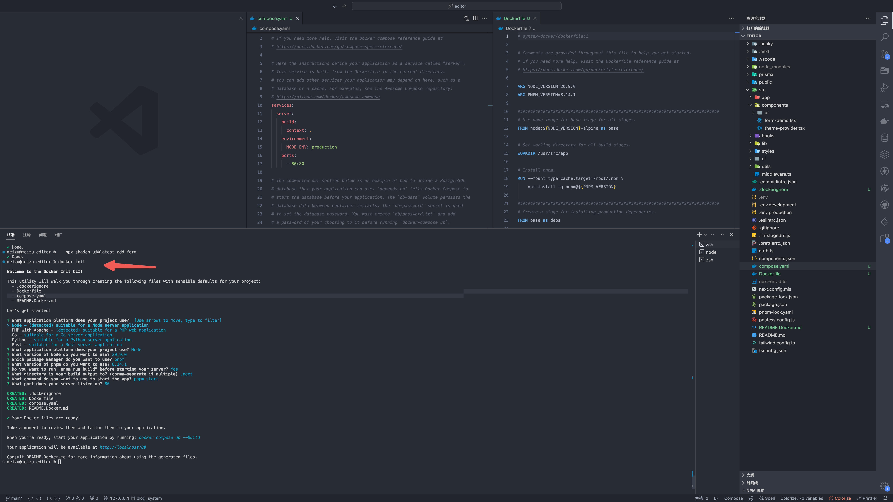
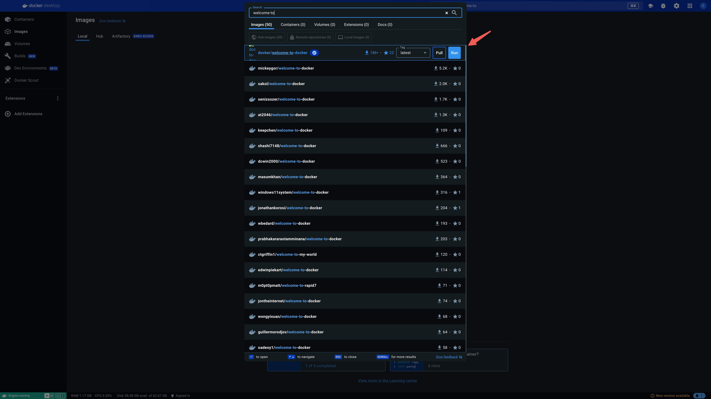

## Docker

## 资源

[阮一峰 Docker 教程](https://www.ruanyifeng.com/blog/2018/02/docker-tutorial.html)

[Nextjs 官网](https://nextjs.org/docs/app/building-your-application/deploying#docker-image)

[Nextjs Example](https://github.com/vercel/next.js/tree/canary/examples/with-docker)

[t3-app](https://create.t3.gg/)

## 工具

`Docker Desktop` 和 `VSCode` 插件

## docker init

项目里 `docker init` 可以生成

## 搜索镜像

## Optional settings

