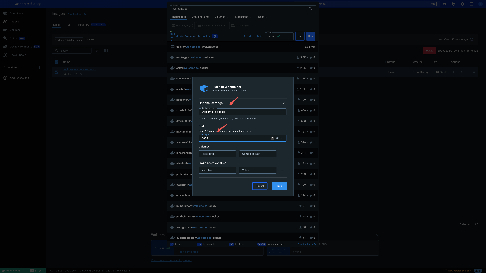

## Docker

## 资源

[阮一峰 Docker 教程](https://www.ruanyifeng.com/blog/2018/02/docker-tutorial.html)

[Nextjs 官网](https://nextjs.org/docs/app/building-your-application/deploying#docker-image)

[Nextjs Example](https://github.com/vercel/next.js/tree/canary/examples/with-docker)

[t3-app](https://create.t3.gg/)

## 工具

`Docker Desktop` 和 `VSCode` 插件

## docker init

项目里 `docker init` 可以生成

## 搜索镜像

## Optional settings

## docker run 命令常见参数

#### docker run 命令常见参数

- -d：让容器后台运行
- --name：给容器命名
- -e：环境变量
- -p：宿主机端口映射到容器内端口

如运行 `mysql`，`docker run -d --name mysql -e TZ=Asia/Shanghai -e MYSQL_ROOT_PASSWORD=123 mysql`

#### 镜像名称结构

- Repository 镜像名:TAG 版本号

## 常见命令

参考[官网](https://docs.docker.com/reference/cli/docker/container/run/)

## 数据卷

## 自定义镜像

## 网络
