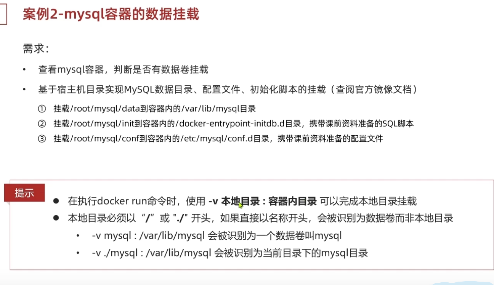
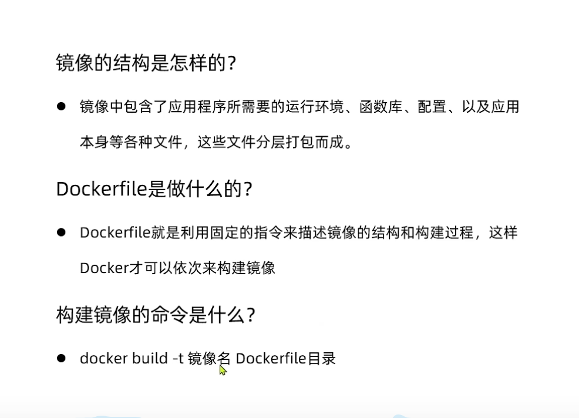
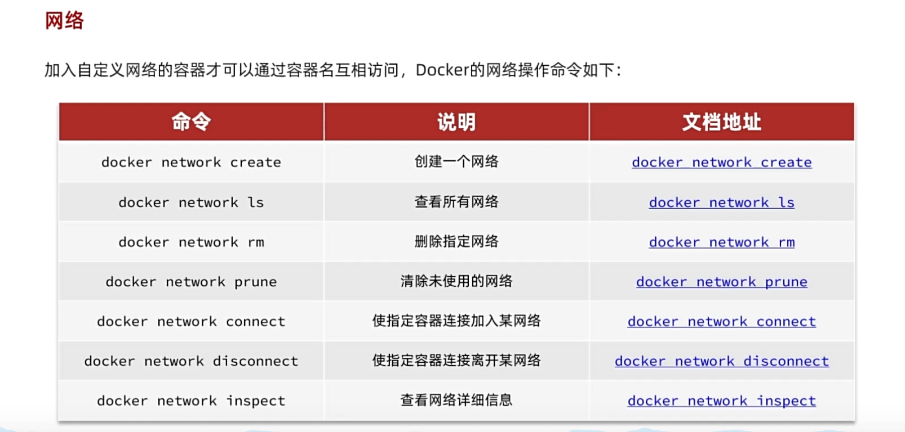
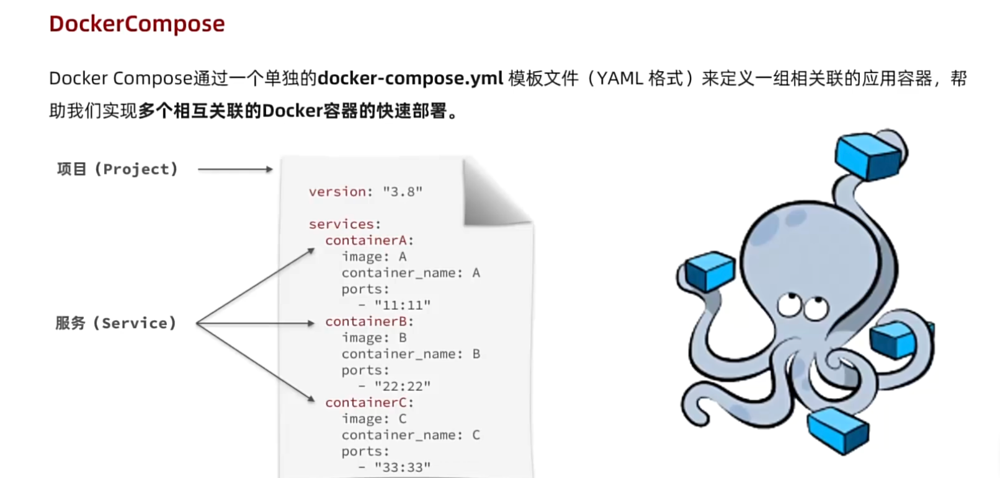
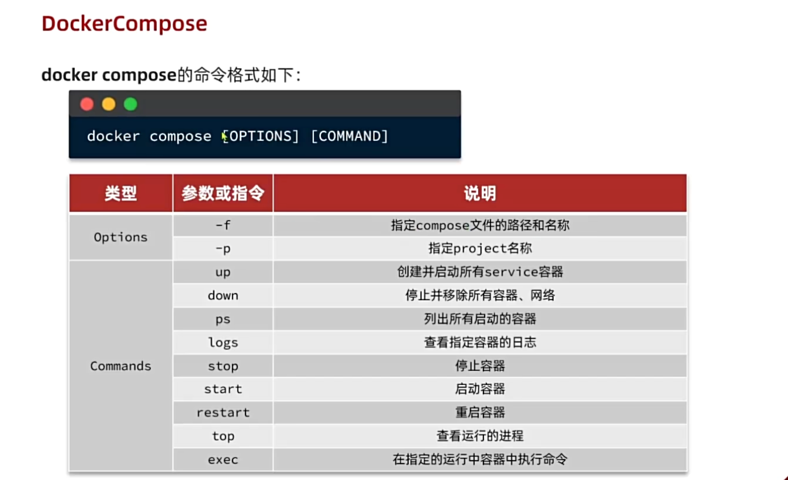

## Docker


## 资源

[阮一峰 Docker 教程](https://www.ruanyifeng.com/blog/2018/02/docker-tutorial.html)

[Nextjs 官网](https://nextjs.org/docs/app/building-your-application/deploying#docker-image)

[Nextjs Example](https://github.com/vercel/next.js/tree/canary/examples/with-docker)

[t3-app](https://create.t3.gg/)

## 工具

`Docker Desktop` 和 `VSCode` 插件


## docker init

项目里 `docker init` 可以生成


## docker hub

[Docker Hub](https://hub.docker.com/?_gl=1*h8exxe*_ga*MTkyNDAxOTY1OS4xNzAyMzUyMjE0*_ga_XJWPQMJYHQ*MTcxMjU0NDkyOC45LjEuMTcxMjU0NDkyOS41OS4wLjA.)是一个镜像仓库，可以搜索镜像，下载镜像，上传镜像。

## 搜索镜像


## Optional settings


## docker run 命令常见参数

#### docker run 命令常见参数

- -d：让容器后台运行
- --name：给容器命名
- -e：环境变量
- -p：宿主机端口映射到容器内端口

如运行 `mysql`，`docker run -d --name mysql -e TZ=Asia/Shanghai -e MYSQL_ROOT_PASSWORD=123 mysql`

#### 镜像名称结构

- Repository 镜像名:TAG 版本号

## 常见命令

参考[官网](https://docs.docker.com/reference/cli/docker/container/run/)


## 数据卷


- 在 docker run 命令的时候，使用 -v 数据卷:容器内目录 可以完成数据卷挂载
- 当创建容器时，如果挂载了数据卷且数据卷不存在，则自动创建

## 本地数据卷挂载



## Dockerfile 语法


[官网](https://docs.docker.com/reference/dockerfile/)




## 自定义镜像


## 网络

`docker network create -d bridge react-notes`

-d 参数指定 Docker 网络类型，有 bridge、overlay。其中 overlay 网络类型用于 Swarm mode。react-notes 为我们的自定义网络的名字。

`docker run -p 6379:6379 --network react-notes redis redis-server`

`docker network inspect react-notes`



<!-- #### Dockerfile dockerignore

拷贝 Dockerfile 和 .dockerignore 到跟目录
配置 next.config.js output: "standalone"
执行之前中的 docker 命令 -->

## DockerCompose





先创建`docker-compose.yml`

```yaml
version: '3.8'
services:
  redis:
    image: redis
    ports:
      - '6379:6379'
    command: redis-server

  nextapp:
    build: .
    ports:
      - '4000:3000'
    depends_on:
      - redis
```

运行容器

`docker-compose up`

## 宝塔

宝塔需要注意 `nginx` 重启

`nginx` 静态目录 `cd /usr/share/nginx/html`

## Demo - 本地

#### 项目里新建 Dockerfile

```Dockerfile
FROM node:18-alpine
# 这个指令的意思就是简单粗暴的将当前目录的所有文件拷贝到 /app下
WORKDIR /app
COPY . .
RUN npm install --registry=https://registry.npmmirror.com && npm run build
CMD npm start
EXPOSE 3000
```

#### 打包成镜像

`docker image build -t next-docker-learn-demo:0.0.1 .`

#### 运行镜像

开启一个容器运行镜像

`docker run -p 4000:3000 next-docker-learn-demo:0.0.1`
