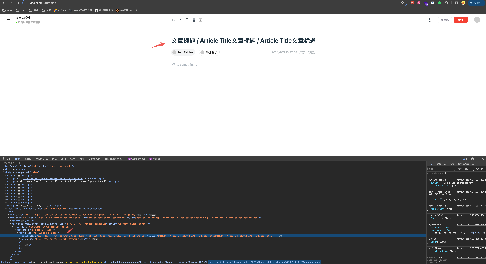
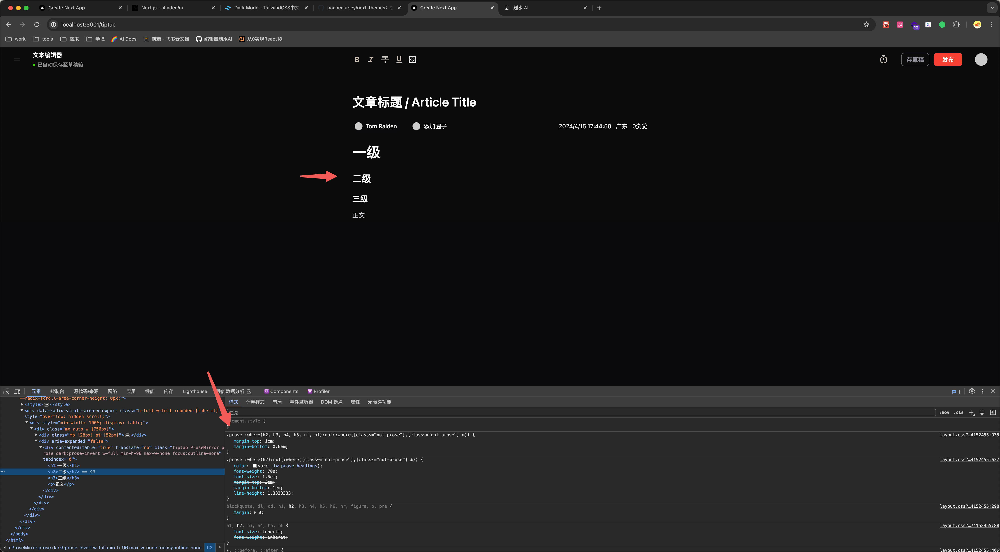
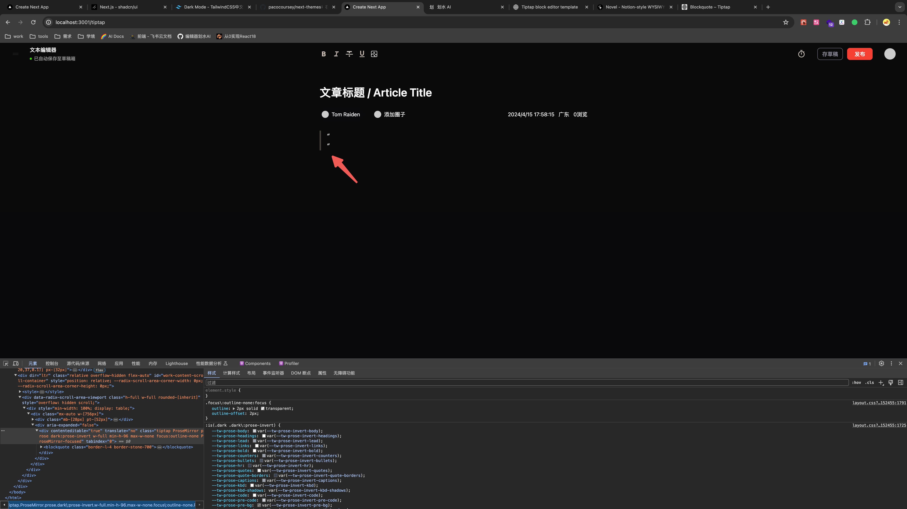

## 标题

先用 input，后续可能优化，有字符限制

## h1、h2、h3、正文字号设计、主题切换

参考 [shadcn Typography](https://ui.shadcn.com/docs/components/typography)、[tailwindcss-typography](https://github.com/tailwindlabs/tailwindcss-typography) 插件给文章加样式，用 [next-themes](https://ui.shadcn.com/docs/dark-mode/next) 实现主题切换

## 引用

[blockquote](https://tiptap.dev/docs/editor/api/nodes/blockquote)

## 无序列表

[bulletList](https://tiptap.dev/docs/editor/api/nodes/bullet-list)
