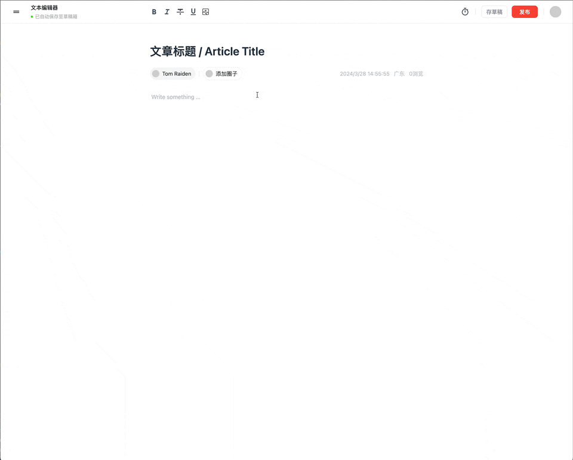

## 当 AI 加入编辑器

我这里选用的是气泡栏插件，AI 显示的文本在气泡栏，然后点击气泡栏的按钮，AI 输入的文本会替换到编辑器中。



## 接入流式数据

后端 AI 接口返回的数据是流式数据，也就是`text/event-stream`这个头


#### 原生 sse EventSource 连接只能对接 get 接口，有一定局限性

```js
const eventSource = new EventSource('http://localhost:3000/stream')

eventSource.onmessage = ({ data }) => {
  console.log('New message', JSON.parse(data))
}
```

#### 为了安全有些接口是 post 接口，这时候可以用微软的一个开源库@microsoft/fetch-event-source

```js
import { fetchEventSource } from '@microsoft/fetch-event-source'

const url = `/api-myplus/myplus-qing/ug/ai/gc/document/friend?text=${encodeURIComponent(
  '魅族'
)}`
let tar = ''
await fetchEventSource(url, {
  method: 'POST',
  onmessage(ev) {
    const encodedData = ev.data
  }
})
```

### base64 字符串解析

可能拿到的数据是 `Base64` 编码的字符串，所以要解析一下

```js
import CryptoJS from 'crypto-js'
// 之前的代码
const decodedData = CryptoJS.enc.Base64.parse(encodedData).toString(
  CryptoJS.enc.Utf8
)
```

## 实现打字稿效果

对接 `ai` 的数据，一般都喜欢用这个打字稿效果，所以这几步最后的代码大约是这样

```tsx s
import CryptoJS from 'crypto-js'
import Typed from 'typed.js'

const typed = useRef<Typed | null>(null)
const el1 = useRef(null)

const handleAI1 = async () => {
  const url = `/api-myplus/myplus-qing/ug/ai/gc/document/friend?text=${encodeURIComponent(
    '魅族'
  )}`
  let tar = ''
  await fetchEventSource(url, {
    method: 'POST',
    onmessage(ev) {
      const encodedData = ev.data // Base64 编码的字符串
      // 解密 Base64 数据
      const decodedData = CryptoJS.enc.Base64.parse(encodedData).toString(
        CryptoJS.enc.Utf8
      )
      tar += decodedData
    }
  })
  if (typed.current) {
    typed.current?.destroy()
  }
  typed.current = new Typed(el1.current, {
    strings: [tar],
    typeSpeed: 50
  })
  setAiData(tar)
  typed.current.start()
}

;<div className="type-wrap w-full">
  <span style={{ whiteSpace: 'wrap' }} ref={el1}></span>
</div>
```

## 解析选中的内容

> 应该还有更好或者简单的方案

要获取选中的内容，可以使用`tiptap-markdown`这个库。

#### 下载

```js
pnpm i tiptap-markdown
```

### 注入编辑器

```js
import { Markdown } from 'tiptap-markdown'

export const extensions = [
  Markdown.configure({
    html: false,
    transformCopiedText: true
  })
]
```

#### 在编辑器中使用

自今而后 `text` 就是选中的内容

```js
const slice = editor.state.selection.content()
const text = editor.storage.markdown.serializer.serialize(slice.content)
```

## 气泡栏插件

气泡栏插件是基于`@tiptap/extension-bubble-menu`的，而这个插件是基于[https://atomiks.github.io/tippyjs/v6/all-props/](tippyjs)的

#### 下载

```js
pnpm i @tiptap/extension-bubble-menu
```

#### 注入编辑器

```js
import BubbleMenu from '@tiptap/extension-bubble-menu'

export const extensions = [BubbleMenu]
```

#### 在编辑器中使用

这里给出部分代码做参考，需要注意的是`tippyOptions`这个配置，监听`onCreate`和`onHidden`，然后去改变气泡栏的位置

```tsx
import { Editor, BubbleMenu } from '@tiptap/react'
import NormalBubble from './normal-bubble'
import AISelector from './ai-selector'
import { Fragment, useRef, useState } from 'react'

interface TiptapBubbleProps {
  editor: Editor
  open: boolean
  onOpenChange: (open: boolean) => void
}

const TiptapBubble = ({ editor, open, onOpenChange }: TiptapBubbleProps) => {
  let pos = 'top'
  const instanceRef = useRef<any>(null)

  const [selection, setSelection] = useState('')

  const bubbleMenuProps = {
    editor: editor,
    tippyOptions: {
      placement: pos as 'top',
      onHidden: () => {
        instanceRef.current.setProps({ placement: 'top' })
        onOpenChange(false)
      },
      onCreate: (val: any) => {
        instanceRef.current = val
      },
      moveTransition: 'transform 0.15s ease-out'
    }
  }

  return (
    <BubbleMenu
      {...bubbleMenuProps}
      className="w-max-[1000px] flex rounded-[4px] bg-[#ffffff] shadow-[rgba(15,15,15,0.05)_0px_0px_0px_1px,rgba(15,15,15,0.1)_0px_3px_6px,rgba(15,15,15,0.2)_0px_9px_24px]"
    >
      {open && <AISelector editor={editor} selection={selection}></AISelector>}

      {!open && (
        <Fragment>
          <button
            onClick={() => {
              onOpenChange(true)
              const slice = editor.state.selection.content()
              const text = editor.storage.markdown.serializer.serialize(
                slice.content
              )
              setSelection(text)
              instanceRef.current.setProps({ placement: 'bottom-start' })
            }}
            className={`${
              editor.isActive('bold') ? 'is-active' : ''
            } border-r border-[#cccccc] px-[10px]`}
          >
            Ask AI
          </button>
          <NormalBubble editor={editor} setOpen={onOpenChange}></NormalBubble>
        </Fragment>
      )}
    </BubbleMenu>
  )
}

export default TiptapBubble
```
