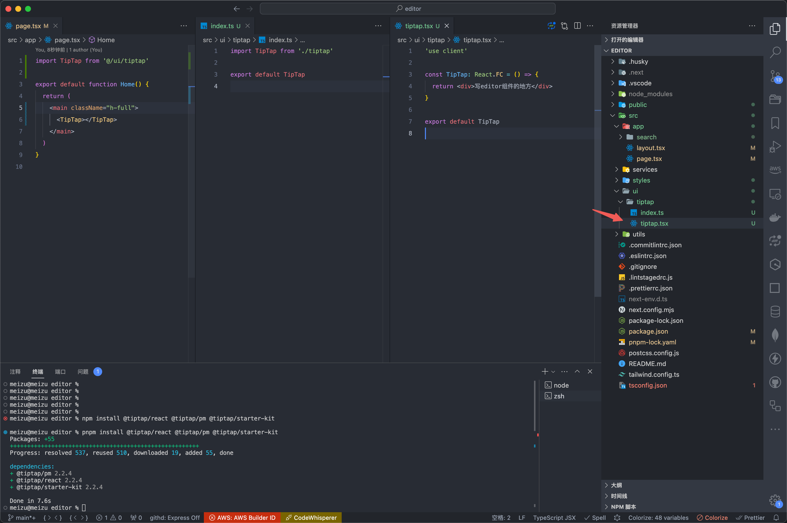
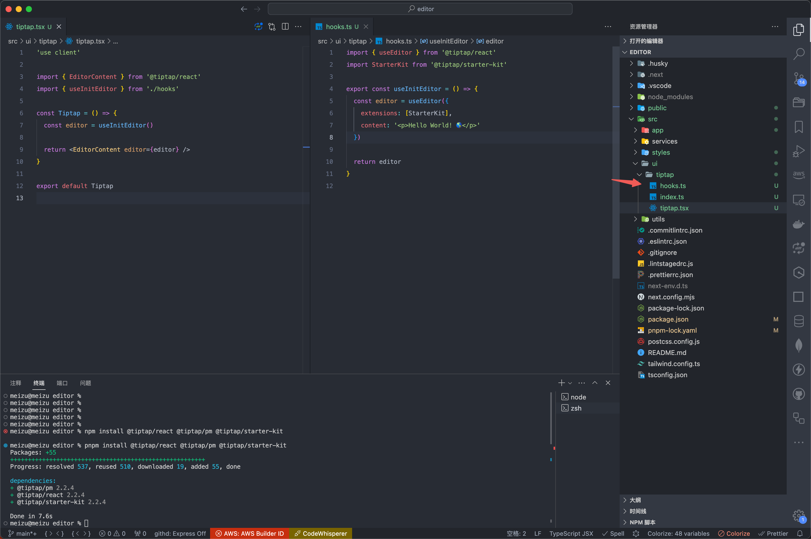
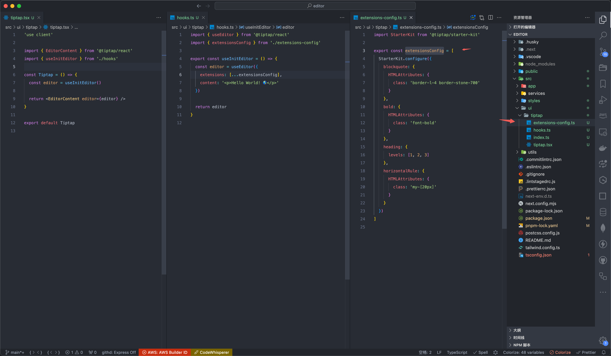
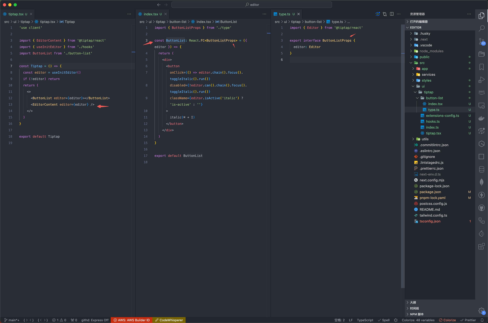
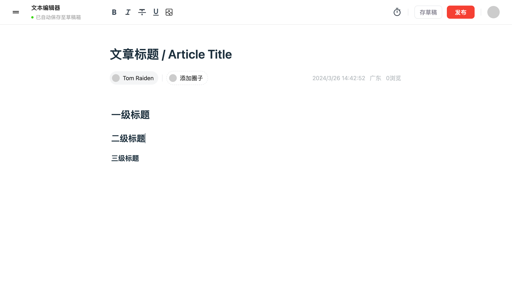
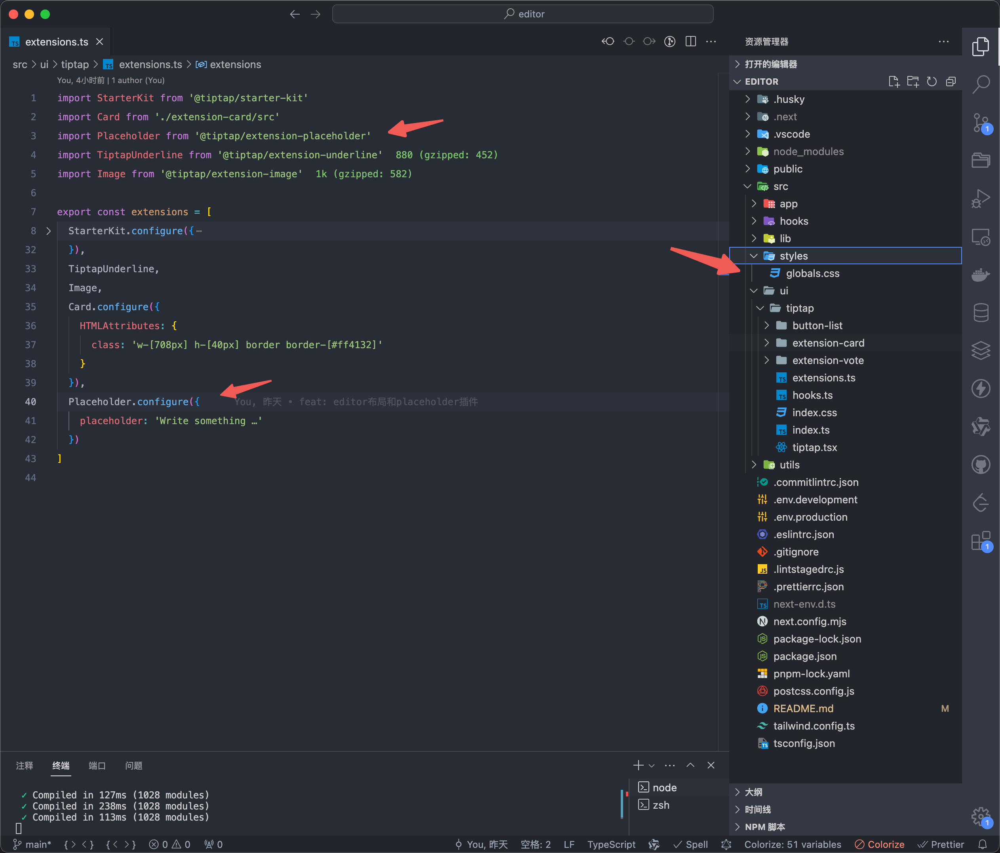
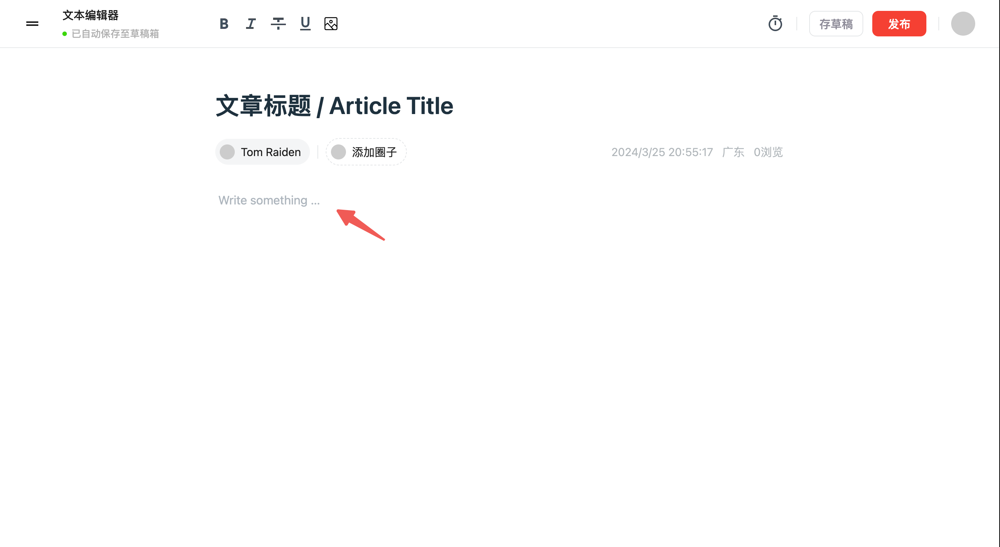
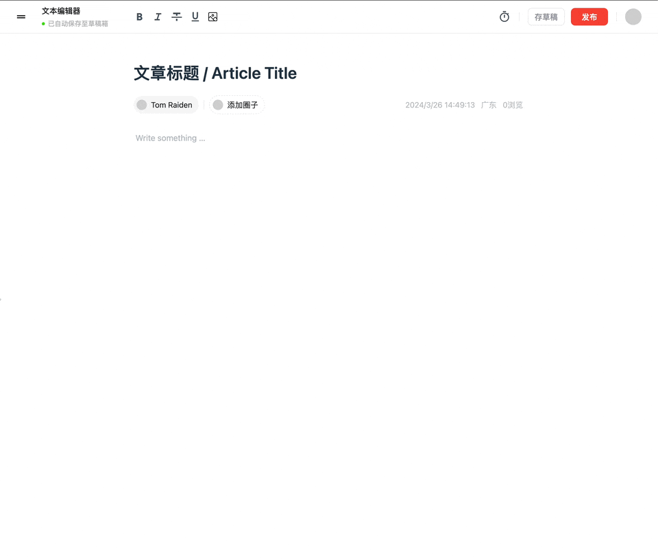

> tiptap 是基于 prosemirror 的富文本编辑器，开箱即用，所以 mvp 版本是比较简单的，但是要合理划分逻辑，让文件不臃肿，提高可维护性
>
> 之前已经说过，[starter-kit](https://tiptap.dev/docs/editor/api/extensions/starter-kit) 包含了很多插件，如果还需要更多插件，需要去下载和注入插件，可以在[examples](https://tiptap.dev/docs/editor/examples/default) 和 [extensions](https://tiptap.dev/docs/editor/extensions)找插件（如文中的 Image 图片上传插件，placeholder 插件），找不到就自己手写一个插件

## editor 组件划分



编辑器组件为 `TipTap`，客户端组件，核心逻辑在`src/ui/tiptap/tiptap.tsx`

## 初始化 editor 和逻辑拆分

```js
pnpm install @tiptap/react @tiptap/pm @tiptap/starter-kit
```

先写进`tiptap.tsx`

```js
'use client'

import { useEditor, EditorContent } from '@tiptap/react'
import StarterKit from '@tiptap/starter-kit'

const Tiptap = () => {
  const editor = useEditor({
    extensions: [StarterKit],
    content: '<p>Hello World! 🌎️</p>'
  })

  return <EditorContent editor={editor} />
}

export default Tiptap
```

但是这样随着方法逻辑越来越多，导致组件变得臃肿，所以拆分一下

当前目录下新建 `hooks.ts`

```js
import { useEditor } from '@tiptap/react'
import StarterKit from '@tiptap/starter-kit'

export const useInitEditor = () => {
  const editor = useEditor({
    extensions: [StarterKit],
    content: '<p>Hello World! 🌎️</p>'
  })

  return editor
}
```

然后`tiptap` 里引用这个`hook`

```js
'use client'

import { EditorContent } from '@tiptap/react'
import { useInitEditor } from './hooks'

const Tiptap = () => {
  const editor = useInitEditor()

  return <EditorContent editor={editor} />
}

export default Tiptap
```

结果是这样



## 社区开源插件 config 拆分

`StarterKit`是一个入门套件，里面包含了很多编辑器基础插件，这些插件都可以传入配置，所以这里把配置抽离出来

修改 `hooks.ts`

```js
import { useEditor } from '@tiptap/react'
import { extensions } from './extensions'

export const useInitEditor = () => {
  const editor = useEditor({
    extensions: [...extensions],
    content: '<p>Hello World! 🌎️</p>'
  })

  return editor
}
```

新增`extensions.ts`

```js
import StarterKit from '@tiptap/starter-kit'

export const extensions = [
  StarterKit.configure({
    blockquote: {
      HTMLAttributes: {
        class: 'border-l-4 border-stone-700'
      }
    },
    bold: {
      HTMLAttributes: {
        class: 'font-bold'
      }
    },
    heading: {
      levels: [1, 2, 3]
    },
    horizontalRule: {
      HTMLAttributes: {
        class: 'my-[20px]'
      }
    }
  })
]
```

结果是这样



## 页面组件拆分

但我们在组件里加按钮的时候，可能是这样，直接写进`tiptap.tsx`，组件越多越臃肿

```js
'use client'

import { EditorContent } from '@tiptap/react'
import { useInitEditor } from './hooks'

const Tiptap = () => {
  const editor = useInitEditor()
  if (!editor) return
  return (
    <div>
      <button
        onClick={() => editor.chain().focus().toggleItalic().run()}
        disabled={!editor.can().chain().focus().toggleItalic().run()}
        className={editor.isActive('italic') ? 'is-active' : ''}
      >
        italic(⌘ + I)
      </button>
      <EditorContent editor={editor} />
    </div>
  )
}

export default Tiptap
```

所以拆分一下，并且 `TS` 也拆分一下，减少臃肿，是这样：



## h1 h2 h3 样式



初始样式是被 `tailwind` 重置的，所以需要自己写样式，同事标题是支持`MD`语法的

```css
.ProseMirror h1 {
  margin-top: 24px;
  mix-blend-mode: 6px;
  font-size: 25px;
  color: rgba(2, 19, 36, 0.9);
  font-weight: bold;
  padding: 3px 2px;
}

.ProseMirror h2 {
  margin-top: 20px;
  mix-blend-mode: 6px;
  font-size: 22px;
  color: rgba(2, 19, 36, 0.9);
  font-weight: bold;
  padding: 3px 2px;
}

.ProseMirror h3 {
  margin-top: 16px;
  mix-blend-mode: 4px;
  font-size: 18px;
  color: rgba(2, 19, 36, 0.9);
  font-weight: bold;
  padding: 3px 2px;
}
```

## Placeholder 插件

插件效果如下





#### 安装插件

```js
pnpm i @tiptap/extension-placeholder
```

#### 注入编辑器

```js
import Placeholder from '@tiptap/extension-placeholder'

export const extensions = [
  Placeholder.configure({
    placeholder: 'Write something …'
  })
]
```

#### 配置样式

如果需要支持每行都有 `placeholder`，比如都提示输入`/`唤起气泡栏，官网也有方案，这里只写了首行的方案

```css
.tiptap p.is-editor-empty:first-child::before {
  color: #adb5bd;
  content: attr(data-placeholder);
  float: left;
  height: 0;
  pointer-events: none;
}
```

## Image 图片上传插件



#### 安装插件

```js
pnpm i @tiptap/extension-image
```

#### 注入编辑器

```js
import Placeholder from '@tiptap/extension-placeholder'

export const extensions = [
  Placeholder.configure({
    Image
  })
]
```

#### 使用插件

如果要使用阿里云 OSS 等图片上传，可以参考[相关功能](/editor/other.html#%E5%8A%A8%E6%80%81%E5%BC%95%E5%85%A5-ali-oss)

```jsx
// 上传图片
export const uploadImage = async (editor: Editor) => {
  const input = document.createElement('input')
  input.type = 'file'
  input.accept = 'image/*'
  input.onchange = async () => {
    if (input.files?.length) {
      const file = input.files[0]
      const reader = new FileReader()
      reader.readAsDataURL(file)
      reader.onloadend = function (e) {
        editor
          ?.chain()
          .focus()
          .setImage({
            // src: e.target?.result as string
            src: url
          })
          .run()
      }
    }
  }
  input.click()
}

// JSX
;<button onClick={() => uploadImage(editor)}>
  <Image
    src={'/editor/image.svg'}
    width={20}
    height={20}
    alt=""
    className="cursor-pointer"
  ></Image>
</button>
```

## 其它插件

还有些可能会用的，但是 `starter-kit` 里没有的

- `underline` 下划线插件
