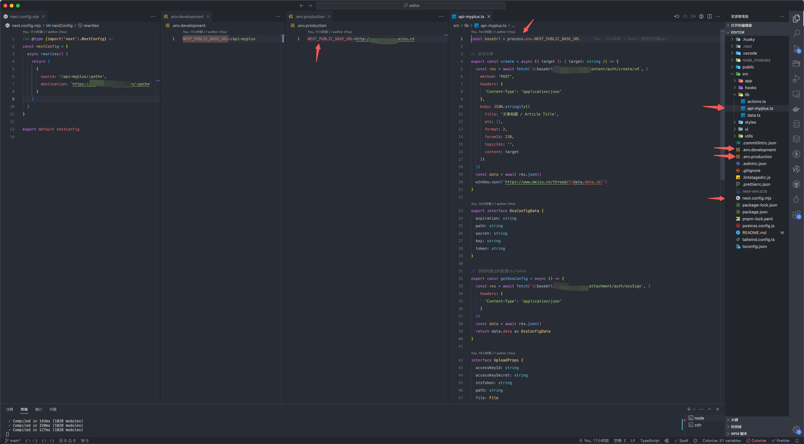
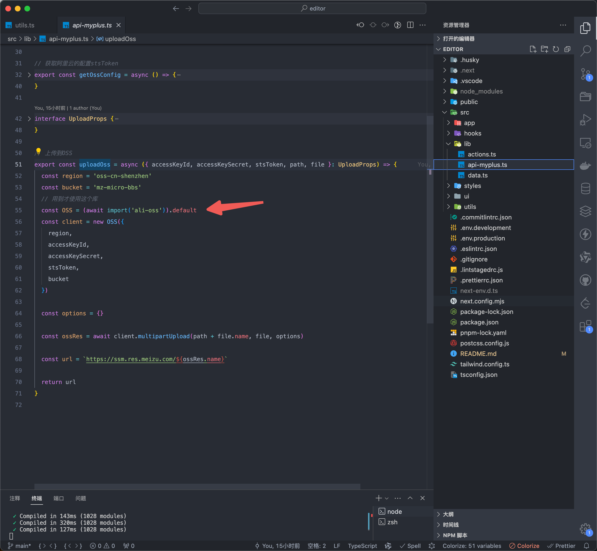
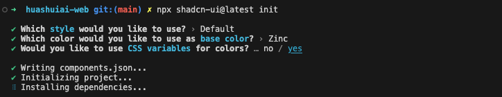

## 代理解决跨域



#### nextConfig 配置代理

```js
/** @type {import('next').NextConfig} */
const nextConfig = {
  async rewrites() {
    return [
      {
        source: '/api-myplus/:path*',
        destination: `https://xxx.com/:path*`
      }
    ]
  }
}

export default nextConfig
```

#### 配置环境变量

需要注意必须是开头带`NEXT_PUBLIC_`才能被访问

```js
NEXT_PUBLIC_BASE_URL=/api-myplus
```

#### 在接口地方引用

```js
const baseUrl = process.env.NEXT_PUBLIC_BASE_URL
```

## 动态引入 ali-oss



如果直接顶层使用`import OSS from 'ali-oss'`会使包的体积变大一倍，我们需要用到上传功能的时候才引入

```js
const OSS = (await import('ali-oss')).default
```

需要注意的是需要加`.default`

## 阿里云 `oss` 图片上传

官方文档：[OSS 对象存储](https://help.aliyun.com/zh/oss/user-guide/simple-upload?spm=a2c4g.11186623.0.0.65f86f4fRX1rhR#6ee9b6b0be6on) -> 操作步骤 -> 使用阿里云 SDK -> JavaScript

#### 上传图片

```js
// 上传图片
export const uploadImage = async (editor: Editor) => {
  const input = document.createElement('input')
  input.type = 'file'
  input.accept = 'image/*'
  input.onchange = async () => {
    if (input.files?.length) {
      const file = input.files[0]
      // 先获取阿里云配置
      const data = await getOssConfig()
      // 再上传到OSS
      const url = await uploadOss({
        accessKeyId: data.key,
        accessKeySecret: data.secret,
        stsToken: data.token,
        path: data.path,
        file
      })

      const reader = new FileReader()
      reader.readAsDataURL(file)
      reader.onloadend = function (e) {
        editor
          ?.chain()
          .focus()
          .setImage({
            // src: e.target?.result as string
            src: url
          })
          .run()
      }
    }
  }
  input.click()
}
```

#### 获取阿里云配置

```js
const baseUrl = process.env.NEXT_PUBLIC_BASE_URL

export interface OssConfigData {
  expiration: string
  path: string
  secret: string
  key: string
  token: string
}

export const getOssConfig = async () => {
  const res = await fetch(`${baseUrl}/myplus-qing/u/attachment/auth/ossSign`, {
    headers: {
      'Content-Type': 'application/json'
    }
  })
  const data = await res.json()
  return data.data as OssConfigData
}
```

#### 上传到阿里云

```js
interface UploadProps {
  accessKeyId: string
  accessKeySecret: string
  stsToken: string
  path: string
  file: File
}

// 上传到OSS
export const uploadOss = async ({ accessKeyId, accessKeySecret, stsToken, path, file }: UploadProps) => {
  const region = 'oss-cn-shenzhen'
  const bucket = 'mz-micro-bbs'
  // 用到才使用这个库
  const OSS = (await import('ali-oss')).default
  const client = new OSS({
    region,
    accessKeyId,
    accessKeySecret,
    stsToken,
    bucket
  })

  const options = {}

  const ossRes = await client.multipartUpload(path + file.name, file, options)

  const url = `https://ssm.res.meizu.com/${ossRes.name}`

  return url
}
```

## shadcn

#### 安装

```js
npx shadcn-ui@latest init
```



#### 使用

```js
npx shadcn-ui@latest add button
```

## middleware.ts 还遇到过两个坑

middleware.ts 放在 src 目录下（总之要和 app 一个目录，不一定是根目录）
直接写 NextResponse.redirect('/mobile') 会报错的（如下图），必须是绝对路径 NextResponse.redirect(url.origin + '/mobile')

## https://supabase.com/ 云数据库
