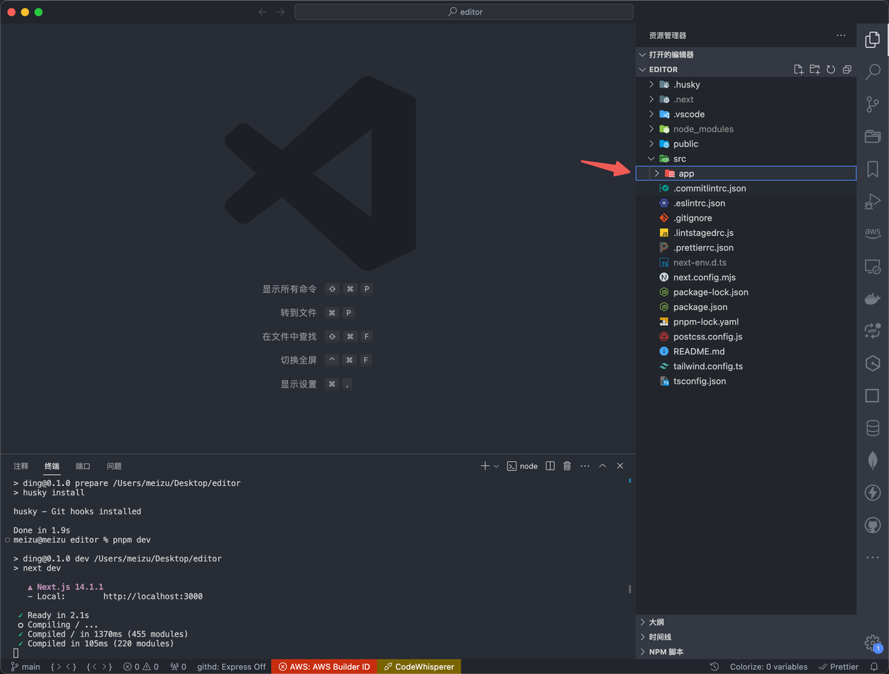
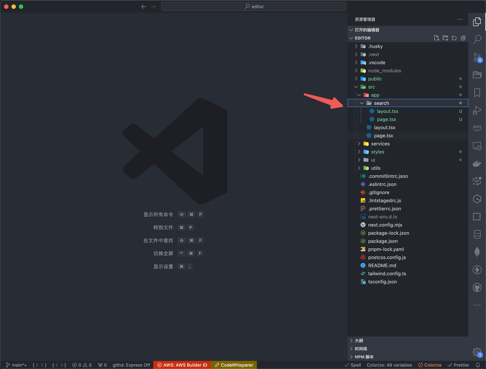
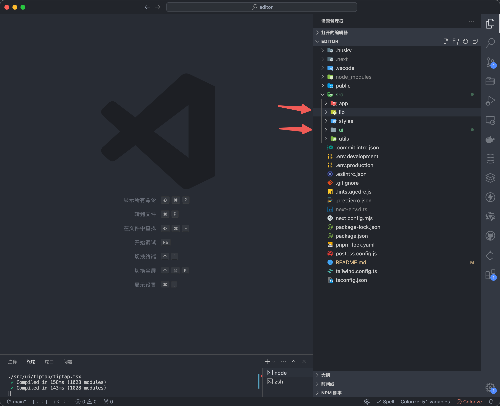
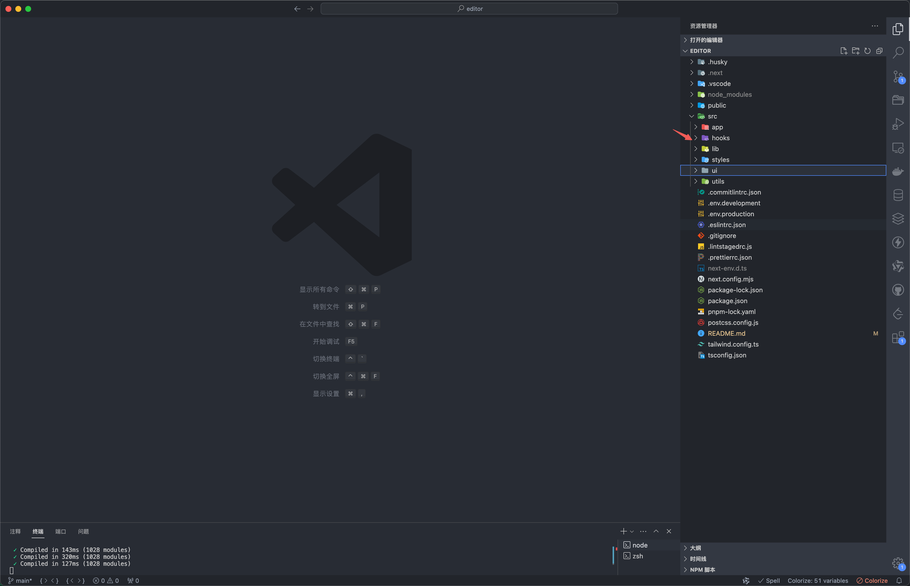

## 总结

基础配置，`eslint、prettier、lint-staged、husky、commitlint`，参考 [Nextjs 官网 - ESLint](https://nextjs.org/docs/app/building-your-application/configuring/eslint)

目录划分

- `middleware.ts` 需要和 `app` 同一层目录
- `lib` 目录，放公共的函数和 `actions.ts`（`server action`）
- `components`，拆分的组件，`shadcn` 的组件
- `hooks`，全局 `hook`
- `styles`，全局样式
- `.env.development` 和 `.env.production` 配置 `NEXT_PUBLIC_BASE_URL=xxx`

## 初始化

使用 `nextjs` 的脚手架 `create-next-app`，然后一路回车，记得选 `src` 目录

```js
npx create-next-app
```

创建后只有基础的架子，可以在项目加上一些工具

- eslint：检验代码错误，保证代码质量
- prettier：保存代码的时候格式化，统一代码风格
- lint-staged：增量式检查，只对修改了的文件做检查
- husky：用来触发 git hook；在 commit 的时候去触发校验
- commitlint：统一提交规范

其它：`.npmrc` 用于指定淘宝镜像，`package.json` 可以指定 `node` 版本（本文没有提到，可以自己随意）

## eslint

`create-next-app` 脚手架已经默认装了 `eslint`，并且还有一个 `eslint-config-next` 库，这个库在配置了`.eslint.json` 中的`"extends": "next/core-web-vitals"`就生效了

但是它的规范不是很严格，所以后续可以自己添加 `rules`，如下面在原来的基础上添加了一个没有用到的声明会报错

`eslint` 配置

```json
{
  "extends": ["next/core-web-vitals", "prettier"],
  "rules": {
    "no-var": "error",
    "no-unused-vars": ["error", { "varsIgnorePattern": ".*", "args": "none" }]
  }
}
```

并且在`tsconfig.json` 中需要添加`"noUnusedLocals": true`规则，和上面的`no-unused-vars`配合使用;因为 ts 声明函数参数的时候，参数可能不会用到，这个合法的操作，但是`eslint` 不允许，所以需要添加这个规则。

## prettier

虽然新版 `eslint` 在初始化的时候，也就是 `eslint --init` 初始化配置文件的时候，可以选择不处理风格，让 `prettier` 去处理，已经可以和 `prettier` 互不影响了；但官网目前还是让我们使用 `eslint-config-prettier` 来避免冲突

```js
pnpm i -D prettier eslint-config-prettier prettier-plugin-tailwindcss
```

配置.prettierrc.json

```json
{
  "singleQuote": true,
  "semi": false,
  "trailingComma": "none",
  "tabWidth": 2,
  "plugins": ["prettier-plugin-tailwindcss"],
  "printWidth": 120
}
```

## lint-staged

```js
pnpm i -D lint-staged
```

配置.lintstagedrc.js

```js
const path = require('path')

const buildEslintCommand = (filenames) =>
  `next lint --fix --file ${filenames
    .map((f) => path.relative(process.cwd(), f))
    .join(' --file ')}`

module.exports = {
  '*.{js,jsx,ts,tsx}': [buildEslintCommand]
}
```

## husky

记得要初始化一个 `git` `仓库，husky` 能执行 `git hook`，在 `commit` 的时候对文件进行操作

```js
sudo pnpm dlx husky-init
```

```js
pnpm install
```

```js
npx husky add .husky/commit-msg 'npx --no -- commitlint --edit "$1"'
```

```js
npx husky add .husky/pre-commit "npm run lint-staged"
```

## commitlint

配置`.lintstagedrc.js`

```js
const path = require('path')

const buildEslintCommand = (filenames) =>
  `next lint --fix --file ${filenames
    .map((f) => path.relative(process.cwd(), f))
    .join(' --file ')}`

module.exports = {
  '*.{js,jsx,ts,tsx}': [buildEslintCommand]
}
```

## src 目录



为什么选择 `src` 目录，而不是直接 `app` 目录?
因为 `src` 结合 `app` 目录会更好，`app` 目录只负责展示路由，这样就不会和别的类型的文件混淆，而且文件全都在 `src` 下了

## app 目录



所以我们的 `app` 目录全是这样子，对应着路由页面，清晰很多，其它组件逻辑在`ui`里

## 其它目录划分



- styles 目录：放样式相关的文件
- utils 目录：放方法相关的文件
- components 目录：放组件相关的文件
- lib 目录：请求和数据相关文件，如果是全栈开发，`lib` 里面还可以放 `server actions` 相关文件

## hooks 划分



`hooks` 应该划分为业务 `hook` 和通用 `hook`，通用 `hooks` 放在 `app` 同级，业务 `hook` 放在用到的文件同级

同理，还可以创建一个`config`，放静态数据
