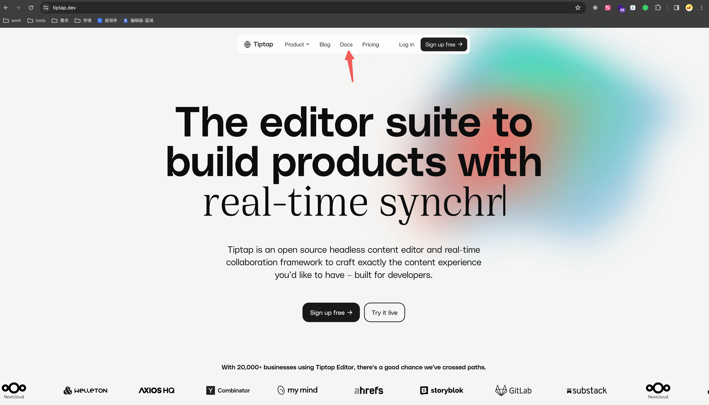
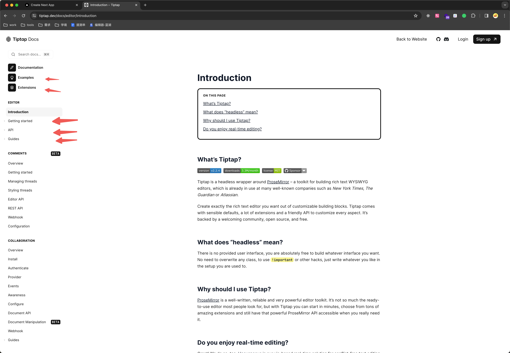
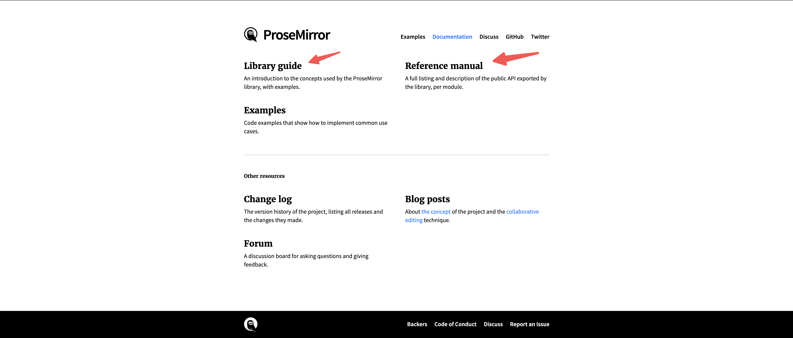

## 总结

- 复用性
- 开发体验，上手成本
- 拓展性
- 性能
- 生态，社区活跃度
- [block-editor](https://juejin.cn/post/6891840180198735886)

## 编辑器演示

我为 `KFC` 代盐

## 编辑器技术选型

从复用性/性能/开发体验/可维护性/可拓展性来看，`tiptap` 都是很好的选择

<iframe src="https://editor-tiptap.netlify.app/1" width="100%" height="390px"></iframe>

可通过键盘上下左右切换 `PPT`

## 阅读 Tiptap 官网

#### 首页

- `Product` 里是 `tiptap` 几个厉害的功能(AI、协同、评论)，是收费的，可以登陆它的云平台然后付费使用
- `Blog` 是一些更新功能的博客
- `Docs` 文档是我们需要关心的 ✅
- `Pricing` 是价格相关

#### Docs 页

`Docs` 里面关心这里好几个地方就行了，下面的都是些要米的功能，可以自己开发
[examples](https://tiptap.dev/docs/editor/examples/default) 和 [extensions](https://tiptap.dev/docs/editor/extensions)这两个是重点，里面很多`Demo`让我们开箱即用

#### 可参考的库

官方开源编辑器：[tiptap template](https://github.com/ueberdosis/tiptap-templates)，[在线地址](https://templates.tiptap.dev/NjcK7n99HF)

社区开源编辑器：[novel](https://github.com/steven-tey/novel)，[在线地址](https://novel.sh/)

## 阅读 prosemirror 官网

做一些功能的时候，tiptap 的文档可能没有那么全，也需要了解下 `prosemirror`

主要看这两部分，[Library guide](https://prosemirror.net/docs/guide/)为一些概念里面有一些 `demo`，[Reference manual](https://prosemirror.net/docs/ref/)为完整 `API` 说明

`prosemirror`有四个基本模块，这些模块是进行任何编辑所必需的

- prosemirror-model：定义编辑器的文档模型，即用于描述编辑器内容的数据结构
- prosemirror-state：prosemirror-state 提供描述编辑器整个状态的数据结构，包括选择，以及用于从一个状态移动到下一个状态的事务系统
- prosemirror-view：实现一个用户界面组件，该组件将给定的编辑器状态显示为浏览器中的可编辑元素，并处理用户与该元素的交互
- prosemirror-transform：包含以可记录和重放的方式修改文档的功能，这是 state 模块中事务的基础，并使撤消历史记录和协作编辑成为可能
