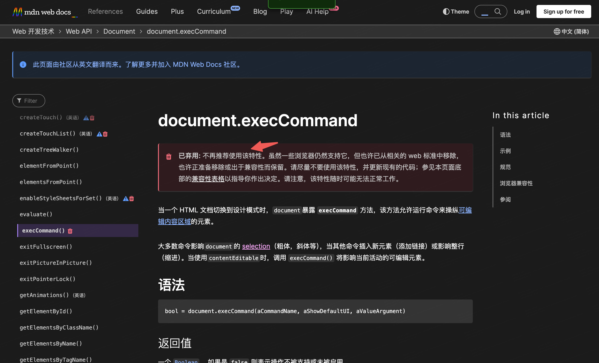
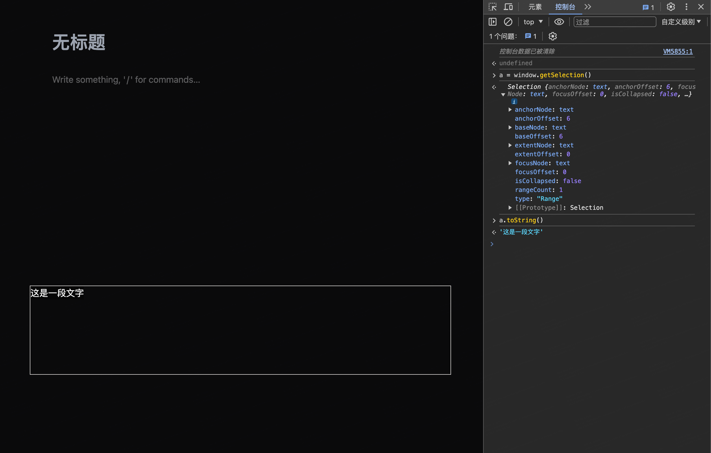
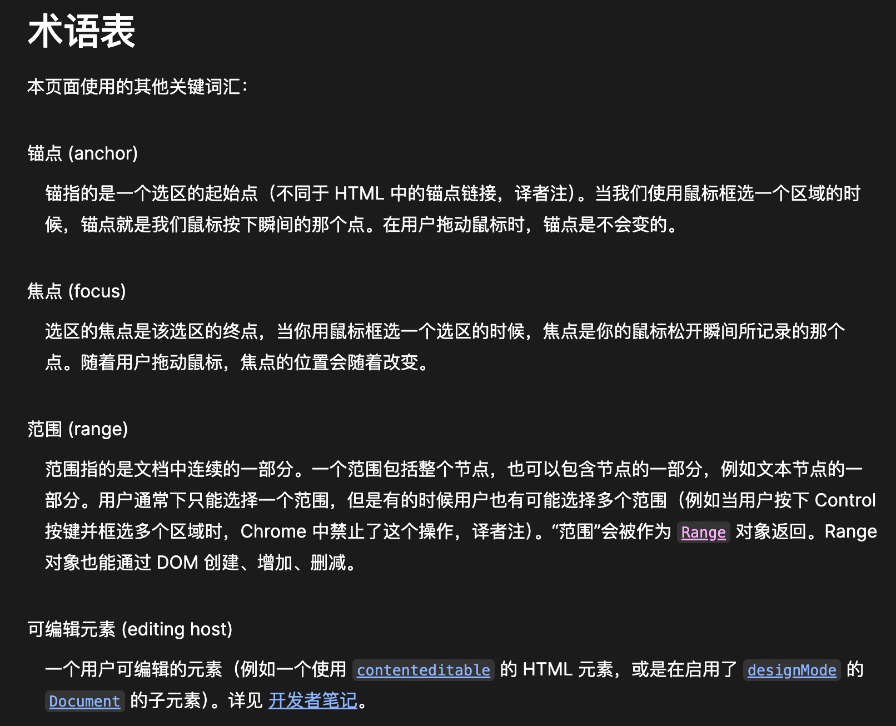
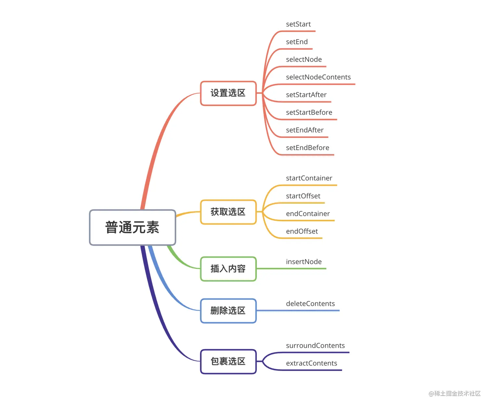

## [document.execCommand](https://developer.mozilla.org/zh-CN/docs/Web/API/Document/execCommand)



`document.execCommand` 是一个已弃用的 API，它也是操作 `selection` 实现编辑器功能，`document.execCommand`可以不学，但是 `selection` 和 `range` 需要学习

```js
// 加粗
document.execCommand('bold', false, null)
```

## [Selection](https://developer.mozilla.org/zh-CN/docs/Web/API/Selection)

`selection` 表示页面中的文本选区，由页面拖拽鼠标经过文字产生，要检查或者修改 `selection` 对象用 `window.getSelection()`

`isCollapsed` 为 `true` 表示选区为空，`false` 表示选区不为空，`toString` 方法可以获取选区中的文本



```js
const selObj = window.getSelection() //选区
const range = selObj.getRangeAt(0) //选区有多个Range范围,我们常常是操作第一个
```

## anchor 和 focus



对于 `anchorOffset` 与 `focusOffset` ，他们的计算方式都是从**左到右**（是当前标签的开始位置而不是选中的也不是整段文本的）计算到选区的边界，总共有多少个字符

## [Range](https://developer.mozilla.org/zh-CN/docs/Web/API/Range)

`Range` 可以有多个，`Selection` 对象的 `rangeCount`可以知道有多少个，`getRangeAt` 方法可以获取第几个，一般`selObj.getRangeAt(0)`

## 设置光标的位置

`sel.collapse(parentNode, offset);`

参考[点亮富文本编辑器的魔力：Selection 与 Range 解密](https://juejin.cn/post/7284545971609305145)、[Web 中的“选区”和“光标”](https://juejin.cn/post/7068232010304585741#heading-7)

建议传入的 `parentNode` 是 文本节点，此时 `offset` 对应文本字符数量，否则，`offset` 对应的是 `parentNode` 中 `Node` 节点的数量，不好把控。也就是说如果传入的是 p，则里面的节点有 `textNode strong em`，三个

```js
<div className="h-40 w-full border border-stone-300" contentEditable>
  <p>
    段落段落段落
    <strong>加粗加粗加粗</strong>
    <em>斜体斜体斜体</em>
  </p>
</div>
<Button
  onClick={() => {
    const selection = window.getSelection()
    if (!selection) return
    const italics = document.getElementsByTagName('em')
    selection.collapse(italics[0].firstChild, 2)//或者setPosition
  }}
>
  设置光标位置
</Button>
```


