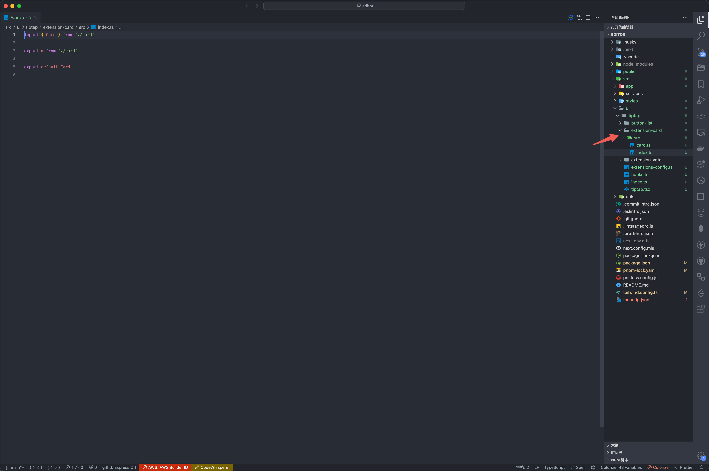

# 编辑器开发规范（项目开发规范）

- 项目初始化
- 项目目录结构
- 优雅的开发 editor

# 三、优雅的开发 editor

## editor 组件划分


编辑器组件为 `TipTap`，客户端组件，核心逻辑在`src/ui/tiptap/tiptap.tsx`

## 初始化 editor 和逻辑拆分

```js
pnpm install @tiptap/react @tiptap/pm @tiptap/starter-kit
```

先写进`tiptap.tsx`

```js
'use client'

import { useEditor, EditorContent } from '@tiptap/react'
import StarterKit from '@tiptap/starter-kit'

const Tiptap = () => {
  const editor = useEditor({
    extensions: [StarterKit],
    content: '<p>Hello World! 🌎️</p>'
  })

  return <EditorContent editor={editor} />
}

export default Tiptap
```

但是这样随着方法逻辑越来越多，导致组件变得臃肿，所以拆分一下

当前目录下新建 `hooks.ts`

```js
import { useEditor } from '@tiptap/react'
import StarterKit from '@tiptap/starter-kit'

export const useInitEditor = () => {
  const editor = useEditor({
    extensions: [StarterKit],
    content: '<p>Hello World! 🌎️</p>'
  })

  return editor
}
```

然后`tiptap` 里引用这个`hook`

```js
'use client'

import { EditorContent } from '@tiptap/react'
import { useInitEditor } from './hooks'

const Tiptap = () => {
  const editor = useInitEditor()

  return <EditorContent editor={editor} />
}

export default Tiptap
```

结果是这样


## 社区开源插件 config 拆分

`StarterKit`是一个入门套件，里面包含了很多编辑器基础插件，这些插件都可以传入配置，所以这里把配置抽离出来

修改 `hooks.ts`

```js
import { useEditor } from '@tiptap/react'
import { extensionsConfig } from './extensions-config'

export const useInitEditor = () => {
  const editor = useEditor({
    extensions: [...extensionsConfig],
    content: '<p>Hello World! 🌎️</p>'
  })

  return editor
}
```

新增`extensions-config.ts`

```js
import StarterKit from '@tiptap/starter-kit'

export const extensionsConfig = [
  StarterKit.configure({
    blockquote: {
      HTMLAttributes: {
        class: 'border-l-4 border-stone-700'
      }
    },
    bold: {
      HTMLAttributes: {
        class: 'font-bold'
      }
    },
    heading: {
      levels: [1, 2, 3]
    },
    horizontalRule: {
      HTMLAttributes: {
        class: 'my-[20px]'
      }
    }
  })
]
```

结果是这样


## 页面组件拆分

但我们在组件里加按钮的时候，可能是这样，直接写进`tiptap.tsx`，组件越多越臃肿

```js
'use client'

import { EditorContent } from '@tiptap/react'
import { useInitEditor } from './hooks'

const Tiptap = () => {
  const editor = useInitEditor()
  if (!editor) return
  return (
    <div>
      <button
        onClick={() => editor.chain().focus().toggleItalic().run()}
        disabled={!editor.can().chain().focus().toggleItalic().run()}
        className={editor.isActive('italic') ? 'is-active' : ''}
      >
        italic(⌘ + I)
      </button>
      <EditorContent editor={editor} />
    </div>
  )
}

export default Tiptap
```

所以拆分一下，并且 `TS` 也拆分一下，减少臃肿，是这样：


# 四、自定义插件开发

## 目录结构

在之前的基础上要下载这个包：`pnpm i @tiptap/core`

参考官方插件，使用这样的目录，这样的好处是后续稳定后能单独发布插件来复用



## Node 和 Mark
