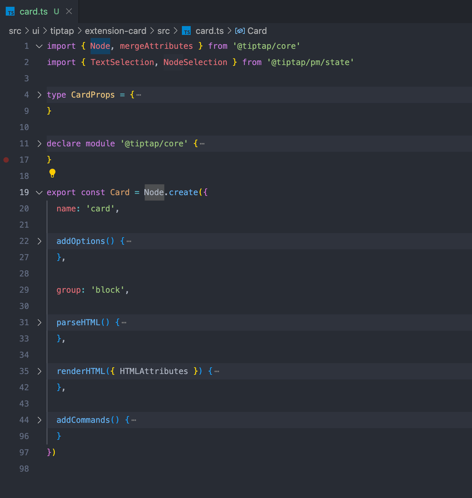
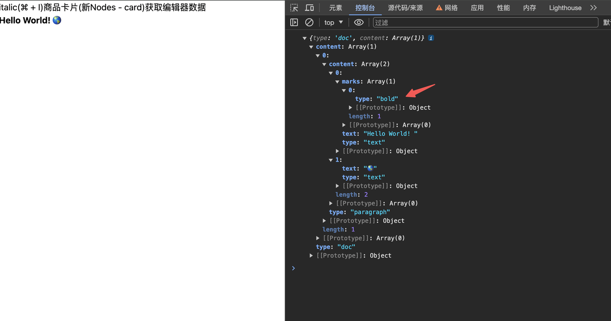
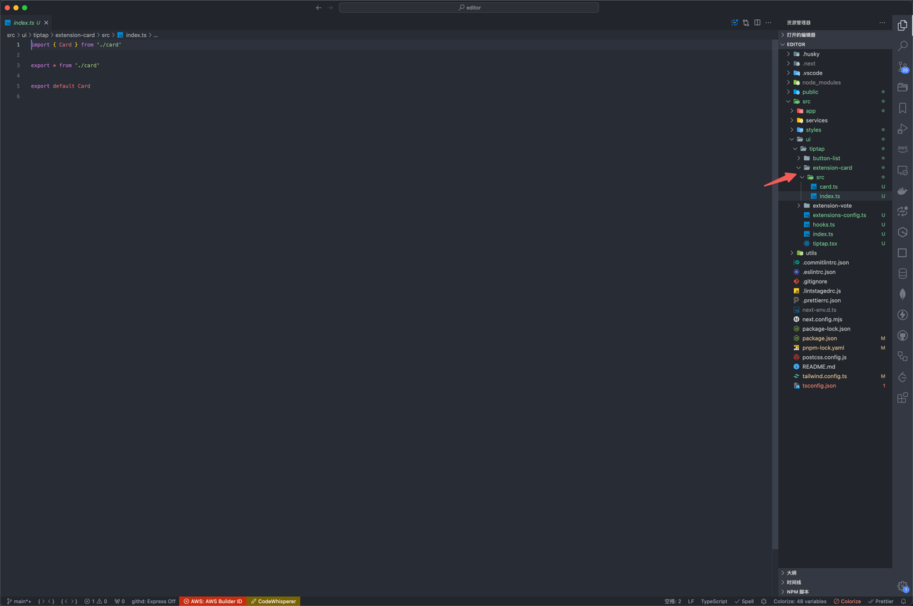

<!-- ## 总结

[复制一个 Card 插件快速开发](http://localhost:5173/editor/tiptap-plugin.html#%E8%87%AA%E5%AE%9A%E4%B9%89%E4%B8%80%E4%B8%AA%E5%8D%A1%E7%89%87%E6%8F%92%E4%BB%B6) -->

## 前言

> 参考：
>
> 官网文档：[custom-extensions](https://tiptap.dev/docs/editor/guide/custom-extensions)
>
> 官方开源编辑器：[tiptap template](https://github.com/ueberdosis/tiptap-templates)
>
> 社区开源编辑器：[novel](https://github.com/steven-tey/novel)
>
> 文中只包含核心配置，插件开发有很多细节和 api，可以在开发中学习

```md
Node 参考 Paragraph 、 Heading、 CodeBlock 或 horizontal-rule 源码，Mark 参考 Bold 、 Italic 和 Highlight 源码。
我们写的插件（投票报名商品卡片）更贴近 Node 的 horizontal-rule
官网的文档写得不清晰，只有多试和看源码
```

## 总览

核心有这六个配置



## Node 和 Mark

- `Mark` 可以应用于节点，例如内联格式
- `Node` 是一种内容类型，例如标题或段落
  可以看到这个插件是 `Node.create` 创建的，对应的是 `Mark`
  可以理解为 `Node` 对应的是块级节点，`Mark` 对应行内节点(当然不一定，但是这样好理解)

## name

第一个`name`是一个标识，也就是 `type`，如下获取数据的时候



## addOptions

保存数据的地方，后面可以用 `this.options.xxx` 来注入数据，获取数据，像 `vue` 的`data`
注入数据：比如要依赖输入的 `title` 来显示插件，通常在 `renderHTML` 的时候
获取数据：通常在 `addCommands` 的时候

```js
  addOptions() {
    return {
      HTMLAttributes: {},
      cardData: {}
    }
  }
```

还能通过插件配置的时候传入数据

```js
Card.configure({
  HTMLAttributes: {
    class: 'w-[708px] h-[40px] border border-[#ff4132]'
  }
})
```

## group

`group: 'block'`指定为块级元素，`Node` 模块一定要加，否则会不显示

## parseHTML

要解析的 DOM，也就是遇到 div 就尝试解析为我们定义的插件

```js
  parseHTML() {
    return [{ tag: 'div' }]
  }
```

## renderHTML

与`parseHTML`对应，是要渲染的内容，是树型结构，第一个参数是类型，第二个参数是`props`，第三个参数为`children`

```js
  renderHTML({ HTMLAttributes }) {
    const { title } = this.options.cardData
    return [
      'div',
      mergeAttributes(this.options.HTMLAttributes, HTMLAttributes),
      ['div', { class: 'text-[16px] font-bold text-[#ff4132]' }, title]
    ]
  }
```

## addCommands

`Command` 命令，在编辑器内执行一个操作，以某种方式改变状态，返回的对象是暴露出去用的函数，并且函数的返回值是做链式调用

```js
addCommands() {
    return {
      setCard:
        (props: CardProps) =>
        ({ chain, state }) => {
          this.options.cardData = props
          const currentChain = chain() // 创建一个新的命令链
          const { $to: $originTo } = state.selection
          // 检查光标是否在文档的开头
          if ($originTo.parentOffset === 0) {
            // 如果是，将分割线插入到文档开头的前两个位置
            currentChain.insertContentAt(Math.max($originTo.pos - 2, 0), {
              type: this.name
            })
          } else {
            // 如果不是，在光标处插入分割线
            currentChain.insertContent({
              type: this.name
            })
          }
          return currentChain
            .command(({ tr, dispatch }) => {
              if (dispatch) {
                const { $to } = tr.selection
                const posAfter = $to.end()
                if ($to.nodeAfter) {
                  if ($to.nodeAfter.isTextblock) {
                    tr.setSelection(TextSelection.create(tr.doc, $to.pos + 1))
                  } else if ($to.nodeAfter.isBlock) {
                    tr.setSelection(NodeSelection.create(tr.doc, $to.pos))
                  } else {
                    tr.setSelection(TextSelection.create(tr.doc, $to.pos))
                  }
                } else {
                  const node = $to.parent.type.contentMatch.defaultType?.create()
                  if (node) {
                    tr.insert(posAfter, node)
                    tr.setSelection(TextSelection.create(tr.doc, posAfter))
                  }
                }
                tr.scrollIntoView()
              }
              return true
            })
            .run()
        }
    }
  }
```

## 自定义一个卡片插件

在之前的基础上要下载这个包：`pnpm i @tiptap/core`，参考官方插件，使用这样的目录，这样的好处是后续稳定后能单独发布插件来复用



#### card.ts

```js
import { Node, mergeAttributes } from '@tiptap/core'
import { TextSelection, NodeSelection } from '@tiptap/pm/state'

type CardProps = {
  title: string
  subTitle: string
  price: string
  img: string
}

declare module '@tiptap/core' {
  interface Commands<ReturnType> {
    card: {
      setCard: (props: CardProps) => ReturnType
    }
  }
}

export const Card = Node.create({
  name: 'card',

  addOptions() {
    return {
      HTMLAttributes: {},
      cardData: {}
    }
  },

  group: 'block',

  parseHTML() {
    return [{ tag: 'div' }]
  },

  renderHTML({ HTMLAttributes }) {
    const { title } = this.options.cardData
    return [
      'div',
      mergeAttributes(this.options.HTMLAttributes, HTMLAttributes),
      ['div', { class: 'text-[16px] font-bold text-[#ff4132]' }, title]
    ]
  },

  addCommands() {
    return {
      setCard:
        (props: CardProps) =>
        ({ chain, state }) => {
          this.options.cardData = props
          const currentChain = chain()
          const { $to: $originTo } = state.selection
          if ($originTo.parentOffset === 0) {
            currentChain.insertContentAt(Math.max($originTo.pos - 2, 0), {
              type: this.name
            })
          } else {
            currentChain.insertContent({
              type: this.name
            })
          }

          return currentChain
            .command(({ tr, dispatch }) => {
              if (dispatch) {
                const { $to } = tr.selection
                const posAfter = $to.end()
                if ($to.nodeAfter) {
                  if ($to.nodeAfter.isTextblock) {
                    tr.setSelection(TextSelection.create(tr.doc, $to.pos + 1))
                  } else if ($to.nodeAfter.isBlock) {
                    tr.setSelection(NodeSelection.create(tr.doc, $to.pos))
                  } else {
                    tr.setSelection(TextSelection.create(tr.doc, $to.pos))
                  }
                } else {
                  const node = $to.parent.type.contentMatch.defaultType?.create()
                  if (node) {
                    tr.insert(posAfter, node)
                    tr.setSelection(TextSelection.create(tr.doc, posAfter))
                  }
                }
                tr.scrollIntoView()
              }

              return true
            })
            .run()
        }
    }
  }
})
```

#### extensions

注入插件

```js
import StarterKit from '@tiptap/starter-kit'
import Card from './extension-card/src'

export const extensionsConfig = [
  StarterKit.configure({
    blockquote: {
      HTMLAttributes: {
        class: 'border-l-4 border-stone-700'
      }
    },
    bold: {
      HTMLAttributes: {
        class: 'font-bold'
      }
    },
    heading: {
      levels: [1, 2, 3]
    },
    horizontalRule: {
      HTMLAttributes: {
        class: 'my-[20px]'
      }
    }
  }),
  Card.configure({
    HTMLAttributes: {
      class: 'w-[708px] h-[40px] border border-[#ff4132]'
    }
  })
]
```

#### 在页面使用

```jsx
<button
  onClick={() =>
    editor
      .chain()
      .focus()
      .setCard({
        title: 'title',
        subTitle: 'subTitle',
        price: '价格',
        img: '图片'
      })
      .run()
  }
  className="outline-none"
>
  商品卡片(新Nodes - card)
</button>
```
