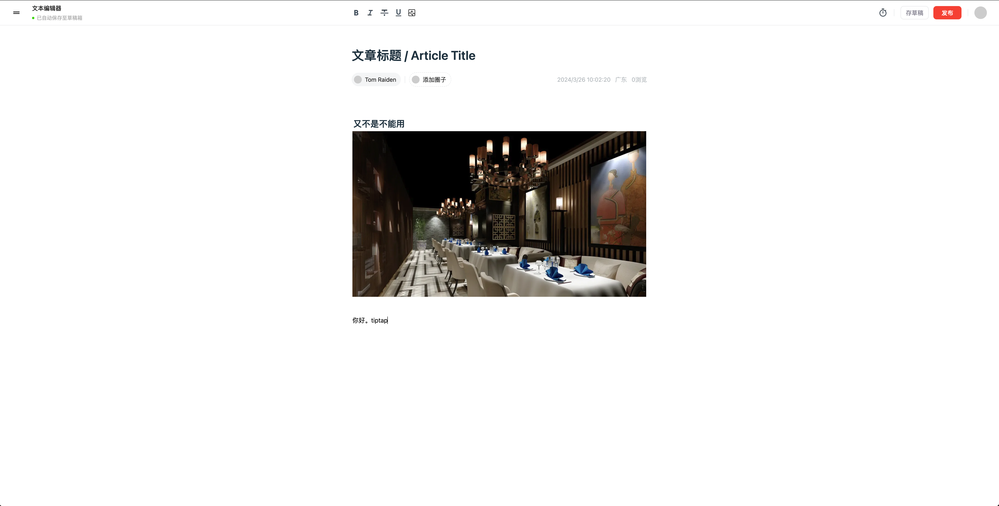
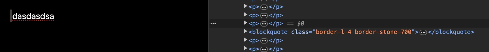
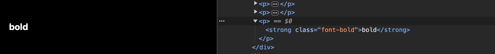
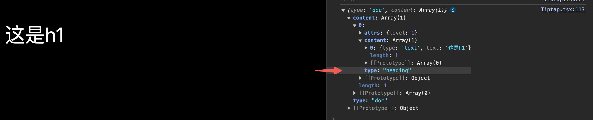

> 认识 tiptap，它的 headless，大量的官方 demo/extensions 等

## why tiptap？

`tiptap` 解决我的问题，概念清晰，有很多 `demo，extension`，能让我快速完成开发工作，基于 tiptap 实现了一款类似`notion`的编辑器



## headless

`tiptap` 支持自由控制页面样式，它自己本身没有样式只提供逻辑，比如自定义类





通过配置插件 [@tiptap/starter-kit](https://tiptap.dev/docs/editor/api/extensions/starter-kit) `HTMLAttributes`，别的插件同理

```js
import StarterKit from '@tiptap/starter-kit'

export const defaultExtensions = [
  StarterKit.configure({
    blockquote: {
      HTMLAttributes: {
        class: 'border-l-4 border-stone-700'
      }
    },
    bold: {
      HTMLAttributes: {
        class: 'font-bold'
      }
    }
  })
]
```

## 生态成熟

1. 有很多开箱即用的拓展，可以减少大量开发时间：https://tiptap.dev/docs/editor/extensions

2. 它还有个 `StarterKit` 入门套件，把常用拓展封装到一起，这样我们使用的时候节省了很多代码，也可以去修改这些拓展

```js
import { Editor } from '@tiptap/core'
import StarterKit from '@tiptap/starter-kit'

const editor = new Editor({
  content: '<p>Example Text</p>',
  extensions: [
    StarterKit.configure({
      history: false, //协同的时候需要禁用history
      heading: {
        levels: [1, 2]
      }
    })
  ]
})
```

3. 另外它属于商业开源库，有自己的公司和团队，有些 `pro` 插件和它的云看板需要收费。这些收费功能也可以自己开发。这种开源项目和 `WangEditor` 个人项目不同，会持续维护。

## 使用已有插件

比如一个分割线插件，只需要很少的步骤就可使用，可以在 [examples](https://tiptap.dev/docs/editor/examples/default) 找到大部分功能

下载和配置

```js
import HorizontalRule from './horizontalRule'

const editor = useEditor({
  extensions: [HorizontalRule],
  content: '<p>Hello World! </p>',
  // 可以传入编辑器里
  editorProps: {
    attributes: {
      class:
        'prose dark:prose-invert prose-sm sm:prose-base lg:prose-lg xl:prose-2xl m-5 focus:outline-none'
    }
  }
})
```

使用

```js
<button onClick={() => editor.chain().focus().setHorizontalRule().run()}>
  horizontal rule
</button>
```

```js
editor 是一个 Tiptap 实例；
chain() 用于告诉编辑器要执行多个命令；
focus() 将焦点设置回编辑器，（这样用户编辑的光标就不会中断）；
setHorizontalRule() 指定对应插件功能；
run() 执行。
```

还能记住是否已经触发过某种状态

```js
className={editor.isActive('bold') ? 'is-active' : ''}
```

## 自定义插件

写一个自定义的插件，可以参考 https://tiptap.dev/docs/editor/guide/custom-extensions

## read-only

所见即所得，也可以自己写渲染代码

```js
import { EditorContent, useEditor } from '@tiptap/react'
import StarterKit from '@tiptap/starter-kit'
import React, { useEffect, useState } from 'react'

export default () => {
  const [editable, setEditable] = useState(false)
  const editor = useEditor({
    editable,
    content: `
        <p>
          This text is <strong>read-only</strong>. No matter what you try, you are not able to edit something. Okay, if you toggle the checkbox above you’ll be able to edit the text.
        </p>
        <p>
          If you want to check the state, you can call <code>editor.isEditable()</code>.
        </p>
      `,
    extensions: [StarterKit]
  })

  useEffect(() => {
    if (!editor) {
      return undefined
    }

    editor.setEditable(editable)
  }, [editor, editable])

  if (!editor) {
    return null
  }

  return (
    <>
      <div className="checkbox">
        <input
          type="checkbox"
          id="editable"
          value={editable}
          onChange={(event) => setEditable(event.target.checked)}
        />
        <label htmlFor="editable">editable</label>
      </div>
      <EditorContent editor={editor} />
    </>
  )
}
```

## 获取编辑器数据

```js
editor.getJSON().content
```

## 监听编辑器变化

可以自动保存草稿

```js
const CustomExtension = Extension.create({
  onCreate() {
    // The editor is ready.
  },
  onUpdate() {
    // The content has changed.
  },
  onSelectionUpdate({ editor }) {
    // The selection has changed.
  },
  onTransaction({ transaction }) {
    // The editor state has changed.
  },
  onFocus({ event }) {
    // The editor is focused.
  },
  onBlur({ event }) {
    // The editor isn’t focused anymore.
  },
  onDestroy() {
    // The editor is being destroyed.
  }
})
```

或者

```js
editor.on('update', () => {
  // 字数实时统计
  const wordCount = editor.getText().length
})
```

## nodes、marks

**nodes**：节点大部分是块级元素，如 `h1`，不同的 `JSON` 的 `type` 字段，文本是`"paragraph"`，`h1` 是`"heading"（attrs:level:）`，可以套娃



**marks**：可以将一个或多个标记应用于节点，例如添加粗体和斜体等内联格式或其他附加信息。就是一个标记，和 `type` 同级的，像 `props`，在 `content > marks` 里标记


## 可参考资料

- [novel](https://github.com/steven-tey/novel)，在线 [Demo](https://novel.sh/) 地址
- [tittap template](https://github.com/ueberdosis/tiptap-templates)，在线 [Demo](https://templates.tiptap.dev/NTFHDfnbFd) 地址
- [BlockNote](https://github.com/TypeCellOS/BlockNote)
- [think](https://github.com/fantasticit/think)

## 一些思考

1. 从复用性/性能/开发体验（易上手）/健壮性（规范且可维护）/可拓展性来看，tiptap 都是很好的选择
2. `tiptap` 插件使用清晰，插件开箱即用，能减少大量开发时间
3. 它想法很好，它有个入门套件，叫，可以通过 `starterKit` 一个插件就能把常用功能覆盖掉，而且也支持修改这些常用功能，减少了很大一部分代码
4. 封装的一些方法和拓展，符合函数式编程思想，比如操作按钮支持 `bold` 功能，可以去看它的 `example`，或者去看它拓展插件，可以快速实现该功能，而且仅仅是函数调用的方式（清晰优雅）
5. 一些细节也到位，比如 `focus`，不阻止用户输入，自定义样式 `headless`，自定义输出等，协同也支持，不过用不上
