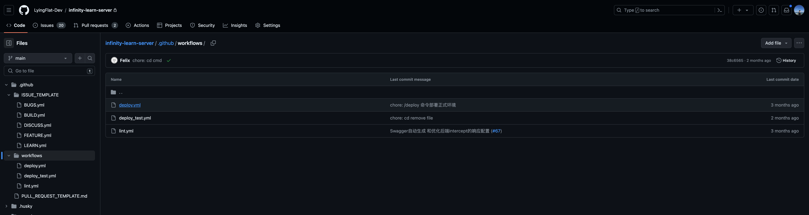

## Github issues

- `issues` 一个页面一个问题，不叉其他话题。无论多少人回复了多少条，都是关于这个问题的；而且上下文是有关联的，哪怕你是新来的，通过上下文也能看出它的历史过程。而微信群里一个群可以聊很多话题，明天想回顾一下问题，翻看聊天记录都翻好几百条，都不一定能找到。

- `issues` 天然就是一个问题列表或集合，并且会持续积累，再遇到重复问题可以再这里搜索找到。而微信群，都是一次性的提问和答复，遇到重复问题只能再问一遍。

- `issues` 的提问和回复都是非常正式的，着就像写信和回复邮件一样，都是想好了再统一回复的，信息特别整体。而微信群里信息过于零散、断句，上来先问“在吗？”，还有各种表情包。

## issues template

`ISSUE_TEMPLATE/BUGS.yml`
