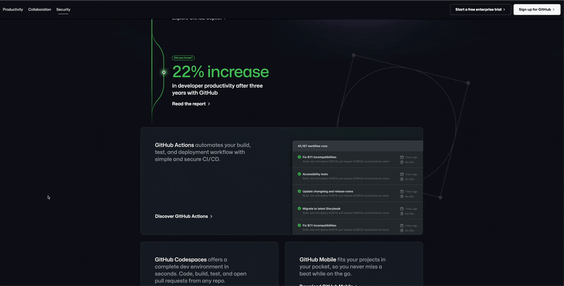
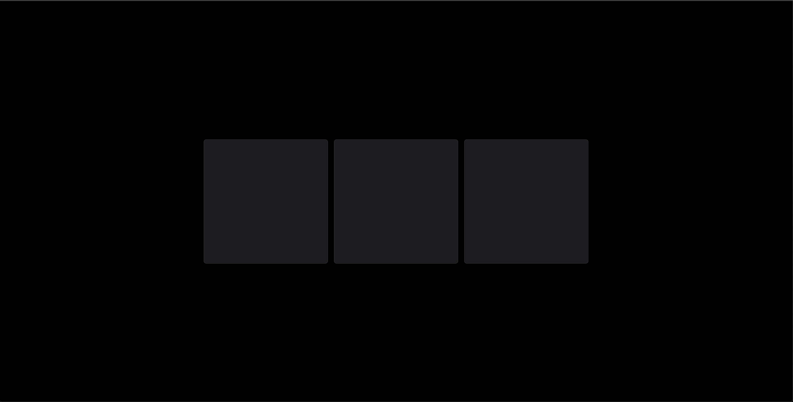
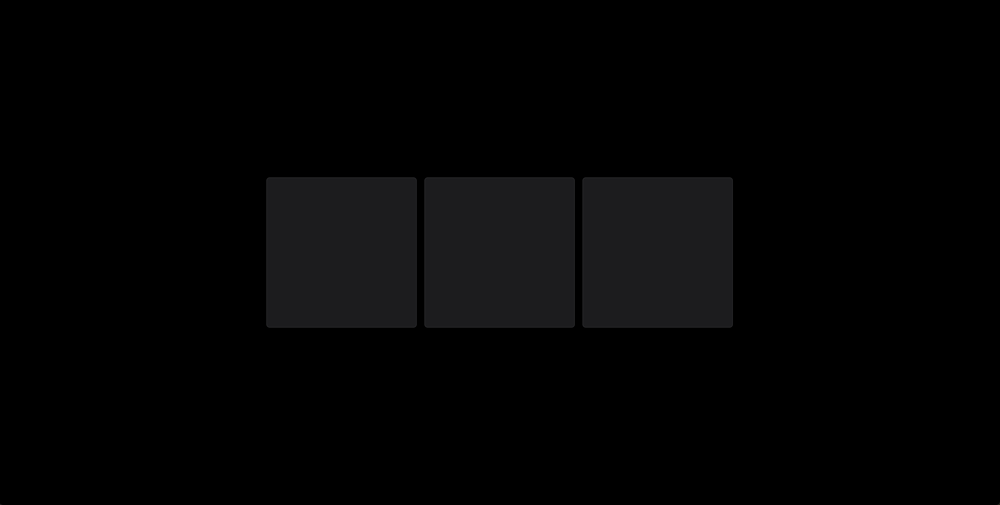
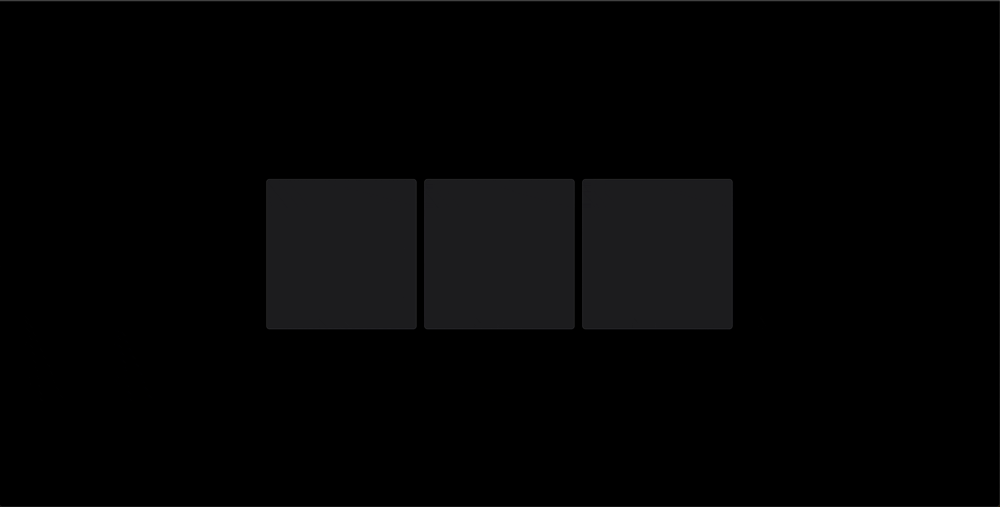
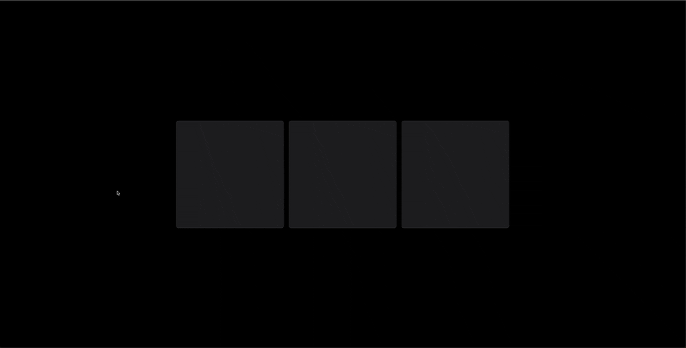

## 🚀🚀 手摸手开发一个很 🔥 的卡片效果

最近掘金在大力推广[扣子](https://www.coze.cn/)这个 AI 平台，可以看到它首页的卡片效果还是很酷炫的；大致包含两个效果，光的跟随效果还有卡片倾斜像 `3D` 的效果


`github` 在你没有登录的时候，首页也有这样一个卡片效果



我们也来实现一下，写一个这样的效果



## 先准备三个盒子

这里用的`react`组件和`tailwind`来写样式，盒子不管你怎么写，但是得有 `relative` 定位，因为光需要用定位来跟随

```jsx
export default function Home() {
  return (
    <main className="min-h-screen p-24 flex justify-center items-center bg-black gap-5">
      <div className="w-[384px] h-[384px] flex-center flex-col rounded-lg border border-[rgba(255,255,255,0.1)] bg-[#1C1C1F]"></div>
      <div className="w-[384px] h-[384px] flex-center flex-col rounded-lg border border-[rgba(255,255,255,0.1)] bg-[#1C1C1F]"></div>
      <div className="w-[384px] h-[384px] flex-center flex-col rounded-lg border border-[rgba(255,255,255,0.1)] bg-[#1C1C1F]"></div>
    </main>
  )
}
```



## 实现光源跟随效果

1、需要监听盒子上的 mouseMove 事件和 mouseLeave 事件，进入的时候显示光源并计算随鼠标滚动的位置

2、需要注意光源不能挡住元素上面的位置，所以要设置低一点的层级

3、光源的模糊效果可以用`filter:blur(100px)`实现

```js
'use client'
import { useRef, useState } from 'react'

export default function Home() {
  const cardRef = (useRef < HTMLDivElement) | (null > null) //卡片
  const lightRef = (useRef < HTMLDivElement) | (null > null) //光源
  const [isShowLight, setIsShowLight] = useState(false) //是否显示光源
  // 光源随鼠标移动
  const [pos, setPos] = useState({
    left: '0px',
    top: '0px'
  })

  return (
    <main className="h-screen p-24 flex justify-center items-center bg-black gap-5">
      <div
        className="w-[384px] h-[384px] flex-center flex-col rounded-lg border border-[rgba(255,255,255,0.1)] bg-[#1C1C1F] relative overflow-hidden"
        onMouseMove={(e: React.MouseEvent<HTMLDivElement>) => {
          if (cardRef.current) {
            // 进入盒子显示光源
            setIsShowLight(true)
            // 父元素相对于页面窗口
            const { x, y } = cardRef.current.getBoundingClientRect()
            // 鼠标在页面位置
            const { clientX, clientY } = e
            //光源随鼠标移动
            setPos({
              left: clientX - x - 100 + 'px', // 100为光源宽度的1/2
              top: clientY - y - 100 + 'px' // 100为光源高度的1/2
            })
          }
        }}
        onMouseLeave={() => {
          // 离开盒子隐藏光源
          setIsShowLight(false)
        }}
        ref={cardRef}
      >
        <div
          className={`${
            isShowLight ? '' : 'hidden'
          } absolute h-[200px] w-[200px] rounded-full bg-[#ff4132] blur-[150px] filter`}
          ref={lightRef}
          style={pos}
        ></div>
      </div>
      <div className="w-[384px] h-[384px] flex-center flex-col rounded-lg border border-[rgba(255,255,255,0.1)] bg-[#1C1C1F] relative"></div>
      <div className="w-[384px] h-[384px] flex-center flex-col rounded-lg border border-[rgba(255,255,255,0.1)] bg-[#1C1C1F] relative"></div>
    </main>
  )
}
```



## 实现 3D 卡片视差效果

1、主要是通过`transform:'perspective(1000px) rotateX(10deg) rotateY(10deg) scale3d(1, 1, 1)'`这个属性实现

`perspective(1000px)`: 这个函数定义了元素的透视效果。它接受一个参数，表示视点（观察者）与屏幕之间的距离。在这个例子中，透视距离被设置为 1000 像素，使得元素在进行 3D 变换时产生透视效果。也就是`偏移幅度`。

`rotateX(10deg)`: 这个函数定义了元素绕其 X 轴旋转的角度。它接受一个参数，表示旋转的角度。在这个例子中，元素绕 X 轴顺时针旋转了 10 度。

`rotateY(10deg)`: 这个函数定义了元素绕其 Y 轴旋转的角度。它接受一个参数，表示旋转的角度。在这个例子中，元素绕 Y 轴顺时针旋转了 10 度。

`scale3d(1, 1, 1)`: 这个函数定义了元素在三个轴上的缩放比例。它接受三个参数，分别表示 X 轴、Y 轴和 Z 轴上的缩放比例。在这个例子中，元素在三个轴上的缩放比例都为 1，表示不进行缩放。

```jsx
import { useRef, useState } from 'react'

export default function Home() {
  const cardRef = (useRef < HTMLDivElement) | (null > null) //卡片
  const lightRef = (useRef < HTMLDivElement) | (null > null) //光源
  const [isShowLight, setIsShowLight] = useState(false) //是否显示光源
  // 光源随鼠标移动
  const [pos, setPos] = useState({
    left: '0px',
    top: '0px'
  })

  return (
    <main className="h-screen p-24 flex justify-center items-center bg-black gap-5">
      <div
        className="w-[400px] h-[400px] flex-center flex-col rounded-lg border border-[rgba(255,255,255,0.1)] bg-[#1C1C1F] relative overflow-hidden"
        onMouseMove={(e: React.MouseEvent<HTMLDivElement>) => {
          if (cardRef.current) {
            setIsShowLight(true) // 进入盒子显示光源

            const { x, y } = cardRef.current.getBoundingClientRect() // 父元素相对于页面窗口
            const { clientX, clientY } = e // 鼠标在页面位置

            const offsetX = clientX - x // 计算鼠标在盒子内的水平偏移量
            const offsetY = clientY - y // 计算鼠标在盒子内的垂直偏移量

            setPos({
              left: offsetX - 100 + 'px', // 100为光源宽度的1/2
              top: offsetY - 100 + 'px' // 100为光源高度的1/2
            })

            // 新增

            const maxXRotation = 10 // 最大绕 X 轴旋转角度
            const maxYRotation = 10 // 最大绕 Y 轴旋转角度

            const rangeX = 400 / 2 // X 轴旋转范围
            const rangeY = 400 / 2 // Y 轴旋转范围

            const rotateX = ((offsetY - rangeY) / rangeY) * maxXRotation // 根据鼠标在 Y 轴上的位置计算绕 X 轴的旋转角度
            const rotateY = -1 * ((offsetX - rangeX) / rangeX) * maxYRotation // 根据鼠标在 X 轴上的位置计算绕 Y 轴的旋转角度

            cardRef.current.style.transform = `perspective(1000px) rotateX(${rotateX}deg) rotateY(${rotateY}deg)` //设置3D透视
          }
        }}
        onMouseLeave={() => {
          // 离开盒子隐藏光源
          setIsShowLight(false)
        }}
        ref={cardRef}
        style={{
          willChange: 'transform',
          transform:
            'perspective(1000px) rotateX(0deg) rotateY(0deg) scale3d(1, 1, 1)'
        }}
      >
        <div
          className={`${
            isShowLight ? '' : 'hidden'
          } absolute h-[200px] w-[200px] rounded-full bg-[#ff4132] blur-[150px] filter`}
          ref={lightRef}
          style={pos}
        ></div>
      </div>
      <div className="w-[400px] h-[400px] flex-center flex-col rounded-lg border border-[rgba(255,255,255,0.1)] bg-[#1C1C1F] relative"></div>
      <div className="w-[400px] h-[400px] flex-center flex-col rounded-lg border border-[rgba(255,255,255,0.1)] bg-[#1C1C1F] relative"></div>
    </main>
  )
}
```



## 封装成好用的 Hook

聪明的你肯定看到了只实现了一个盒子，如果页面很多盒子的时候怎么办，所以还是要封装个`Hook`来逻辑复用

然后统一的光源有点丑，所以设置个不同的光源

```jsx
'use client'

import { useRef, useState, useEffect } from 'react'

const useCardAnimation = () => {
  const cardRef = (useRef < HTMLDivElement) | (null > null) // 卡片
  const lightRef = (useRef < HTMLDivElement) | (null > null) // 光源
  const [isShowLight, setIsShowLight] = useState(false) // 是否显示光源
  const [pos, setPos] = useState({ left: '0px', top: '0px' }) // 光源位置

  useEffect(() => {
    const handleMouseMove = (e: MouseEvent) => {
      if (cardRef.current) {
        setIsShowLight(true) // 进入盒子显示光源

        const { x, y } = cardRef.current.getBoundingClientRect() // 父元素相对于页面窗口
        const { clientX, clientY } = e // 鼠标在页面位置

        const offsetX = clientX - x // 计算鼠标在盒子内的水平偏移量
        const offsetY = clientY - y // 计算鼠标在盒子内的垂直偏移量

        setPos({
          left: offsetX - 100 + 'px', // 100为光源宽度的1/2
          top: offsetY - 100 + 'px' // 100为光源高度的1/2
        })

        const maxXRotation = 5 // 最大绕 X 轴旋转角度
        const maxYRotation = 5 // 最大绕 Y 轴旋转角度

        const rangeX = 400 / 2 // X 轴旋转范围
        const rangeY = 400 / 2 // Y 轴旋转范围

        const rotateX = ((offsetY - rangeY) / rangeY) * maxXRotation // 根据鼠标在 Y 轴上的位置计算绕 X 轴的旋转角度
        const rotateY = -1 * ((offsetX - rangeX) / rangeX) * maxYRotation // 根据鼠标在 X 轴上的位置计算绕 Y 轴的旋转角度

        cardRef.current.style.transform = `perspective(1000px) rotateX(${rotateX}deg) rotateY(${rotateY}deg)` // 设置3D透视
      }
    }

    const handleMouseLeave = () => {
      setIsShowLight(false) // 离开盒子隐藏光源
      if (cardRef.current) {
        cardRef.current.style.transform = `perspective(1000px) rotateX(0deg) rotateY(0deg)` // 设置3D透视
      }
    }

    cardRef.current?.addEventListener('mousemove', handleMouseMove)
    cardRef.current?.addEventListener('mouseleave', handleMouseLeave)

    return () => {
      cardRef.current?.removeEventListener('mousemove', handleMouseMove)
      cardRef.current?.removeEventListener('mouseleave', handleMouseLeave)
    }
  }, [])

  return { cardRef, lightRef, isShowLight, pos }
}

export default function Home() {
  const {
    cardRef: cardRef1,
    lightRef: lightRef1,
    isShowLight: isShowLight1,
    pos: pos1
  } = useCardAnimation()
  const {
    cardRef: cardRef2,
    lightRef: lightRef2,
    isShowLight: isShowLight2,
    pos: pos2
  } = useCardAnimation()
  const {
    cardRef: cardRef3,
    lightRef: lightRef3,
    isShowLight: isShowLight3,
    pos: pos3
  } = useCardAnimation()

  return (
    <main className="h-screen p-24 flex justify-center items-center bg-black gap-5">
      <div
        className="w-[400px] h-[400px] flex-center flex-col rounded-lg border border-[rgba(255,255,255,0.1)] bg-[#1C1C1F] relative overflow-hidden"
        ref={cardRef1}
        style={{
          willChange: 'transform',
          transform:
            'perspective(1000px) rotateX(0deg) rotateY(0deg) scale3d(1, 1, 1)'
        }}
      >
        <div
          className={`${
            isShowLight1 ? '' : 'hidden'
          } absolute h-[200px] w-[200px] rounded-full bg-[#ff4132] blur-[150px] filter`}
          ref={lightRef1}
          style={pos1}
        ></div>
      </div>
      <div
        className="w-[400px] h-[400px] flex-center flex-col rounded-lg border border-[rgba(255,255,255,0.1)] bg-[#1C1C1F] relative overflow-hidden"
        ref={cardRef2}
        style={{
          willChange: 'transform',
          transform:
            'perspective(1000px) rotateX(0deg) rotateY(0deg) scale3d(1, 1, 1)'
        }}
      >
        <div
          className={`${
            isShowLight2 ? '' : 'hidden'
          } absolute h-[200px] w-[200px] rounded-full bg-[#f9b613] blur-[150px] filter`}
          ref={lightRef2}
          style={pos2}
        ></div>
      </div>
      <div
        className="w-[400px] h-[400px] flex-center flex-col rounded-lg border border-[rgba(255,255,255,0.1)] bg-[#1C1C1F] relative overflow-hidden"
        ref={cardRef3}
        style={{
          willChange: 'transform',
          transform:
            'perspective(1000px) rotateX(0deg) rotateY(0deg) scale3d(1, 1, 1)'
        }}
      >
        <div
          className={`${
            isShowLight3 ? '' : 'hidden'
          } absolute h-[200px] w-[200px] rounded-full bg-[#3191f7] blur-[150px] filter`}
          ref={lightRef3}
          style={pos3}
        ></div>
      </div>
    </main>
  )
}
```


