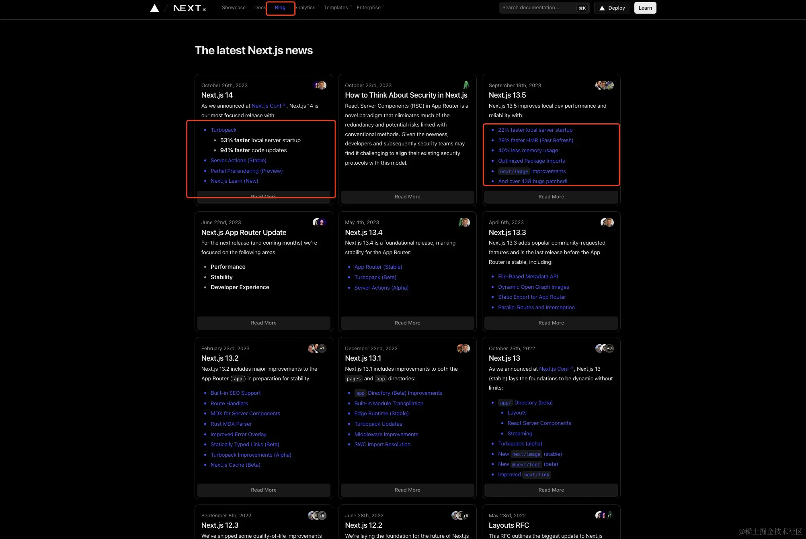
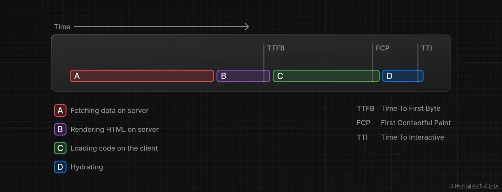
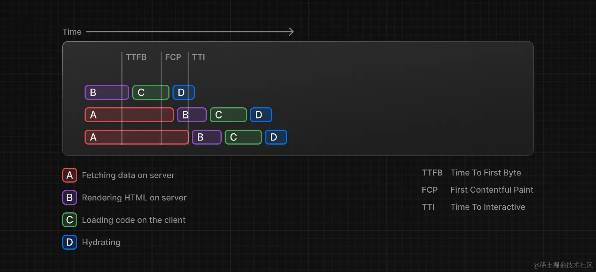

## 前言

vercel 于 2023/10/16 发布 next14 版本，从[官网的博客](https://nextjs.org/blog)更新记录可以看到，最新的两个版本主要更新性能方面，具体 Next14 更新点可以看[官网](https://nextjs.org/blog/next-14)



## 一、Nextjs 更新是要解决什么问题？

众所周知 nextjs 在本地开发的时候速度不太好，HMR 和首次打开页面的时候速度都没有 vite 体验好，现在 next13.5、next14 重点更新了 nextjs 性能方面的问题，提高我们的开发体验。注意 turbopack 从 13 开始已经是 nextjs 内置的，不过打包不太稳定，比如打包 3D 模型的时候可能会报错，只能在 dev 环境使用，也就是 `next dev --turbo` 直接开箱即用。

## 二、为什么 vite 模块少的时候那么快，模块多则会变慢？

vite 是基于 esbuild 的 `no bundle` 模式，只需要依赖预构建成 `esm`，浏览器直接使用，不需要打包；但是项目大起来的时候可能也会首次渲染较慢，因为全量编译导致一次性执行的任务比较多，且发起的请求比较多浏览器对请求数是有限制了，请求排队也会导致变慢。

## 三、Turbopack 为什么比 vite 快？

turbopack 自己说比 vite 快，条件是 1000 个模块的情况下，但是想一下我们的项目其实很少会写到这么多模块，那 1000 个模块之前都会让开发者体验不是很好.

### 3.1 turbopack 在性能方面做的事情

1、基于 turbo 引擎支持增量计算，由 `rust` 编写，比 js 速度更快；

2、`函数级缓存`，turbopack 能做到函数级别的缓存，也就是说更细化；

3、`按需编译`，也就是说不会像 webpack 一样全量编译；

4、`请求级编译`，相比于页面级编译更智能；如果浏览器想要一些  CSS，turbopack 只会编译它  -  不编译引用的图像。背后  next/dynamic  有一个大的图表库，在显示图表的选项卡之前不会编译它。Turbopack 甚至知道不要编译源映射，除非你的 Chrome DevTools 是开放的。

## 四、Turborepo 和 Turbopack 又是什么关系？

Turborepo 是基于 go 写的，目前正在用 rust 重构，主要是管理 Monorepo 用于增量式缓存打包，可以和 Nx 比较，除了增量缓存，还有并行执行任务、远程缓存减少团队 CI 时间等功能；

Turborepo 非常适合于你写一个项目开始的`starter`，建议使用 with-tailwind 模版，命令是 `npx create-turbo -e with-tailwind` ，我从源码仓库里对比过它 10+ 模版，这个是最合适的用于普通项目 C 端开发；

两者可以说都是工程化工具，未来 vercel 会把这 Turborepo 和 Turbopack `结合`到一起使用，所以说两者其实是可以互相配合的。

## 五、Next14 有哪些核心功能（app router）？

> Next14 功能真的超多，如果看过 React 文档，然后对比 Next，发现 Next 真的很强大，由于技术有限只聊几个常见的功能

### 5.1 流式渲染（Streaming）

流式渲染解决了传统 SSR 渲染的阻塞问题，先了解传统 SSR 渲染的流程

1. 在服务端获取数据
2. 在服务端生成 html
3. 把 html、css、js 发送到客户端
4. 使用 html 和 css 生成非交互的用户界面
5. 最后，在客户端注水让页面可以交互（比如绑定点击事件）



这些流程是`顺序和阻塞`的，在服务器上 只能在获取所有数据后才能生成 html，在客户端上 只有在页面中所有组件
的代码都下载完后才能生成 UI！这就是传统的 SSR 的弊端。

而流式渲染的出现允许将页面 html 分解为更小的块（Streaming 和 RSC 配合得很好，一个组件就可以视为一个块），并逐步将这些块从服务器发送到客户端，这样可以更快的显示页面某些部分，不必等所有数据加载后才呈现 UI；优先级高的组件或不依赖于数据的组件可以先发送，然后客户端选择性注水，React 可以更早的 `hydration`。



### 5.2 嵌套 layout

next13 之前有持久化缓存问题；比如切换 tab 的时候，是整个页面切换，而 tab 往往是通用的，整个页面切换导致无法记录 tab 状态，导致你 tab 切换之后重新刷新高量显示都成了个问题，这就是持久化缓存问题，next13 之前会经常遇到。

next13 开始修改了文件系统，使用 `app router` 之后开始支持保存状态，也就是 tab 切换，layout 并不会刷新，也会保留状态。

### 5.3 SSR/SSG/ISR（app router）

SSR

关键是指定`fetch`的第二个参数为`{ cache: 'no-store' }`

```js
async function getProjects() {
  const res = await fetch(`https://...`, { cache: 'no-store' })
  const projects = await res.json()

  return projects
}

export default async function Dashboard() {
  const projects = await getProjects()

  return (
    <ul>
      {projects.map((project) => (
        <li key={project.id}>{project.name}</li>
      ))}
    </ul>
  )
}
```

SSG

关键是将  `fetch()`  默认为  `cache: 'force-cache'`（也可以指定动态路径`generateStaticParams`，相当于 `pages router` 的 `getStaticPaths`，如果指定 `fallback` 只有 `true` 和 `false` ，没有 `blocking` 了）

```js
async function getProjects() {
  const res = await fetch(`https://...`)
  const projects = await res.json()

  return projects
}

export default async function Index() {
  const projects = await getProjects()

  return projects.map((project) => <div>{project.name}</div>)
}
```

ISR

关键是指定`fetch`的第二个参数为`{ revalidate: 'xxx秒' }`

```js
async function getPosts() {
  const res = await fetch(`https://.../posts`, { next: { revalidate: 60 } })
  const data = await res.json()

  return data.posts
}

export default async function PostList() {
  const posts = await getPosts()

  return posts.map((post) => <div>{post.name}</div>)
}
```

## 六、Next14（app router）最佳实践？

1、初始化 `Nextjs` 项目建议使用 `turborepo` 的 with-tailwind 模版，但有一些比较严格的 eslint 约定建议关掉，并且需要自己配置一下 prettier，husky，lint-staged 等工具

2、客户端组件和服务端组件建议`混合使用`，除了 `server` 组件里嵌套 `client` 组件，`client` 组件里也可以通过 `children props`嵌入 `server` 组件），并且客户端组件记得拆分细一点，尽量走服务端组件和服务端请求

3、为了减少请求瀑布 `request waterfall`，建议使用 `Router Handler` 做 `BFF`，也就是 `router.ts` 里多做一层服务端处理

4、服务端 `fetch` 可以直接多次使用如果传递的 props 过大或者多层，不如写两个`fetch`获取同一数据，并不会有多的性能消耗，Next 是提倡这样做的；

5、客户端建议用 `swr`，状态建议用 `use-immer` ，状态管理建议 `zustand`

6、在 `rootLayout` 里不要使用客户端组件，踩坑过，客户端访问`window`需要在`useEffect`里
