## Next14 主题切换最佳实践

- 项目准备
- 主题切换方案
- 结合 tailwind 快速开发
- 持久化缓存问题
- 多标签同步问题
- 系统主题同步优化
- 解决闪屏问题
- CSP 问题
- 服务端和客户端渲染不一致问题
- antfu 大佬博客酷炫主题切换
- 封装成一个好用的 hook

## 项目准备

#### 初始化项目

用官方命令`npx create-next-app@latest`初始化项目，然后一路回车，生成了这样一个项目：

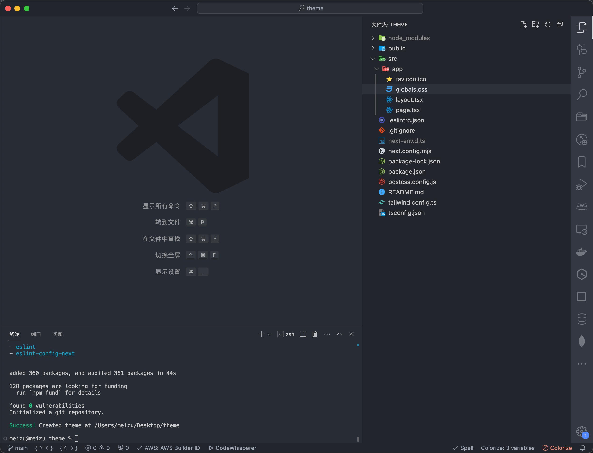

#### 再删除无用代码

`global.css`删除代码后：

```css
@tailwind base;
@tailwind components;
@tailwind utilities;
```

layout.tsx 删除代码后：

```jsx
import type { Metadata } from 'next'
import './globals.css'

export const metadata: Metadata = {
  title: 'Create Next App',
  description: 'Generated by create next app'
}

export default function RootLayout({
  children
}: Readonly<{
  children: React.ReactNode
}>) {
  return (
    <html lang="en">
      <body>{children}</body>
    </html>
  )
}
```

page.tsx 删除代码后：

```jsx
export default function Home() {
  return (
    <main className="flex min-h-screen flex-col items-center justify-between p-24"></main>
  )
}
```

#### 在页面上添加一个切换按钮

在同目录下新建一个按钮组件然后引入到 `page.tsx`

```jsx
'use client'

const Button: React.FC = () => {
  const toggleTheme = () => {
    // TODO:主题切换
  }
  return <button onClick={toggleTheme}>切换</button>
}

export default Button
```

最后页面上是这样，只留下一个切换按钮
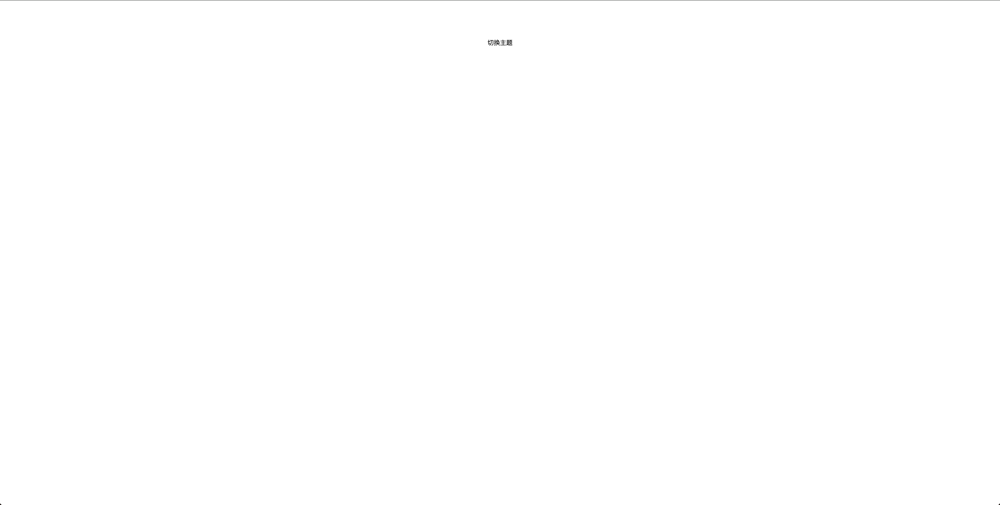

## 主题切换方案

最主流的方案那肯定是 `CSS` 变量

#### 第一步先定义 `css`，用 `body` 来控制背景颜色切换

```css
:root {
  --color: #ffffff;
}

.dark {
  --color: #000000;
}

body {
  background: var(--color);
}
```

#### 第二步给按钮添加事件

```js
const [theme, setTheme] = useState('light')

// 当theme变化的时候切换html上的class属性
useEffect(() => {
  const classList = document.documentElement.classList
  classList.toggle('dark', theme === 'dark')
  classList.toggle('light', theme === 'light')
}, [theme])

// 切换事件
const toggleTheme = () => {
  const newTheme = theme === 'light' ? 'dark' : 'light'
  setTheme(newTheme)
}
```

效果如下：

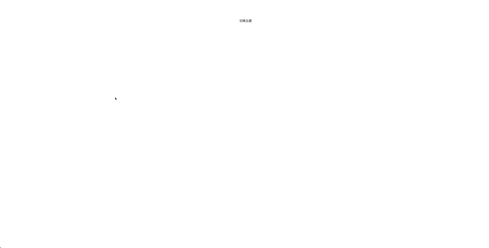

## 结合 tailwind 快速开发

细心的你一定会发现文字没有随页面切换，还是要去写 `css` 吗？有没有更简单的方法？这时候用 `tailwind` 就非常香了，再也不用去想类名和切换去写 `css` 了。

因为我们需要手动切换，所以配置一下 tailwind

首先第一步 `tailwind.config.ts` 中配置`darkMode: 'class',`

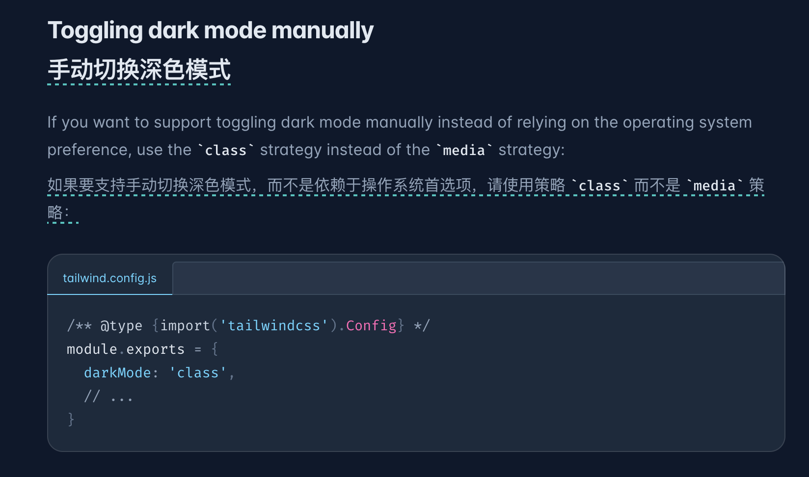

第二步给按钮加上颜色切换

```jsx
<button onClick={toggleTheme} className="text-[#000000] dark:text-[#ffffff]">
  切换主题
</button>
```

这时候文字也一样切换了，而且后面的模块开发也都用这种方式可以极大提高代码效率


## 持久化缓存问题

这里我只点了一下切换，然后点刷新，主题就变回去了

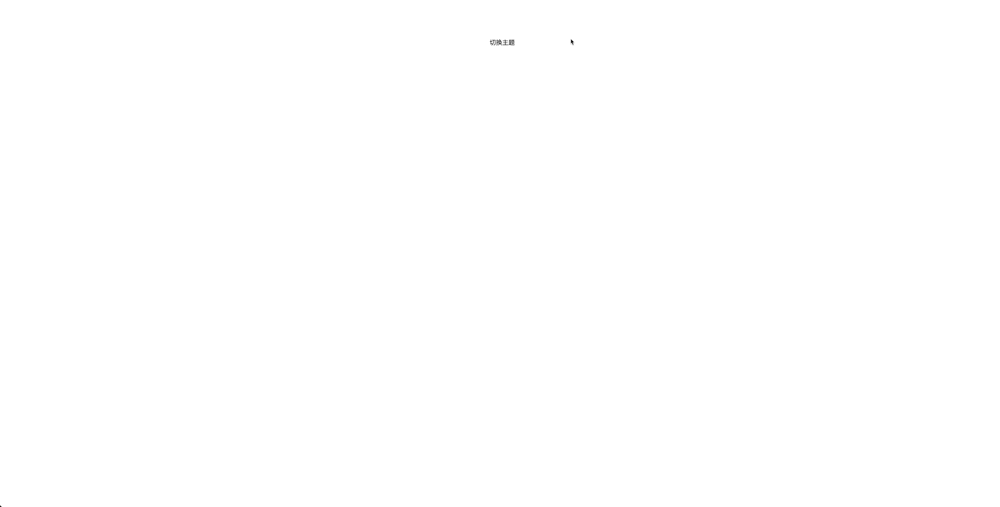

问题：一个问题是持久化缓存问题，用户刷新页面，活着关闭页面后重新打开，没有保留之前设置的主题

解决方案：如果用户设置过一次主题，那应该在 `localStorage` 里存起来，下次用户打开页面还是用户之前设置过的主题；修改一下代码，加上`localStorage`相关逻辑

```jsx
'use client'

import { useEffect, useState } from 'react'

const Button: React.FC = () => {
  const [theme, setTheme] = useState('light')

  // 新增：初始化theme
  useEffect(() => {
    const storedTheme = localStorage.getItem('theme') || 'light'
    setTheme(storedTheme)
  }, [])

  // 当theme变化的时候切换html上的class属性
  useEffect(() => {
    const classList = document.documentElement.classList
    classList.toggle('dark', theme === 'dark')
    classList.toggle('light', theme === 'light')
  }, [theme])

  // 切换事件
  const toggleTheme = () => {
    const newTheme = theme === 'light' ? 'dark' : 'light'
    setTheme(newTheme)
    localStorage.setItem('theme', newTheme) // 新增：解决持久化缓存问题
  }

  return (
    <button
      onClick={toggleTheme}
      className="text-[#000000] dark:text-[#ffffff]"
    >
      切换主题
    </button>
  )
}

export default Button
```

## 多标签同步问题

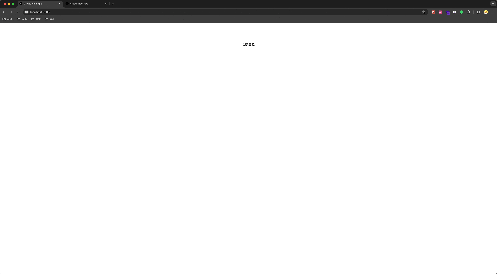

问题：用户在一个 `tab` 上设置了主题，在另一个 `tab` 却是之前的主题，主题割裂

解决方案：通过监听`Storage`事件，storage 事件是在浏览器中的其他标签页或窗口修改了存储在同一域名下的 localStorage 或 sessionStorage 时触发的。改一下代码，加上`Storage`相关逻辑

```js
'use client'

import { useEffect, useState } from 'react'

const Button: React.FC = () => {
  const [theme, setTheme] = useState('light')

  // 初始化theme
  useEffect(() => {
    const storedTheme = localStorage.getItem('theme') || 'light'
    setTheme(storedTheme)
  }, [])

  // 当theme变化的时候切换html上的class属性
  useEffect(() => {
    const classList = document.documentElement.classList
    classList.toggle('dark', theme === 'dark')
    classList.toggle('light', theme === 'light')
  }, [theme])

  // 新增：监听storage事件，更新主题，解决多标签同步问题
  useEffect(() => {
    const handleStorageChange = (event: StorageEvent) => {
      if (event.key === 'theme') {
        setTheme(event.newValue || 'light')
      }
    }

    window.addEventListener('storage', handleStorageChange)

    return () => {
      window.removeEventListener('storage', handleStorageChange)
    }
  }, [])

  // 切换事件
  const toggleTheme = () => {
    const newTheme = theme === 'light' ? 'dark' : 'light'
    setTheme(newTheme)
    localStorage.setItem('theme', newTheme) // 持久化缓存
  }

  return (
    <button
      onClick={toggleTheme}
      className="text-[#000000] dark:text-[#ffffff]"
    >
      切换主题
    </button>
  )
}

export default Button
```

## 系统主题同步优化

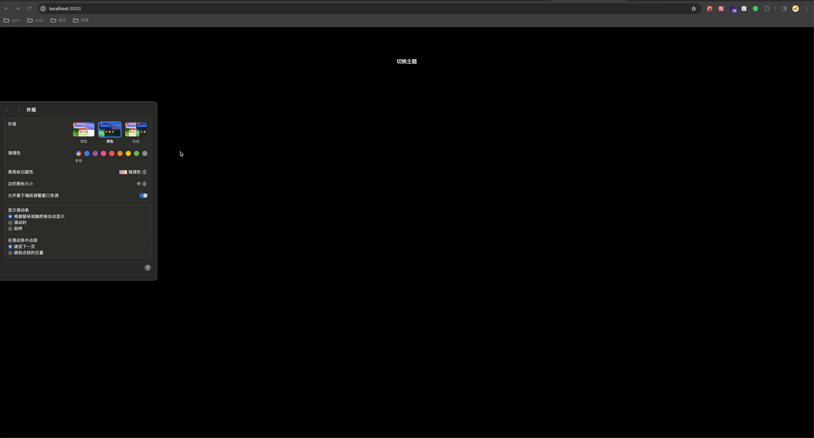

问题：用户可以手动切换主题，当用户手动切换主题的时候，网页随切换变化

优化方案：监听系统主题切换

```jsx
'use client'

import { useEffect, useState } from 'react'

const Button: React.FC = () => {
  const [theme, setTheme] = useState('light')

  // 初始化theme
  useEffect(() => {
    const storedTheme = localStorage.getItem('theme') || 'light'
    setTheme(storedTheme)
  }, [])

  // 当theme变化的时候切换html上的class属性
  useEffect(() => {
    const classList = document.documentElement.classList
    classList.toggle('dark', theme === 'dark')
    classList.toggle('light', theme === 'light')
  }, [theme])

  // 监听storage事件，更新主题
  useEffect(() => {
    const handleStorageChange = (event: StorageEvent) => {
      if (event.key === 'theme') {
        setTheme(event.newValue || 'light')
      }
    }

    window.addEventListener('storage', handleStorageChange)

    return () => {
      window.removeEventListener('storage', handleStorageChange)
    }
  }, [])

  // 新增：监听系统切换事件，更新主题
  useEffect(() => {
    const mediaQueryList = window.matchMedia('(prefers-color-scheme: dark)')

    const handleSystemThemeChange = (event: MediaQueryListEvent) => {
      const newTheme = event.matches ? 'dark' : 'light'
      setTheme(newTheme)
      localStorage.setItem('theme', newTheme) // 持久化缓存
    }

    mediaQueryList.addEventListener('change', handleSystemThemeChange)

    return () => {
      mediaQueryList.removeEventListener('change', handleSystemThemeChange)
    }
  }, [])

  // 切换事件
  const toggleTheme = () => {
    const newTheme = theme === 'light' ? 'dark' : 'light'
    setTheme(newTheme)
    localStorage.setItem('theme', newTheme) // 持久化缓存
  }

  return (
    <button
      onClick={toggleTheme}
      className="text-[#000000] dark:text-[#ffffff]"
    >
      切换主题
    </button>
  )
}

export default Button
```

## 解决闪屏问题

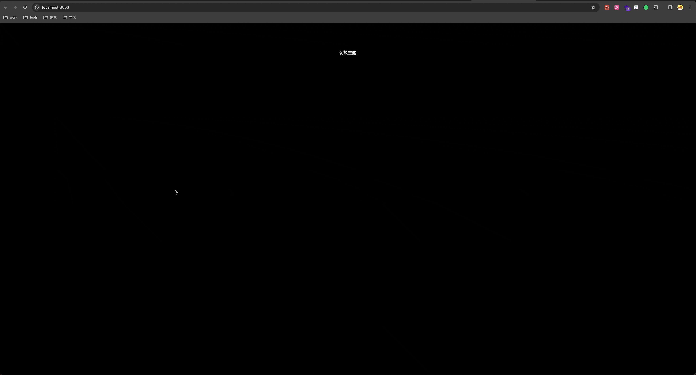

问题：页面初始化的时候，会短时间由白色变为黑色

解决方案：在页面还没有渲染前执行 JS，提前渲染对应主题

在 layout.tsx 里加入脚本，在页面渲染前生效

```jsx
import type { Metadata } from 'next'
import './globals.css'

export const metadata: Metadata = {
  title: 'Create Next App',
  description: 'Generated by create next app'
}

export default function RootLayout({
  children
}: Readonly<{
  children: React.ReactNode
}>) {
  return (
    <html lang="en" className="light">
      <body>
        {/* 新增 */}
        <script
          async
          dangerouslySetInnerHTML={{
            __html: `
              const item = localStorage.getItem('theme') || 'light';
              document.documentElement.classList.toggle('dark', item === 'dark');
              document.documentElement.classList.toggle('light', item === 'light');
            `
          }}
        ></script>
        {children}
      </body>
    </html>
  )
}
```

在 `button.tsx` 里做兼容，服务端的时候初始状态，通过函数懒执行可以只触发一次 useEffect

```jsx
'use client'

import { useEffect, useState } from 'react'

const Button: React.FC = () => {
  // 新增
  const init = () => {
    if (typeof window === 'undefined') {
      return 'light'
    }
    const classList = document.documentElement.classList
    return classList.contains('dark') ? 'dark' : 'light'
  }

  const [theme, setTheme] = useState(init)

  // 之前的代码
}

export default Button
```

## CSP 问题

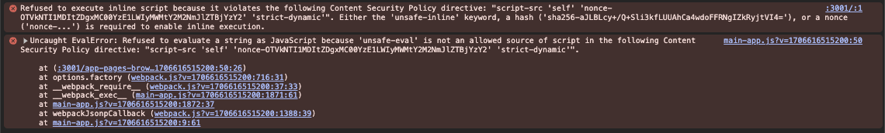

问题：这个问题要设置了 [CSP](https://nextjs.org/docs/app/building-your-application/configuring/content-security-policy) 才会有的问题，C 端项目往往需要 `CSP` 策略还防止 `XSS`，而我们自己加入的脚本会和 `CSP` 策略冲突

解决方案：设置自己写的脚本不受 `CSP` 限制

```jsx
import { headers } from 'next/headers'

const nonce = headers().get('x-nonce') || ''


<script
  nonce={nonce}
  async
  dangerouslySetInnerHTML={{
    __html: `
      const item = localStorage.getItem('theme') || 'light';
      document.documentElement.classList.toggle('dark', item === 'dark');
      document.documentElement.classList.toggle('light', item === 'light');
    `
  }}
></script>
```

## 服务端和客户端渲染不一致问题

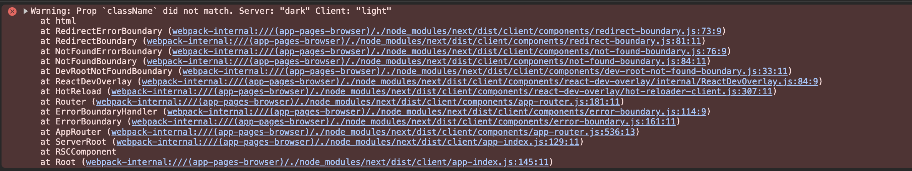

问题：由于初始值为 `light`，服务端渲染为为 `dark`，社区比较出名的`next-themes`也有这个问题

解决方案：目前看好像是[不可避免](https://react.dev/reference/react-dom/client/hydrateRoot#suppressing-unavoidable-hydration-mismatch-errors)的，所以学习 `react`官网说的抑制报错添加`suppressHydrationWarning`

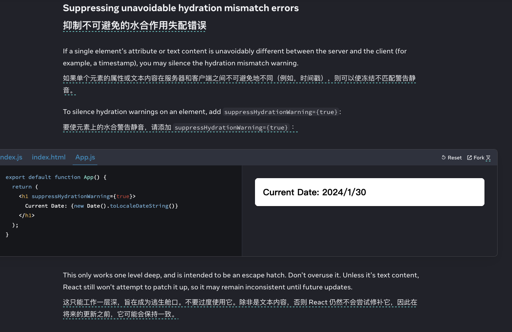

```js
<html lang="en" suppressHydrationWarning>
  <body>
    {/* 新增 */}
    <script
      nonce={nonce}
      async
      dangerouslySetInnerHTML={{
        __html: `
              const item = localStorage.getItem('theme') || 'light';
              document.documentElement.classList.toggle('dark', item === 'dark');
              document.documentElement.classList.toggle('light', item === 'light');
            `
      }}
    ></script>
    {children}
  </body>
</html>
```

## antfu 大佬博客酷炫主题切换

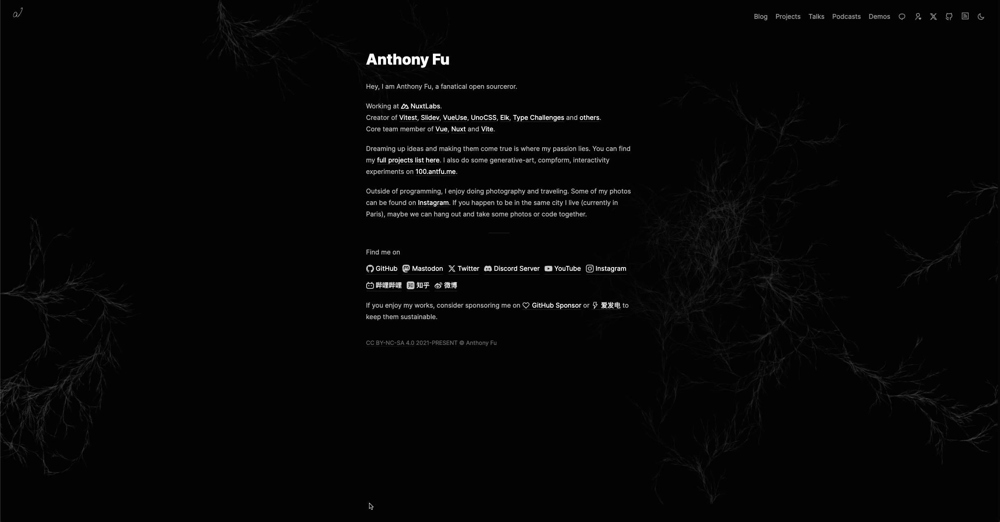

优化方案：`document.startViewTransition`这是一个新出的属性，可以在 antfu 大佬的博客上看到，目前由于兼容性问题，就不管了

## 封装成一个好用的 hook

最后为了提高复用性，封装成一个`useTheme`的`hook`

```jsx
import { useEffect, useState } from 'react'

const useTheme = () => {
  const init = () => {
    if (typeof window === 'undefined') {
      return 'light'
    }
    const classList = document.documentElement.classList
    return classList.contains('dark') ? 'dark' : 'light'
  }

  const [theme, setTheme] = useState(init)

  // 初始化theme
  useEffect(() => {
    const storedTheme = localStorage.getItem('theme') || 'light'
    setTheme(storedTheme)
  }, [])

  // 当theme变化的时候切换html上的class属性
  useEffect(() => {
    const classList = document.documentElement.classList
    classList.toggle('dark', theme === 'dark')
    classList.toggle('light', theme === 'light')
    // 变化操作
  }, [theme])

  // 监听storage事件，更新主题
  useEffect(() => {
    const handleStorageChange = (event: StorageEvent) => {
      if (event.key === 'theme') {
        setTheme(event.newValue || 'light')
      }
    }

    window.addEventListener('storage', handleStorageChange)

    return () => {
      window.removeEventListener('storage', handleStorageChange)
    }
  }, [])

  // 监听系统切换事件，更新主题
  useEffect(() => {
    const mediaQueryList = window.matchMedia('(prefers-color-scheme: dark)')

    const handleSystemThemeChange = (event: MediaQueryListEvent) => {
      const newTheme = event.matches ? 'dark' : 'light'
      setTheme(newTheme)
      localStorage.setItem('theme', newTheme) // 持久化缓存
    }

    mediaQueryList.addEventListener('change', handleSystemThemeChange)

    return () => {
      mediaQueryList.removeEventListener('change', handleSystemThemeChange)
    }
  }, [])

  // 切换事件
  const toggleTheme = () => {
    const newTheme = theme === 'light' ? 'dark' : 'light'
    setTheme(newTheme)
    localStorage.setItem('theme', newTheme) // 持久化缓存
  }

  return { theme, toggleTheme }
}

export default useTheme
```

使用的时候引入一下

```jsx
'use client'

import useTheme from './hook'

const Button: React.FC = () => {
  const { toggleTheme } = useTheme()

  return (
    <button
      onClick={toggleTheme}
      className="text-[#000000] dark:text-[#ffffff]"
    >
      切换主题
    </button>
  )
}

export default Button
```
