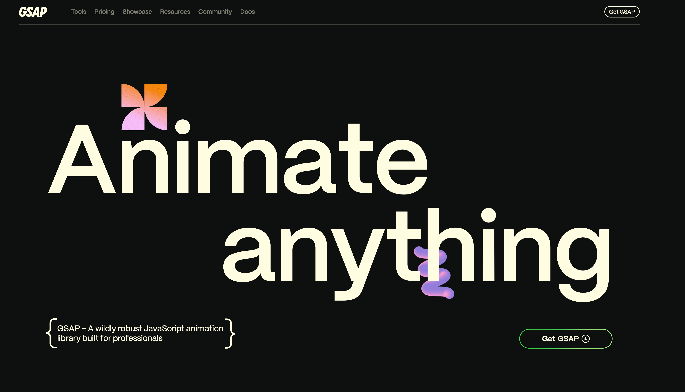
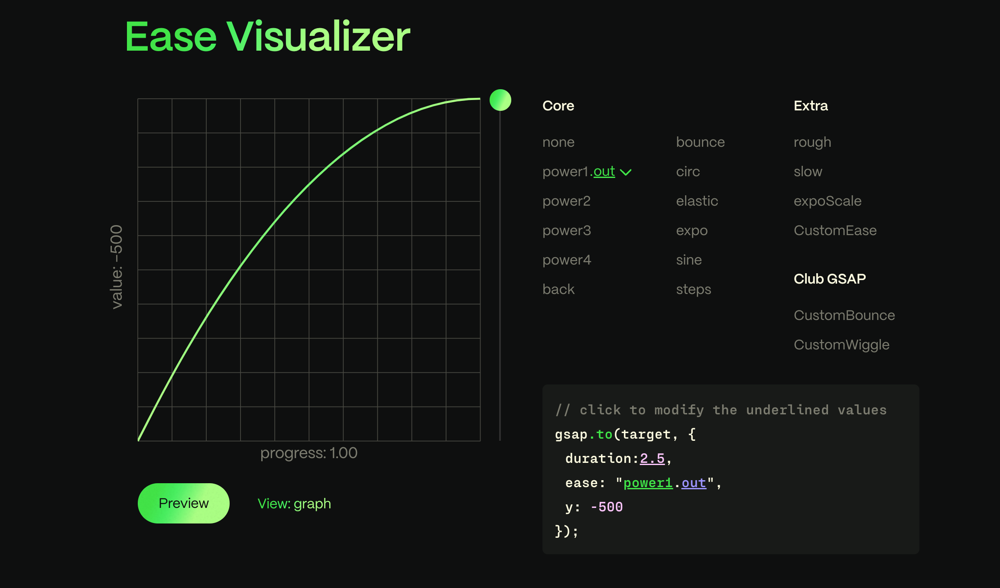
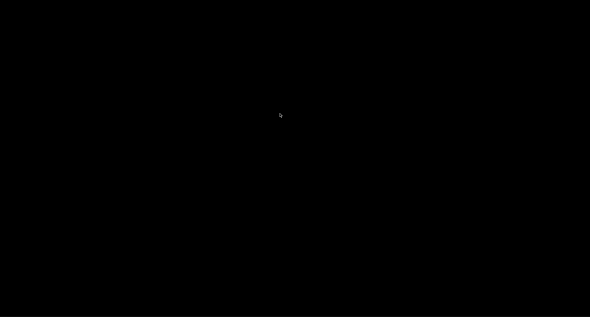
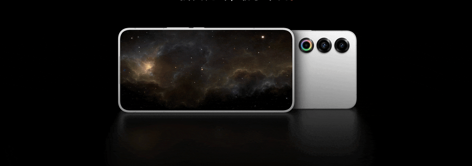
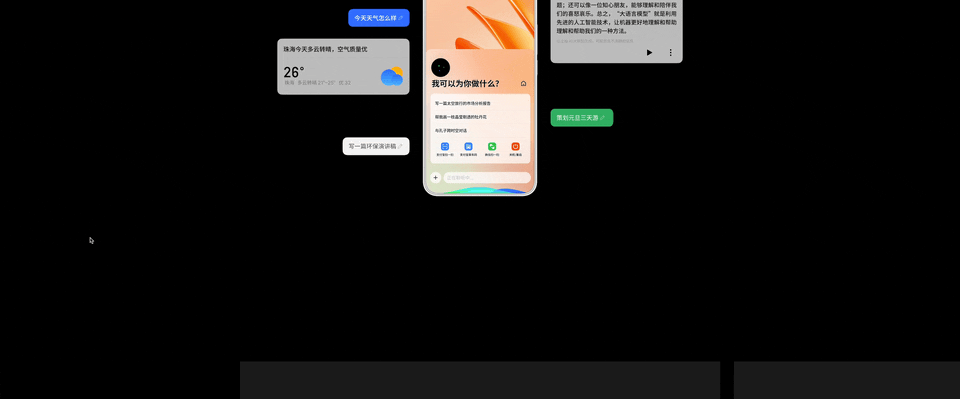
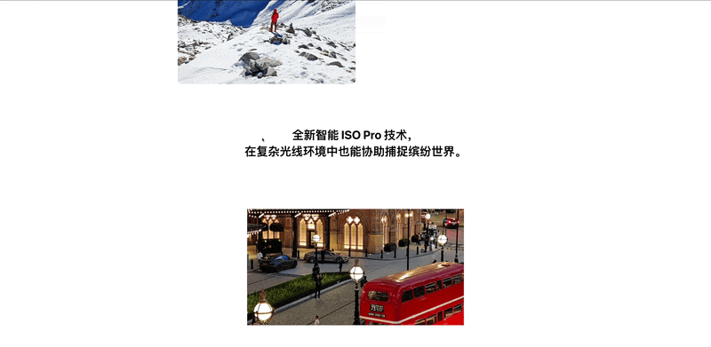

## 复杂 web 动画开发



## 为什么 选择 GSAP

- `GSAP` 是一个老牌框架，但也在持续更新，兼容性很好

- 与框架无关，比如 `framer-motion`，`react spring` 只能用于 `react`；这里有多个框架的 [starter](https://gsap.com/resources/frameworks)

- 心智负担低，易于上手，它的核心理念就是以时间轴（`Timeline`）为维度的补间动画（`Tween`），在文章后面会聊一下，然后还有各种强大的插件，如 `scrollTrigger`

- 经过时间的沉淀，在 `react` 中使用提供了简便的 [react api](https://gsap.com/resources/React)，比如自带动画清理的`useGSAP`

## 补间动画（Tween）

补间是所有动画的工作 - 可以把它想象成一个高性能的属性设置器。输入目标（要进行动画处理的对象）、持续时间以及希望其动画化的任何属性，然后当补间的播放头移动到新位置时，确定此时属性值应是什么，相应地应用它们

常用创建补间动画的方法

```js
gsap.to()
gsap.from()
gsap.fromTo()
```

用法很简单，就不细说了，如下 demo：

```js
gsap.to('.box', { rotation: 27, x: 100, duration: 1 })
```

## 时间线（Timeline）

让补间动画可以排序，可让动画及时放置在任何想要的位置，然后使用 `pause（）、play（）、progress（）、reverse（）、timeScale（）` 等方法轻松控制整个序列

```text
                        PLAYHEAD
|--------------timeline-----|-----------|
|--tween1--|                |
           |-----tween2-----|-----------|
```

可以用 `addLabel` 标记时间线的点，通过第二个参数来做对应动画

```js
tl.addLabel("step2", 3)
  .to(..., "step2")
  .to(..., "step2+=0.75")
```

控制补间和时间线

```js
var tween = gsap.to(...);
var tl = gsap.timeline();
tl.to(...).to(...);

tween.pause();
tween.timeScale(2);
tl.seek(3);
tl.progress(0.5);
...
```

## 动画曲线

可视化动画曲线 [https://gsap.com/docs/v3/Eases](https://gsap.com/docs/v3/Eases)



## 封装渐入效果



```jsx
import { gsap } from 'gsap/gsap-core'
import { useGSAP } from '@gsap/react'

export const useFadeIn = ({
  target,
  item
}: {
  target: string,
  item: string
}) => {
  useGSAP(() => {
    gsap
      .timeline({
        scrollTrigger: {
          trigger: target,
          start: '0% 90%',
          end: '0% 90%',
          toggleActions: 'play none reverse none'
        }
      })

      .from(item, {
        y: 200,
        opacity: 0
      })
  })
}
```

## 依次入场效果


主要是`stagger`属性做依次动画

```jsx
import Image from 'next/image'
import { gsap } from 'gsap'
import type { Block1218 } from '../../type'
import { useFadeIn, useIsomorphicLayoutEffect } from '../../hooks'

export default function Section8(props: { data: Block1218 }) {
  const { data } = props

  useFadeIn({ target: '.section8', item: '.section8-title' })

  useGSAP(() => {
    gsap
      .timeline({
        scrollTrigger: {
          trigger: '.section8-wrapper',
          start: '0% 80%',
          end: '0% 80%',
          toggleActions: 'play none reverse none'
        }
      })

      .from('.section8-item', {
        x: 200,
        opacity: 0,
        scale: 0.5,
        stagger: 0.1,
        ease: 'back.out(1.7)'
      })
  })
  const map = {
    0: 'mr-[67px]',
    1: 'mr-[59px]',
    2: 'mr-[43px]'
  }
  return (
    <section className="section8 relative h-[1400px] w-screen overflow-hidden text-center text-white">
      <Image
        alt=""
        className="absolute left-0 top-0 z-[-1] h-full w-full object-cover"
        height={5120}
        src={data.bg}
        width={5120}
      />
      <div className="mx-auto w-fit">
        <div className="section8-title">
          <div className="m-auto !mb-[40px] text-[60px] font-bold">
            {data.name}
          </div>
          <div className="mb-[120px] text-[20px] font-bold leading-[36px]">
            {data.tex.split('$').map((item, index) => {
              return <p key={index}>{item}</p>
            })}
          </div>
        </div>
      </div>
      <div className="section8-wrapper absolute bottom-[133px] left-[50%] flex w-[1200px] translate-x-[-50%] pl-[280px]">
        {data.node.map((item, index) => {
          return (
            <div
              className={`section8-item text-left ${map[index]}`}
              key={index}
            >
              <div className="text-[24px] font-bold text-[373737]">
                {' '}
                {item.title}
              </div>
              <div className="text-[14px] font-bold"> {item.desc}</div>
            </div>
          )
        })}
      </div>
    </section>
  )
}
```

## 跟随鼠标滚动动画（1）


```js
import { gsap } from 'gsap/gsap-core'
import { useGSAP } from '@gsap/react'

useGSAP(() => {
  const t1 = gsap
    .timeline({
      scrollTrigger: {
        trigger: '.section9-item1',
        start: '0% 70%',
        end: '0% 70%',
        toggleActions: 'play none reverse none'
      }
    })
    .addLabel('spin')

  t1.from(
    '.section9-item1',
    {
      x: '-10%',
      opacity: 0
    },
    'spin'
  )

  t1.from(
    '.section9-item2',
    {
      x: '10%',
      opacity: 0
    },
    'spin'
  )

  const t2 = gsap
    .timeline({
      scrollTrigger: {
        trigger: '.section9-item3',
        start: '0% 70%',
        end: '0% 70%',
        toggleActions: 'play none reverse none'
      }
    })
    .addLabel('spin')

  t2.from(
    '.section9-item3',
    {
      x: '-10%',
      opacity: 0
    },
    'spin'
  )

  t2.from(
    '.section9-item4',
    {
      x: '10%',
      opacity: 0
    },
    'spin'
  )
})
```

## 跟随鼠标滚动动画（2）



```js
import { gsap } from 'gsap/gsap-core'
import { useGSAP } from '@gsap/react'

useGSAP(() => {
  gsap
    .timeline({
      scrollTrigger: {
        trigger: section2Ref.current,
        // pin: true,
        start: 'top 90%',
        end: '+=1000',
        scrub: 1,
        toggleActions: 'play none reverse none'
      }
    })

    .to('.section2_line', {
      stagger: 0.1,
      y: -40,
      keyframes: {
        '0%': { color: '#4c4c4c' },
        '25%': { color: '#4c4c4c' },
        '50%': { color: '#ffffff' },
        '75%': { color: '#4c4c4c' },
        '100%': { color: '#4c4c4c' }
      }
    })
})
```

## GSAP pin 效果（1）



```jsx
import { gsap } from 'gsap/gsap-core'
import { useGSAP } from '@gsap/react'

useGSAP(() => {
  const tl = gsap.timeline({
    scrollTrigger: {
      trigger: '.section5',
      start: 'center center',
      end: '+=2000',
      scrub: 1,
      pin: true,
      toggleActions: 'play none reverse none'
    }
  })

  tl.to('.section5_block', {
    right: 0
  })
})

return (
  <section className="section5 flex h-screen">
    <div className="relative m-auto h-[650px] w-[1280px]">
      <div className="section5_block absolute flex w-fit text-center">
        {node.map((item, index) => {
          return (
            <div
              className="mr-[36px] flex h-[650px] w-[1280px] flex-col items-center justify-center bg-[#1c1c1c] last:mr-[36px]"
              key={index}
            >
              <div className="base_title1">{item.title}</div>
              <div className="base_desc">{trans(item.desc)}</div>
            </div>
          )
        })}
      </div>
    </div>
  </section>
)
```

## GSAP pin 效果（2）


```jsx
import { gsap } from 'gsap/gsap-core'
import { useGSAP } from '@gsap/react'

useGSAP(() => {
  const t2 = gsap
    .timeline({
      scrollTrigger: {
        trigger: '.section4-block',
        start: '50% 50%',
        end: '+=4000',
        toggleActions: 'play none reverse none',
        pin: true,
        scrub: 1
      }
    })
    .addLabel('spin')

  t2.from(
    '.section4-video ',
    {
      width: '300px',
      height: '300px',
      left: 0,
      top: 100
    },
    'spin'
  )

  t2.from(
    '.section4-img',
    {
      opacity: 0
    },
    'spin'
  )

  t2.from('.bubble1', {
    x: '10%',
    opacity: 0
  })

  t2.from('.bubble2', {
    x: '10%',
    opacity: 0
  })

  t2.from('.bubble3', {
    x: '10%',
    opacity: 0
  })

  t2.from('.bubble4', {
    x: '-10%',
    opacity: 0
  })

  t2.from('.bubble5', {
    x: '-10%',
    opacity: 0
  })

  t2.from('.bubble6', {
    x: '-10%',
    opacity: 0
  })
})
```

## GSAP pin 效果（3）

```js
useGSAP(() => {
  const t1 = gsap.timeline({
    scrollTrigger: {
      trigger: '.section14',
      start: 'center center',
      end: '+=1000',
      scrub: 1,
      toggleActions: 'play none reverse none',
      pin: true
    }
  })
  t1.to('.section14-block', {
    clipPath: 'inset(30% 30%)'
  })
})
```



## GSAP 控制线条

## GSAP 控制视频

## 浅谈原理

`css` 可以做简单动画，但复杂 `web` 动画还是需要 `js`，`gsap` 的核心原理也就是`requestAnimation`做`js`动画

```js
function myAnimation(element, options) {
  const { rotation, x, duration } = options
  const startRotation = element.style.transform || 'rotate(0deg)'
  const startX = parseFloat(element.style.left) || 0

  const startTime = performance.now()

  function animate(currentTime) {
    const elapsed = (currentTime - startTime) / 1000
    const progress = Math.min(elapsed / duration, 1)

    const currentRotation = startRotation + rotation * progress
    const currentX = startX + x * progress

    element.style.transform = `rotate(${currentRotation}deg)`
    element.style.left = `${currentX}px`

    if (progress < 1) {
      requestAnimationFrame(animate)
    }
  }

  requestAnimationFrame(animate)
}
```

这样就实现了一个和 `gsap.to` 的效果

```js
const element = document.querySelector('.box')
myAnimation(element, { rotation: 27, x: 100, duration: 1000 })
```
