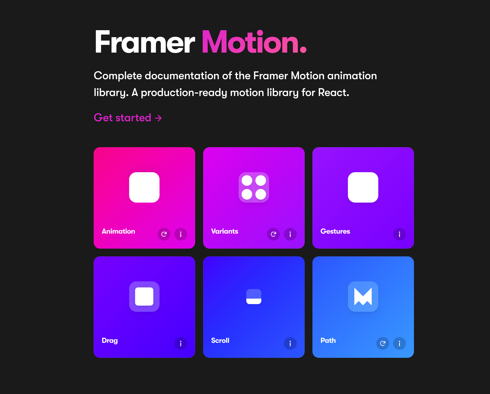
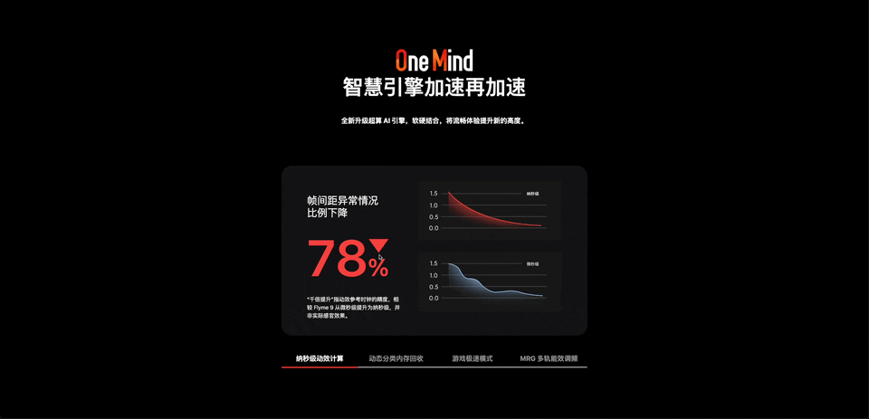
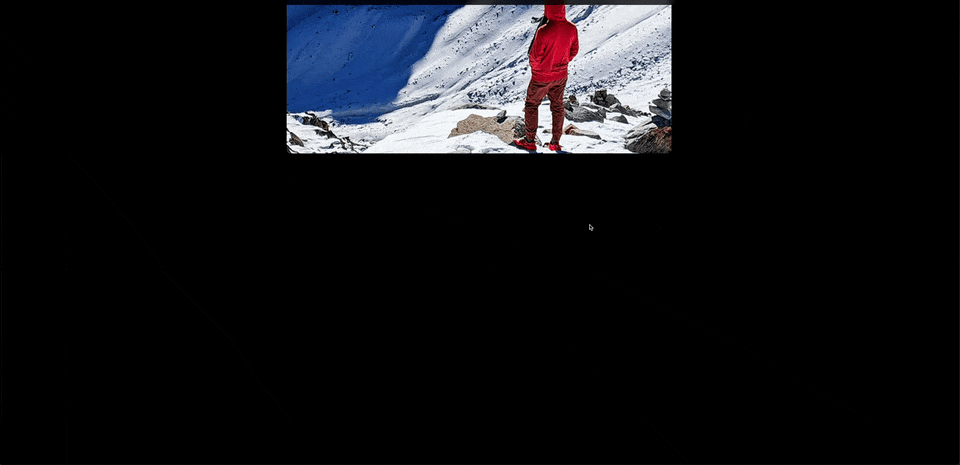
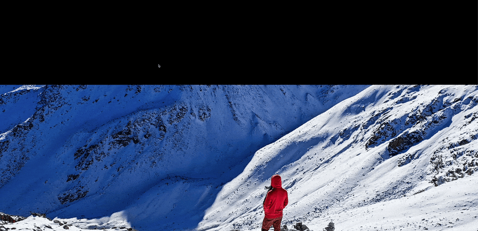

## 复杂 web 动画开发（Framer Motion 篇）



## 为什么 选择 Framer Motion

- `Framer Motion`是比较新的 `react` 动画方案，提供了很多 `Hook`来开发，更加贴合现代化的函数式编程
- `Framer Motion`已经被一些出名的 `UI`组件库使用（如 [Chakra](https://chakra-ui.com/getting-started)、[NextUI](https://nextui.org/docs/guide/introduction)），所以我们也需要学习它
- `Framer Motion`也有不少例子，可以快速开发一些动画，所以我勇于和`GSAP`一起使用，加快开发效率

## 声明式动画

通过指定 `motion` 组件，可以方便快捷的写出声明式动画

```js
import { motion } from 'framer-motion'
;<motion.div
  animate={{
    x: 0,
    y: 0,
    scale: 1,
    rotate: 0
  }}
/>
```

## 如何实现鼠标滚动动画

和`GSAP`一样，通过`useScroll`可以设置容器和触发时机

```js
const { scrollYProgress } = useScroll({
  // 容器
  target: targetRef,
  // 相遇的点，目标的起点和容器的起点相遇
  offset: ['end end', 'start start']
})
```

然后设置过渡，除了 0-1 也可以设置别的值

```js
const inset = useTransform(
  scrollYProgress,
  [0, 1],
  ['inset(0 0 0 0)', 'inset(0 0 0 100%)']
)
```

## 文字弹簧出现效果


```js
import Image from 'next/image'
import { motion } from 'framer-motion'
import type { Block1218 } from '../../type'

export default function Section1(props: { data: Block1218 }) {
  const { data } = props

  const textVariants = {
    initial: {
      x: -500,
      opacity: 0
    },
    animate: {
      x: 0,
      opacity: 1,
      transition: {
        type: 'spring',
        duration: 1,
        staggerChildren: 0.1
      }
    },
    initial2: {
      opacity: 0
    },
    animate2: {
      opacity: 1,
      transition: {
        type: 'spring',
        duration: 1,
        staggerChildren: 0.1
      }
    }
  }

  return (
    <section className="section1 relative flex h-screen bg-black">
      <motion.div
        animate="animate2"
        className="absolute bottom-0 left-[50%] z-[1] h-full w-full translate-x-[-50%]"
        initial="initial2"
        variants={textVariants}
      >
        <Image
          alt=""
          className="z-[1] h-full w-full object-cover"
          height={5120}
          priority
          src={data.bg}
          width={5120}
        />
      </motion.div>
      <motion.div
        animate="animate"
        className="section1-media-title z-[2] mx-auto mt-[8vw] translate-x-[-50%] text-center font-[500] text-white"
        initial="initial"
        variants={textVariants}
      >
        <motion.h1
          className="text-[60px] tracking-[10px]"
          variants={textVariants}
        >
          {data.annotation}
          <div className="relative top-[6px] inline-block h-[11px] w-[11px] rounded-[2px] bg-[#ff4132]"></div>
        </motion.h1>
      </motion.div>
    </section>
  )
}
```

## tab 切换效果



```js
import { motion, AnimatePresence } from 'framer-motion'
import { useState } from 'react'
import Image from 'next/image'
import type { Block1218 } from '../../type'

export default function Section12(props: { data: Block1218 }) {
  const { data } = props

  const [selectedTab, setSelectedTab] = useState(data.node[0])

  return (
    <section className="section12 relative flex h-[1100px] w-screen overflow-hidden bg-black pt-[100px] text-center text-white">
      <div className="m-auto">
        <div className="section12-title">
          <div className="mx-auto h-[65px] w-[360px]">
            <Image
              alt=""
              className="h-full w-full object-contain"
              height={5120}
              src={data.bg}
              width={5120}
            ></Image>
          </div>
          <div className="mb-[40px] text-[60px] font-bold">{data.name}</div>
          <div className="mb-[118px] text-[20px] font-bold">{data.tex}</div>
        </div>

        <div className="h-[850px] w-[1280px] rounded-[15px]">
          <div className="mx-auto w-[900px]">
            <AnimatePresence mode="wait">
              <motion.div
                animate={{ y: 0, opacity: 1 }}
                className="relative m-auto !mb-[52px] h-[500px] w-[900px]"
                exit={{ y: -10, opacity: 0 }}
                initial={{ y: 10, opacity: 0 }}
                key={selectedTab.title}
                transition={{ duration: 0.2 }}
              >
                <div className="absolute pl-[75px] pt-[84px] text-left text-white">
                  <div className="w-[228px] text-left text-[30px] leading-[36px]">
                    {selectedTab.annotation.split('$')[0]}
                  </div>
                  <div
                    className="relative font-[600]"
                    style={{
                      color: selectedTab.url
                    }}
                  >
                    <span className="section12-count text-[150px]">
                      {selectedTab.annotation.split('$')[1].slice(0, -1)}
                    </span>
                    <span className="text-[72px]">
                      {selectedTab.annotation.split('$')[1].slice(-1)}
                    </span>
                    <span
                      className={`${
                        selectedTab.title === '动态分类内存回收'
                          ? 'opacity-0'
                          : ''
                      } triangle absolute right-[42px] top-[60px]`}
                      style={{
                        borderTop: `40px solid ${selectedTab.url}`
                      }}
                    ></span>
                  </div>
                  <div className="w-[282px]">
                    {selectedTab.annotation.split('$')[2]}
                  </div>
                </div>
                <Image
                  alt=""
                  className="h-full w-full rounded-[30px] object-cover"
                  height={5120}
                  src={selectedTab.img}
                  width={5120}
                />
              </motion.div>
            </AnimatePresence>
            <nav>
              <ul className="flex justify-around">
                {data.node.map((item, index) => (
                  <li
                    className={`relative flex-1 cursor-pointer text-[20px] font-bold ${
                      item === selectedTab ? 'text-white' : 'text-[#939393]'
                    }`}
                    key={index}
                    onClick={() => {
                      setSelectedTab(item)
                    }}
                  >
                    {item.title}
                    {item === selectedTab ? (
                      <motion.div
                        className="absolute bottom-[-13px] left-0 right-0 h-[3px] rounded-[10px] bg-[#ff4132]"
                        layoutId="underline"
                      />
                    ) : null}
                  </li>
                ))}
              </ul>
            </nav>
            <div className="mx-auto mb-[28px] mt-[10px] h-[2px] w-full rounded-[15px] bg-[#d1d1d1]" />
          </div>
        </div>
      </div>
    </section>
  )
}
```

## 图片对比效果



```js
import Image from 'next/image'
import { motion, useScroll, useTransform } from 'framer-motion'
import { useRef } from 'react'
import type { Block1218 } from '../../type'

export default function Section15(props: { data: Block1218 }) {
  const { node } = props.data

  const targetRef = (useRef < HTMLDivElement) | (null > null)

  // 我们可以通过将元素传递给 target 选项来跟踪容器 ref 中元素的进度
  const { scrollYProgress } = useScroll({
    target: targetRef,
    // 相遇的点，目标的起点和容器的起点相遇
    offset: ['end end', 'start start']
  })

  const inset = useTransform(
    scrollYProgress,
    [0, 1],
    ['inset(0 0 0 0)', 'inset(0 0 0 100%)']
  )

  return (
    <section className="section15 relative h-[1367px] w-screen pt-[270px] text-center">
      <div className="relative mx-auto h-[550px] w-[915px]">
        <div className="absolute z-0 mx-auto h-[550px] w-[915px]">
          <Image
            alt=""
            className="z-0 h-full w-full"
            height={550}
            src={node[0].img}
            width={915}
          ></Image>
        </div>
        <motion.div
          className="z-1 absolute mx-auto h-[550px] w-[915px]"
          ref={targetRef}
          style={{
            clipPath: inset
          }}
        >
          <Image
            alt=""
            className="z-0 h-full w-full"
            height={550}
            src={node[1].img}
            width={915}
          ></Image>
        </motion.div>
      </div>
    </section>
  )
}
```

## pin 效果



```js
import Image from 'next/image'
import { motion, useScroll, useTransform } from 'framer-motion'
import { useLayoutEffect, useRef, useState } from 'react'
import type { Block1218 } from '../../type'

export default function Section24(props: { data: Block1218 }) {
  const { name, bg } = props.data

  const targetRef = (useRef < HTMLDivElement) | (null > null)

  const { scrollYProgress } = useScroll({
    target: targetRef,
    offset: ['start start', 'end end']
  })

  const [target, setTarget] = useState('inset(0px 0px)')

  useLayoutEffect(() => {
    if (window.innerWidth && window.innerWidth < 1480) {
      setTarget(`inset(${240}px ${380}px)`)
      return
    }
    setTarget(`inset(${450}px ${890}px)`)

    const resizeHandle = () => {
      if (window.innerWidth && window.innerWidth < 1480) {
        setTarget(`inset(${250}px ${446}px)`)
        return
      }
      setTarget(`inset(${450}px ${890}px)`)
    }

    window.addEventListener('resize', resizeHandle)

    return () => {
      window.removeEventListener('resize', resizeHandle)
    }
  }, [])

  const inset = useTransform(
    scrollYProgress,
    [0, 1],
    [target, 'inset(0px 0px)']
  )

  const color = useTransform(scrollYProgress, [0, 1], ['#000000', '#ffffff'])

  const position = useTransform(scrollYProgress, (pos) => {
    if (pos === 0) return 'relative'
    return pos >= 1 ? 'relative' : 'fixed'
  })

  // pin完之后transition到最后
  const y = useTransform(scrollYProgress, (pos) => {
    if (pos === 1) return '2000px'
  })

  return (
    <motion.section
      className="section24 relative h-[calc(100vh_+_2000px)] min-h-[1000px] pb-[2000px]"
      ref={targetRef}
    >
      <motion.div
        className="relative left-0 top-0 flex h-screen w-screen bg-white"
        style={{ position, y }}
      >
        <motion.div
          className="absolute left-[50%] top-[6vw] z-[2] mb-[84px] translate-x-[-50%] text-center text-[42px] font-bold leading-[1.4] text-black"
          style={{ color }}
        >
          {name.split('$').map((item, index) => {
            return (
              <p className="whitespace-nowrap" key={index}>
                {item}
              </p>
            )
          })}
        </motion.div>
        <motion.div
          className="m-auto h-full w-full overflow-hidden"
          style={{ clipPath: inset }}
        >
          <Image
            alt=""
            className="h-full w-full object-cover"
            height={5120}
            src={bg}
            width={5120}
          ></Image>
        </motion.div>
      </motion.div>
    </motion.section>
  )
}
```
