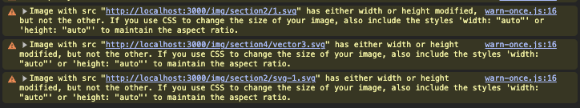

## 本地图片

Next.js 将根据导入的文件自动确定图像的 width 和 height 。这些值用于防止在加载图像时出现累积布局偏移

需要注意的是不是放在 `public` 文件里，因为 `public` 里不会打包图片

```js
import Image from 'next/image'
import profilePic from './me.png'

export default function Page() {
  return (
    <Image
      src={profilePic}
      alt="Picture of the author"
      // width={500} 自动提供
      // height={500} 自动提供
      // blurDataURL="data:..." 自动提供
      // placeholder="blur" // 可选
    />
  )
}
```

## 远程图片

需要 `width` `height` 属性用于推断图像的正确纵横比，并避免从图像加载开始布局偏移

```js
import Image from 'next/image'

export default function Page() {
  return (
    <Image
      src="https://s3.amazonaws.com/my-bucket/profile.png"
      alt="Picture of the author"
      width={500}
      height={500}
    />
  )
}
```

要安全地允许优化图像，请在 `next.config.js` 中定义支持的 `URL` 模式列表。

```js
images: {
    remotePatterns: [
      {
        protocol: 'https',
        hostname: 's3.amazonaws.com',
        port: '',
        pathname: '/my-bucket/**',
      },
    ],
  }
```

## 图片警告问题



产生原因是这个图片设置的 `width` 和 `height` 和真实图片的宽高不一致，`next` 就认为图片发生了偏移，图片宽高有小数往往不行。所以先尝试设置匹配的 `width` 和 `height`。如果还不行可以给个父盒子，`Image` 上 `width` 为 0，`height` 为 0，然后 `className="h-auto w-full"` 就可以解决，但要注意清晰度问题。

```jsx
<div className="absolute bottom-[70px] right-0 h-[316] w-[120px]">
  <Image
    src={xxx}
    alt=""
    width={0}
    height={0}
    className="h-auto w-full"
  ></Image>
</div>
```

## 图片常用的一些属性

#### priority

高优先级和预加载，仅当图像在首屏上方可见时才应使用，将自动禁用延迟加载

#### placeholder（图片渐进加载）

图片加载时显示的占位符，可选值：`blur、empty、data:image/...`，默认值为 `empty` 。

```js
placeholder = 'empty' // "empty" | "blur" | "data:image/..."
```

当 `blur` 时，该 `blurDataURL` 属性将用作占位符。如果 `src` 是来自静态导入的对象，并且导入的图像是 `.jpg 、 .png 、 .webp` 或 `.avif` ，则 `blurDataURL` 将自动填充，除非检测到图像是动画的

对于动态图像，必须提供 `blurDataURL` 属性。[Plaiceholder](https://github.com/joe-bell/plaiceholder) 等解决方案可以帮助生成 `base64`

当 `data:image/...` 时，数据 `URL` 将用作图像加载时的占位符

当 `empty` 时，加载图像时将没有占位符，只有空白空间。

#### blurDataURL

在 `src` 成功加载图像之前用作占位符图像的数据 `URL`。仅当与 `placeholder="blur"`

## 图片渐进加载

静态图片（放项目的图片），不能用路径，只能 `import`，再加上`placeholder="blur"`就可以了

```jsx
import Image from 'next/image'
import mountains from '../../../public/1.jpg'
export default function Page() {
  return <Image alt="Mountains" src={mountains} placeholder="blur" />
}
```

这样就可以两张图片，先加载 `svg` 占位图，原图加载好了，再换成原图


对于动态图片，可以直接提供 base64

```js
placeholder={`data:image/svg+xml;base64,${xxxxx}`}
```

也可以用 [plaiceholder](https://plaiceholder.co/docs/examples/next)生成 `base64`

## 图片 CDN

如果要使用云提供商来优化图像，而不是使用 `Next.js` 内置的图像优化 `API`，可以 `next.config.js` 按照如下方式进行配置 `loaderFile`（如果需要直接使用图片地址，而不是把图片下载到项目里）

```js
const isProd = process.env.NODE_ENV === 'production'

module.exports = {
  reactStrictMode: false,
  assetPrefix: isProd ? '/new' : undefined, //cdn前缀 访问静态资源的前缀
  basePath: isProd ? '/new' : undefined, // 访问路由的前缀

  images: {
    loader: isProd ? 'custom' : undefined,
    loaderFile: isProd ? './bin/image-loader.js' : undefined,
    remotePatterns: [
      {
        protocol: 'https',
        hostname: 'store.res.meizu.com',
        port: '',
        pathname: '/www/**'
      }
    ]
  }
}
```

bin

```js
'use client'

export default function myImageLoader({ src, width, quality }) {
  return `${src}?w=${width}&q=${quality || 75}`
}
```
