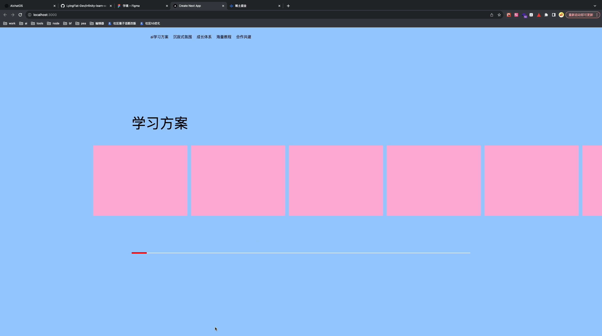

```js
'use client'

import { useLineScale } from './hooks'

const Section2 = () => {
  const { containerRef, contentRef, scaleX } = useLineScale()

  return (
    <section className="flex bg-blue-300" ref={containerRef}>
      <div className="relative m-auto h-full w-[1440px]">
        <div className="absolute top-[50%] h-[600px] w-full translate-y-[-50%]">
          <h2 className="mb-[50px] text-[60px]">学习方案</h2>
          <ul
            ref={contentRef}
            className="absolute mb-[50px] flex h-[300px] w-fit"
          >
            {Array(8)
              .fill(0)
              .map((item, index) => {
                return (
                  <div
                    key={index}
                    className="mr-[16px] w-[400px] bg-pink-300"
                  ></div>
                )
              })}
            <li></li>
          </ul>
          <div className="absolute bottom-0 h-[2px] w-full bg-[#ffffff]">
            <div
              className="absolute left-0 top-[-2px] h-[6px] w-full origin-left bg-[red]"
              style={{ transform: `scaleX(${scaleX})` }}
            ></div>
          </div>
        </div>
      </div>
    </section>
  )
}

export default Section2
```

```js
import { gsap } from 'gsap'
import { useRef, useState } from 'react'
import { useIsomorphicLayoutEffect } from 'framer-motion'

export const useLineScale = () => {
  const containerRef = useRef < HTMLDivElement > null
  const contentRef = useRef < HTMLUListElement > null
  const [scaleX, setScaleX] = useState(0)

  useIsomorphicLayoutEffect(() => {
    const tl = gsap.timeline({
      scrollTrigger: {
        trigger: containerRef.current,
        start: 'center center',
        end: '+=2000',
        scrub: 1,
        pin: true,
        toggleActions: 'play none reverse none',
        onUpdate: (self) => {
          try {
            setScaleX(self.progress)
          } catch (e) {
            console.log(e)
          }
        }
      }
    })

    tl.to(contentRef.current, {
      right: 0
    })
    return () => {
      tl.kill()
    }
  }, [])
  return { containerRef, contentRef, scaleX }
}
```
