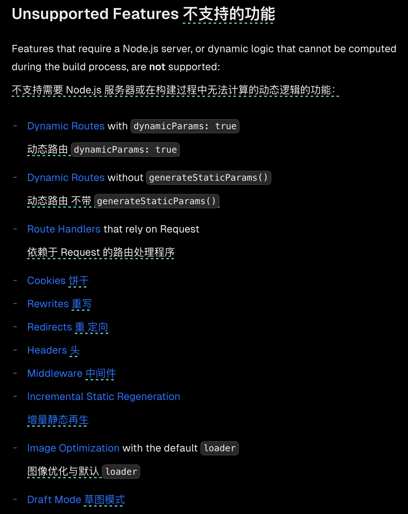

## 默认情况

`pnpm run build`打包

`pnpm run start`启动 `node` 服务

## 静态导出



静态导出相当于是 `SSG`，相当于传统 `SPA` 开发完打包成静态资源，所以不支持 `export const dynamic = 'force-dynamic'`

```js
const nextConfig = {
  output: 'export',
  distDir: 'out'
  // assetPrefix: '../', 问静态资源的前缀
}

module.exports = nextConfig
```

注意如果想本地打开，还需要删除打包后的`html`里的`crossorigin=""`
