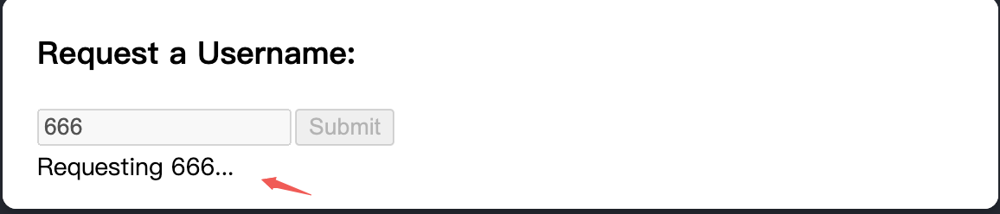

## useFormState

- 如果表单尚未提交，则表示的初始状态，主要处理错误信息
- 如果用 `Form` 提交的话，方法放到`<form action={create}>`的话，需要 `useFormState`来获取状态信息，可以简化操作（否则需要多写一个状态）

```js
'use client'
import { useFormState } from 'react-dom'
import { addToCart } from './actions.js'

function AddToCartForm({ itemID, itemTitle }) {
  const [formState, formAction] = useFormState(addToCart, {})
  return (
    <form action={formAction}>
      <h2>{itemTitle}</h2>
      <input type="hidden" name="itemID" value={itemID} />
      <button type="submit">Add to Cart</button>
      {formState?.success && (
        <div className="toast">
          Added to cart! Your cart now has {formState.cartSize} items.
        </div>
      )}
      {formState?.success === false && (
        <div className="error">Failed to add to cart: {formState.message}</div>
      )}
    </form>
  )
}

export default function App() {
  return (
    <>
      <AddToCartForm itemID="1" itemTitle="JavaScript: The Definitive Guide" />
      <AddToCartForm itemID="2" itemTitle="JavaScript: The Good Parts" />
    </>
  )
}
```

```js
'use server'

export async function addToCart(prevState, queryData) {
  const itemID = queryData.get('itemID')
  if (itemID === '1') {
    return {
      success: true,
      cartSize: 12
    }
  } else {
    return {
      success: false,
      message: 'The item is sold out.'
    }
  }
}
```

## useFormStatus

- `const { pending, data, method, action } = useFormStatus();`
- 重点注意：`useFormStatus` 将仅返回父 `<form>` 级的状态信息。它不会返回在同一组件或子组件中呈现的任何 `<form>` 状态信息
- 使用 `data` 参数，还可以用来显示临时状态消息，确认他们请求的用户名



```js
import { useFormStatus } from 'react-dom'
import action from './actions'

function Submit() {
  const status = useFormStatus()
  return <button disabled={status.pending}>Submit</button>
}

export default function App() {
  return (
    <form action={action}>
      <Submit />
    </form>
  )
}
```
