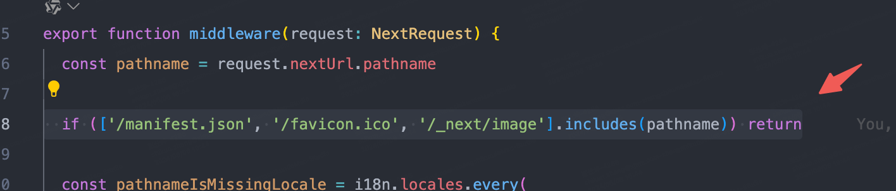
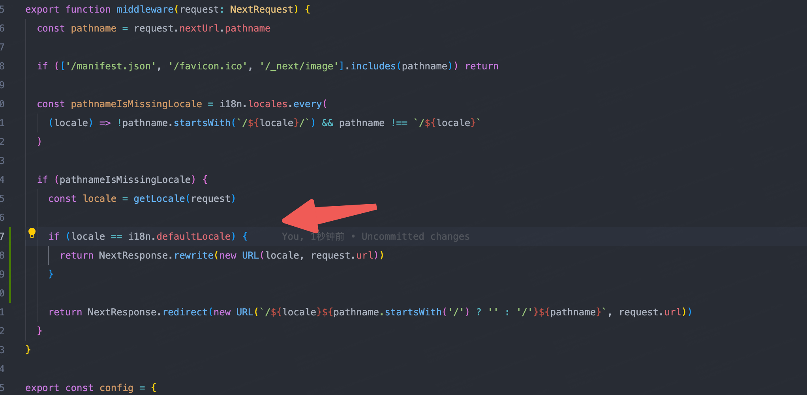

## 国际化

参考 [app-dir-i18n-routing](https://github.com/vercel/next.js/tree/canary/examples/app-dir-i18n-routing)

注意 `middleware.ts` 一定要与 `app` 目录同级

`middleware.ts`

看官网例子可能会遇到两个问题

- 图片放 `public` 文件夹的时候，图片国际化会找不到图片
- 无法默认根目录是某种语言

解决问题一



新增代码

```js
if (['/manifest.json', '/favicon.ico', '/_next/image'].includes(pathname))
  return
```

解决问题二



新增代码

```js
if (locale == i18n.defaultLocale) {
  return NextResponse.rewrite(new URL(locale, request.url))
}
```
