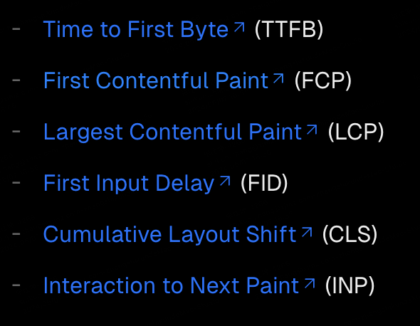

用法

```js
'use client'

import { useReportWebVitals } from 'next/web-vitals'

export function WebVitals() {
  useReportWebVitals((metric) => {
    console.log(metric)
  })
  return undefined
}
```

支持的性能指标


