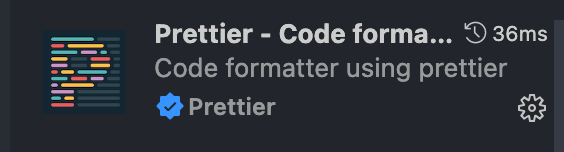
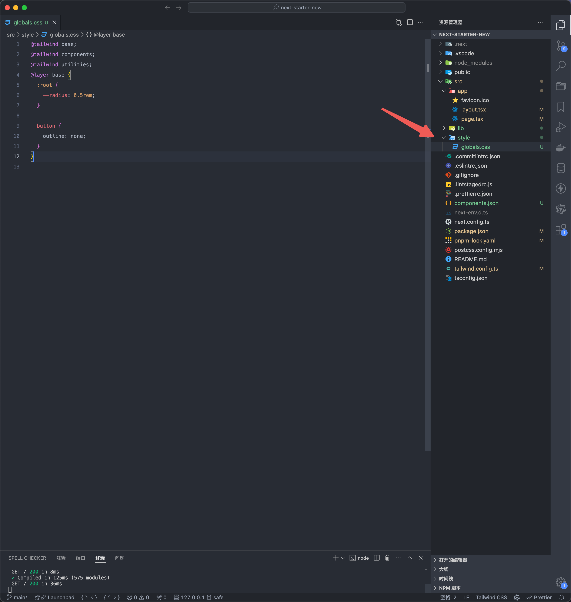
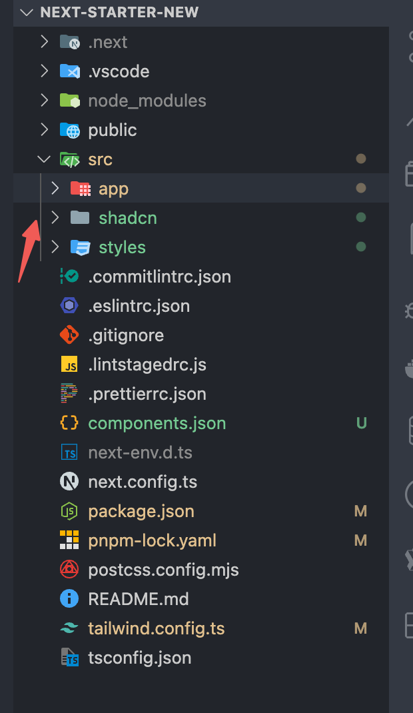

## next15 项目初始化

next15 更新，重新做一个架子，再熟悉一下项目初始化的流程。

## 初始化

首先用官方脚手架初始化`npx create-next-app@latest`，但下载依赖的时候可能是我之前有缓存报错了，可以 `sudo npm cache clean --force` 清除缓存，默认是 npm 下载依赖，也可以手动 `pnpm i` 下载依赖

配置使用默认的，官方脚手架没升级 `eslint`，咋也不管


然后就是把原有的字体，和 page 里面的没用的代码删掉，readme 的内容，global.css 和 tailwind.config.js 里多余的代码 也删掉

## README.md

简单清晰的 readme，方便维护

```md
## 项目文档

- [项目上线地址](xxx)
- [需求文档](xxx)
- [设计稿](xxx)
- [DMS 地址](xxx)
- [代码仓库地址](xxx)

## 项目环境

测试环境 host：

- xxx

灰度环境 host：

- xxx

- Node.js 版本: v20.9.0
- pnpm 版本: v9.11.0

## 发布流程

先构建，再点击新建发布

1. **测试环境**

   - [测试](xxx)

2. **灰度环境**

   - [灰度](xxx)

3. **正式环境**
   - [外网](xxx)
```

## next-snippets

设置常用的代码片段

```json
{
  "react typescript component": {
    "prefix": "rt",
    "body": [
      "const ${TM_FILENAME_BASE/(.*)/${1:/capitalize}/} = () => {",
      "  return (",
      "    <div>",
      "      <div></div>",
      "    </div>",
      "  )",
      "}",
      "",
      "export default ${TM_FILENAME_BASE/(.*)/${1:/capitalize}/}"
    ],
    "description": "react typescript"
  },
  "next image": {
    "prefix": "ni",
    "body": [
      "<Image src='' height={} width={} className='h-full w-full object-cover'  alt=''/>"
    ],
    "description": "next image"
  },
  "gsap useGSAP": {
    "prefix": "up",
    "body": [
      "useGSAP(() => {",
      "  const t1 = gsap.timeline({",
      "    scrollTrigger: {",
      "      trigger: '$1',",
      "      start: '$2',",
      "      end: '$3',",
      "      toggleActions: 'play none none reverse',",
      "      markers: true",
      "    }",
      "  })",
      "",
      "  t1.from('$4', {",
      "    opacity: 0",
      "  })",
      "})",
      ""
    ],
    "description": "gsap useGSAP"
  },
  "useEffect": {
    "prefix": "useE",
    "body": ["useEffect(() => {", " ", "}, [])"],
    "description": "useEffect"
  }
}
```


## eslint & prettier

首先需要在 vscode 下载 `eslint` 和 `prettier` 插件




然后配置 `setting.json`，支持 eslint 格式化

```json
{
  "typescript.tsdk": "node_modules/typescript/lib",
  "editor.codeActionsOnSave": {
    "source.fixAll.eslint": "explicit"
  },
  "editor.formatOnSave": true,
  "editor.defaultFormatter": "esbenp.prettier-vscode"
}
```


然后参考官网文档 [ESlint](https://nextjs.org/docs/app/api-reference/config/eslint#with-prettier)，[eslint](https://nextjs.org/docs/app/api-reference/config/eslint#with-core-web-vitals) 和 [typescript](https://nextjs.org/docs/app/api-reference/config/eslint#with-typescript) 建议规范已经有了，需要配置 [prettier](https://nextjs.org/docs/app/api-reference/config/eslint#with-prettier) 防止冲突

安装命令：`pnpm i eslint-config-prettier prettier prettier-plugin-tailwindcss -D`


配置 `.prettierrc.json`，`prettier-plugin-tailwindcss` 插件也很有必要，之前有写过 [优雅的使用 Tailwind](http://localhost:5173/next/tailwind/tw-config.html#%E6%80%8E%E4%B9%88%E4%BC%98%E5%8C%96-tailwind-%E6%9D%82%E4%B9%B1%E7%9A%84%E6%8E%92%E5%BA%8F%E6%96%B9%E5%BC%8F)

```json
{
  "singleQuote": true,
  "semi": false,
  "trailingComma": "none",
  "tabWidth": 2,
  "plugins": ["prettier-plugin-tailwindcss"],
  "printWidth": 120,
  "endOfLine": "lf"
}
```

## simple-git-hook & lint-staged & commitlint

这里放弃使用 husky，使用 simple-git-hooks，这个看个人喜欢，都差不多

安装命令：`pnpm i simple-git-hooks @commitlint/cli @commitlint/config-conventional lint-staged -D`

配置 [.lintstagedrc.js](https://nextjs.org/docs/app/api-reference/config/eslint#running-lint-on-staged-files)

```js
const path = require('path')

const buildEslintCommand = (filenames) =>
  `next lint --fix --file ${filenames
    .map((f) => path.relative(process.cwd(), f))
    .join(' --file ')}`

module.exports = {
  '*.{js,jsx,ts,tsx}': [buildEslintCommand]
}
```

配置 `commitlint.json`

```json
{ "extends": ["@commitlint/config-conventional"] }
```

配置 `.simple-git-hooks.json`，配置完重新 pnpm i 一下初始化 simple-git-hooks

```json
  "scripts": {
    "dev": "next dev",
    "build": "next build",
    "start": "next start",
    "lint": "next lint",
    "postinstall": "simple-git-hooks"
  },
  "simple-git-hooks": {
    "pre-commit": "pnpm lint-staged",
    "commit-msg": "npx --no -- commitlint --edit '$1'"
  }
```


看到这样就对了，第一次提交错误的规范，就提示报错了，后面用正确的规范提交就通过了，并且可以看到 lint-staged 检查的效果


## shadcn

初始化 `pnpm dlx shadcn@latest init`

这里不使用主题切换的话，就把这个选项选 no


我把样式提到 styles 文件夹里，因为我只会写极少的 css，基本写 tailwind 类名，这里增加 button 的样式放 layer 层，否则低版本浏览器会有一个边框

```css
button {
  outline: none;
}
```



修改一下 `components.json`，原因之前[思考过](http://localhost:5173/next/tailwind/tw-config.html#%E6%80%9D%E8%80%83-tailwind-shadcn)，还是不要混着比较好

```json
{
  "$schema": "https://ui.shadcn.com/schema.json",
  "style": "new-york",
  "rsc": true,
  "tsx": true,
  "tailwind": {
    "config": "tailwind.config.ts",
    "css": "src/styles/globals.css",
    "baseColor": "neutral",
    "cssVariables": false,
    "prefix": ""
  },
  "aliases": {
    "components": "@/shadcn/components",
    "utils": "@/shadcn/lib/utils",
    "ui": "@/shadcn/components/ui",
    "lib": "@/shadcn/lib",
    "hooks": "@/shadcn/hooks"
  },
  "iconLibrary": "lucide"
}
```

需要把 shadcn 文件夹也添加到 `tailwind.config.ts` 的 content 里

```ts
content: [
  './src/pages/**/*.{js,ts,jsx,tsx,mdx}',
  './src/components/**/*.{js,ts,jsx,tsx,mdx}',
  './src/app/**/*.{js,ts,jsx,tsx,mdx}',
  './src/shadcn/**/*.{js,ts,jsx,tsx,mdx}' //新增
]
```

初始化一个按钮试试，`pnpm dlx shadcn@latest add button`


最后的目录结构如下



## next.config.ts 中配置代理和图片安全域名

```ts
import type { NextConfig } from 'next'

const nextConfig: NextConfig = {
  reactStrictMode: false,
  async rewrites() {
    return [
      {
        source: '/api/:path*',
        destination: 'https://www.baidu.com/:path*'
      }
    ]
  },
  images: {
    remotePatterns: [
      {
        protocol: 'https',
        hostname: 'baidu.com',
        port: '',
        pathname: '/**'
      },
      {
        protocol: 'https',
        hostname: 'baidu.com',
        port: '',
        pathname: '/**'
      }
    ]
  }
}

export default nextConfig
```

## 环境变量

上面的代理需要配合环境变量

.env.development 中配置

```bash
NEXT_PUBLIC_BASE_URL=/api
```

.env.production 中配置

```bash
NEXT_PUBLIC_BASE_URL=https://baidu.com
```

之前我们请求的 url 就是：`const BASE_URL = process.env.NEXT_PUBLIC_BASE_URL`

## nextjs 预设文件

参考 [File Conventions](https://nextjs.org/docs/app/api-reference/file-conventions)，使用常用的 `loading.ts`，`not-found.ts`（暂时不考虑 error.ts，因为这种情况较少）

loading.ts

```ts
const Loading: React.FC = () => {
  return (
    <div className="flex h-screen items-center justify-center">
      <div className="loader-ui"></div>
    </div>
  )
}

export default Loading
```

```css
.loader-ui {
  display: block;
  width: 130px;
  height: 4px;
  border-radius: 30px;
  background-color: rgb(0 0 0 / 20%);
  position: relative;
}

.loader-ui::before {
  content: '';
  position: absolute;
  background: #ff4132;
  top: 0;
  left: 0;
  width: 0%;
  height: 100%;
  border-radius: 30px;
  will-change: transform; /* 启用硬件加速 */
  animation: moving 1s ease-in-out infinite;
}

@keyframes moving {
  50% {
    width: 100%;
  }

  100% {
    width: 0;
    right: 0;
    left: unset;
  }
}
```

测试 loading 效果，可以写个 sleep 函数

```tsx
const sleep = (ms: number) => new Promise((resolve) => setTimeout(resolve, ms))

const Page = async () => {
  await sleep(1000)

  return (
    <div>
      <div></div>
      Lorem ipsum dolor sit, amet consectetur adipisicing elit. Ipsa reiciendis
      provident perspiciatis, corrupti placeat voluptate necessitatibus dicta
      ducimus, non doloribus eaque facilis suscipit, esse omnis! Totam excepturi
      deleniti pariatur ullam!
    </div>
  )
}

export default Page
```


not-found.ts，可以用 [v0](https://v0.dev/) 生成一个


```ts
import Link from 'next/link'
import { Button } from '@/shadcn/components/ui/button'
import {
  Card,
  CardContent,
  CardFooter,
  CardHeader,
  CardTitle
} from '@/shadcn/components/ui/card'
import { XCircle } from 'lucide-react'

export default function NotFound() {
  return (
    <div className="flex min-h-screen items-center justify-center bg-gray-50 p-4">
      <Card className="w-full max-w-md">
        <CardHeader>
          <CardTitle className="flex items-center justify-center space-x-2 text-center">
            <XCircle className="h-6 w-6 text-red-500" />
            <span>页面未找到</span>
          </CardTitle>
        </CardHeader>
        <CardContent>
          <p className="text-center text-gray-600">
            抱歉，您请求的页面不存在或已被移除。
          </p>
        </CardContent>
        <CardFooter className="flex justify-center">
          <Button asChild>
            <Link href="/">返回首页</Link>
          </Button>
        </CardFooter>
      </Card>
    </div>
  )
}
```

## seo 相关文件

1. robots.txt
2. sitemap.xml

robots.txt

```ts
import { MetadataRoute } from 'next'
import { WEBSITE_URL } from '@/config'

// 如果有国际化，可以通过robots动态让搜索引擎爬取对应的页面
export default function robots(): MetadataRoute.Robots {
  return {
    rules: {
      userAgent: '*',
      allow: '/'
    },
    sitemap: `${WEBSITE_URL}/sitemap.xml`
  }
}
```

访问 [http://localhost:3000/robots.txt](http://localhost:3000/robots.txt)

sitemap.xml，需要动态生成 sitemap，安装 `pnpm  i globby -D`

```ts
import { WEBSITE_URL } from '@/config'
import { globby } from 'globby'

function addPage(page: string) {
  const path = page
    .replace('src/app', '')
    .replace('.tsx', '')
    .replace('.mdx', '')
    .replace('/page', '')
  return path
}

export default async function sitemap() {
  const pages = await globby(['src/app/**/page.tsx'])

  const cleanPages = pages.map((item) => {
    return item.replace('/(pages)', '')
  })

  const cleanPolicy = cleanPages.map((item) => {
    return item.replace('/(policy)', '')
  })

  const routes = cleanPolicy.map((page: string) => ({
    url: `${WEBSITE_URL}${addPage(page)}`,
    // ISO标准
    lastModified: new Date().toISOString()
  }))

  return [...routes]
}
```

访问 [http://localhost:3000/sitemap.xml](http://localhost:3000/sitemap.xml)


## tdk & opengraph

tdk，微信分享，opengraph，常常是运营配置，也就是通过 cms 平台生成接口，所以得动态请求

对于 title 来说应该有子标题，看起来看像这样


所以在 layout 应该配置个对象

```tsx
import type { Metadata } from 'next'
import '@/styles/globals.css'
import '@/styles/loading.css'
import LayoutClient from './layout-client'
import {
  getDmsWxShare,
  getTdk,
  ShareReturnData,
  TDKReturnData
} from '@/service/common'
import {
  BAIDU_TONGJI_URL,
  BLOCK_TDK_ID,
  BLOCK_WX_SHARE_ID,
  TDK_ID,
  WEBSITE_URL,
  WX_SHARE_ID
} from '@/config'
import Script from 'next/script'

export async function generateMetadata(): Promise<Metadata> {
  const promiseArr: [Promise<TDKReturnData>, Promise<ShareReturnData>] = [
    getTdk(TDK_ID),
    getDmsWxShare(WX_SHARE_ID)
  ]

  const [tdkResponse, wxShareResponse] = await Promise.all<
    [Promise<TDKReturnData>, Promise<ShareReturnData>]
  >(promiseArr)

  const { tdk } = tdkResponse

  const { shareInfo } = wxShareResponse

  if (!tdk || !tdk[BLOCK_TDK_ID] || !shareInfo || !shareInfo[BLOCK_WX_SHARE_ID])
    return {}

  const { title, description, keywords } = tdk[BLOCK_TDK_ID][0]

  const { wxTitle, content, imageUrl } = shareInfo[BLOCK_WX_SHARE_ID][0]

  return {
    title: {
      template: `%s | ${title}`,
      default: title
    },
    description,
    keywords,
    openGraph: {
      type: 'website',
      images: imageUrl,
      description: content,
      title: wxTitle,
      url: WEBSITE_URL
    }
  }
}

export default async function RootLayout({
  children
}: Readonly<{
  children: React.ReactNode
}>) {
  return (
    <html lang="zh-CN">
      {process.env.NODE_ENV === 'production' && (
        <Script src={BAIDU_TONGJI_URL}></Script>
      )}
      <link rel="canonical" href={WEBSITE_URL} />
      <body suppressHydrationWarning>
        <LayoutClient></LayoutClient>
        {children}
      </body>
    </html>
  )
}
```

在其他页面，配置副标题

```js
export const metadata: Metadata = {
  title: 'SU7'
}
```

## layout-client

在上面的代码里，我有个 layout-client，这个是客户端组件，用来初始化客户端配置，我用到的有 gsap 插件注册，微信分享，做 h5 项目还需要 vconsole

```js
'use client'

import { useShowVconsole, useWxShare } from '@/hooks'
import { ScrollTrigger } from 'gsap/ScrollTrigger'
import { gsap } from 'gsap'
import { useGSAP } from '@gsap/react'

gsap.registerPlugin(ScrollTrigger, useGSAP)

const LayoutClient = () => {
  // 开发时 vconsole
  useShowVconsole()

  // 微信分享
  useWxShare()

  return null
}

export default LayoutClient
```

## 关于 config

应该在 src 目录下建一个 config，用来放配置


比如我放了这些，这样下次使用的时候，不用去关心别的地方，只需要在 config 里修改对应的配置就好了


