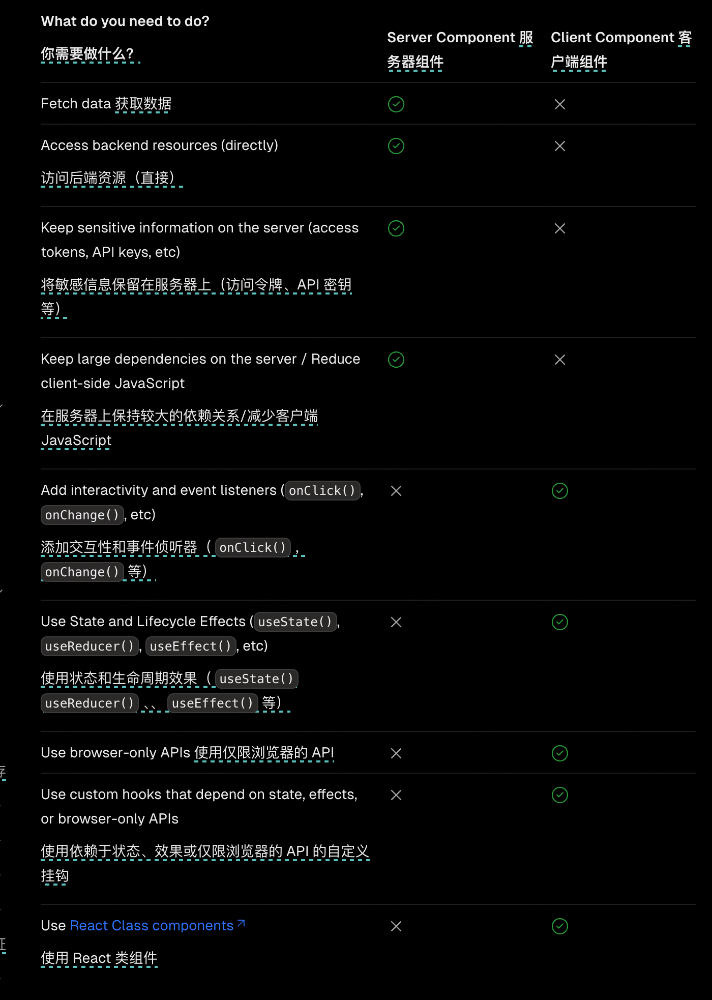

## 何时用？

还要注意的是第三方库往往需要`"use client"`

## 一些关系

服务端组件客户端组件和 `SSR/SSG/ISR` 有关系吗？

没有关系，`SSR/SSG/ISR` 里随便使用服务端组件客户端组件，两个互不影响

服务端组件客户端组件和 `Server Action` 有关系吗？

有关系，服务端组件可以直接访问服务端，而客户端组件不能直接访问服务端但是可以通过 `server action` 访问服务端

但是服务端组件可以通过 `<form>` 元素中的 `action` 属性调用服务器这个时候服务端组件使用`server action`

服务器组件支持渐进式增强，这意味着即使 `JavaScript` 尚未加载或被禁用，也会提交表单
