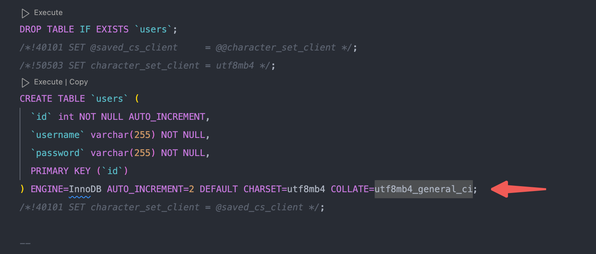
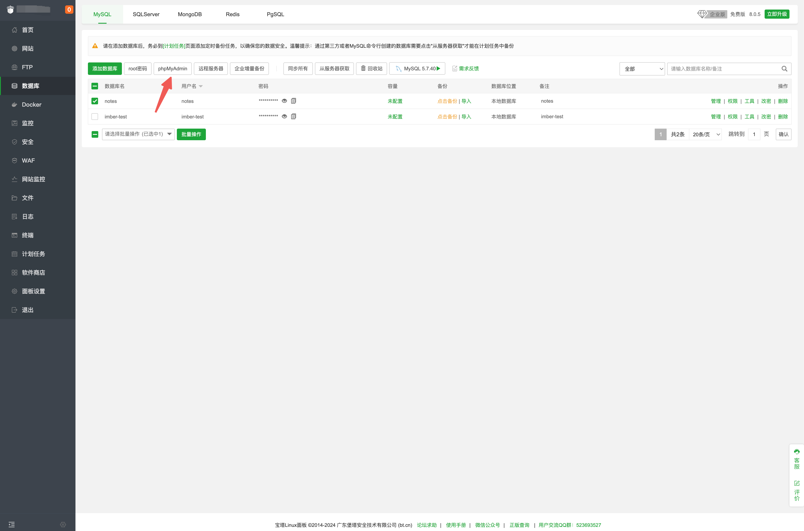
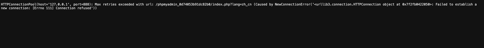
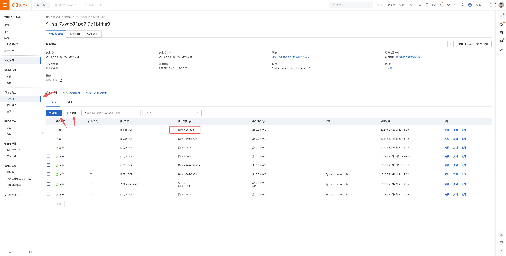
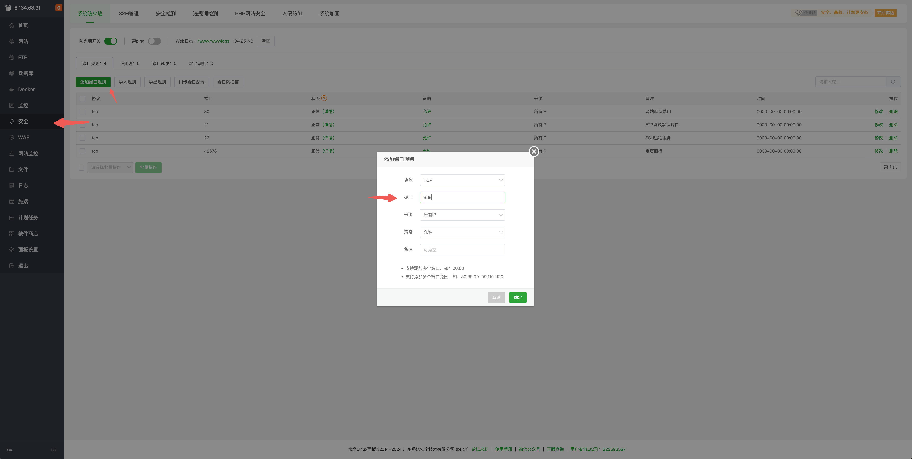
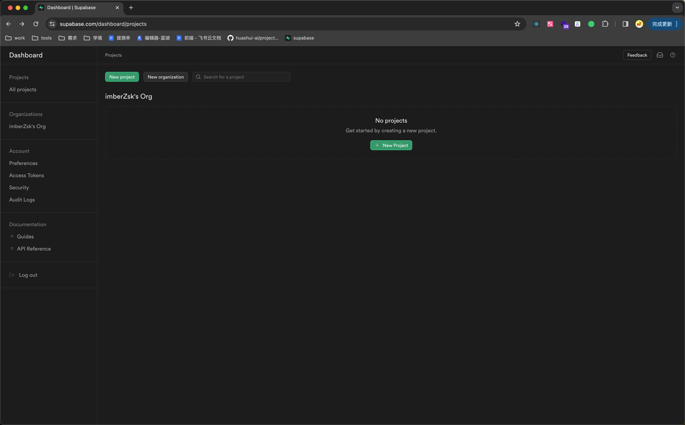
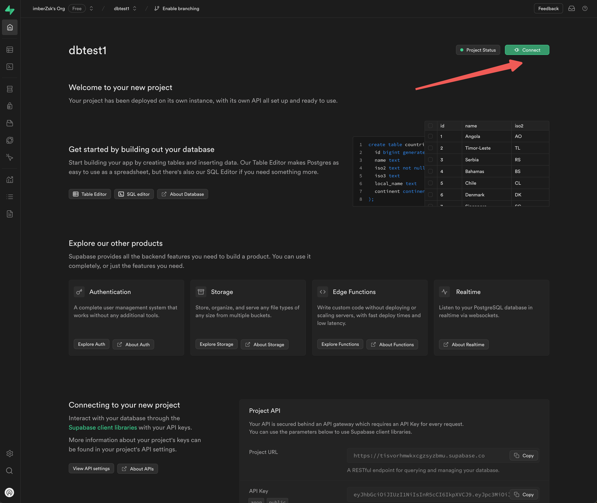

## 数据库版本



本地开发完导出数据库 `sql` 的时候，`utf8mb4_0900_ai_ci`为 `MySQL 8` 版本开始才有的编码， 需要改为 `utf8mb4_general_ci`，再导入测试环境

`MySQL 5.7.8`版本以上才有 `json` 数据类型，所以 `strapi`在目前公司级别的字段暂不使用 `json` 格式

## 部署脚本

```js
pnpm run build
```

```js
pnpm run start
```

## 环境变量

#### 本地.env

```js
# Database
DATABASE_CLIENT=mysql
DATABASE_HOST=127.0.0.1
DATABASE_PORT=3306
DATABASE_NAME=strapi
DATABASE_USERNAME=root
DATABASE_PASSWORD=admin
DATABASE_SSL=false
JWT_SECRET=ytRFl69z6mHFG0TrUzitRg==
```

#### 连接测试环境的库

```js

```

## 图片如何保存到阿里云？

## 宝塔 phpMyAdmin

创建数据库和导入 `sql` 后点击 `phpMyAdmin`



点击可能出现报错



需要到阿里云 `ECS` 中配置安全组开放 `888` 端口



宝塔里的安全配置一下



## supabase

[supabase](https://supabase.com/)首页选择 `start your project`，然后 `github` 登陆



点击连接，可以看到要写在`.env`文件里的连接内容


注意修改密码和修改端口号 `5432`
