## 总结

自定义接口，能代替一些管理系统的简单功能

## 前言

`node` 版本需要 `18` 或者 `20`

## CMS 系统

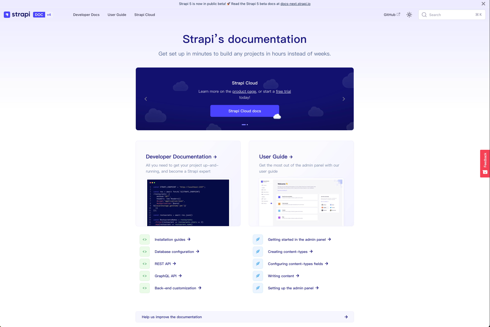

`strapi` 时 `CMS Headless` 系统，让前端 -> 全栈，适合 `C` 端项目

## 创建项目

#### 安装

如果使用`npx create-strapi-app@latest my-project --quickstart` 则是用默认都 `SQLite` 数据库，但是国内还是常用 `MySQL`

```js
npx create-strapi-app@latest my-project
```

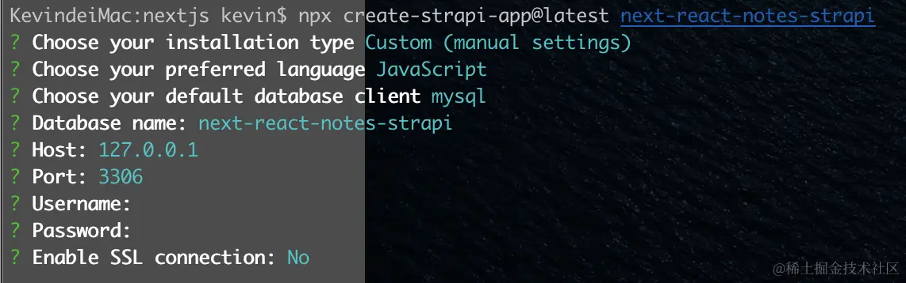

#### 注册第一个本地管理员

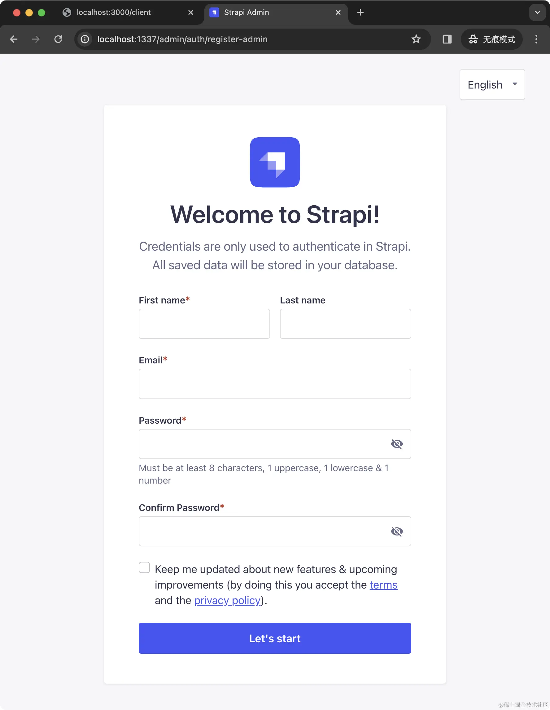

## 设置中文

为了方便使用，我们先把界面的中文设置了，打开 `src/admin/app.example.js`，重命名为 `app.js`，在其中取消掉 `'zh-Hans'`的注释：

```js
const config = {
  locales: [
    // 'ar',
    // 'fr',
    // 'cs',
    // 'de',
    // 'dk',
    // 'es',
    // 'he',
    // 'id',
    // 'it',
    // 'ja',
    // 'ko',
    // 'ms',
    // 'nl',
    // 'no',
    // 'pl',
    // 'pt-BR',
    // 'pt',
    // 'ru',
    // 'sk',
    // 'sv',
    // 'th',
    // 'tr',
    // 'uk',
    // 'vi',
    'zh-Hans'
    // 'zh',
  ]
}

const bootstrap = (app) => {
  console.log(app)
}

export default {
  config,
  bootstrap
}
```

注意可能需要重启项目，然后点击左下角的用户名 -> Profile，拉到最下面，选择中文（简体）：

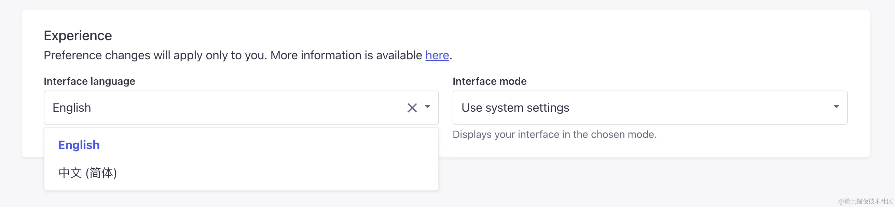

## 使用 Content-type 构建数据结构

相当于数据库建表操作，添加各种字段

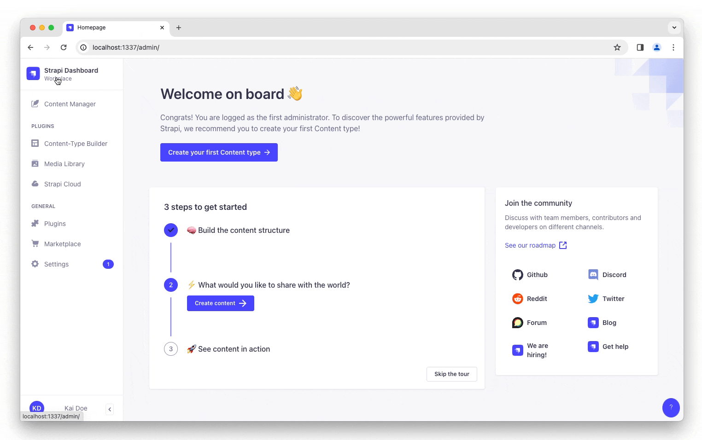

## 使用 REST API

现在接口就已经生成了，对于一个 ` COLLECTION TYPE`，`Strapi ` 对应会生成这些接口，我们以这里的 `Note COLLECTION TYPE` 为例：

方法 `URL` 示例 作用

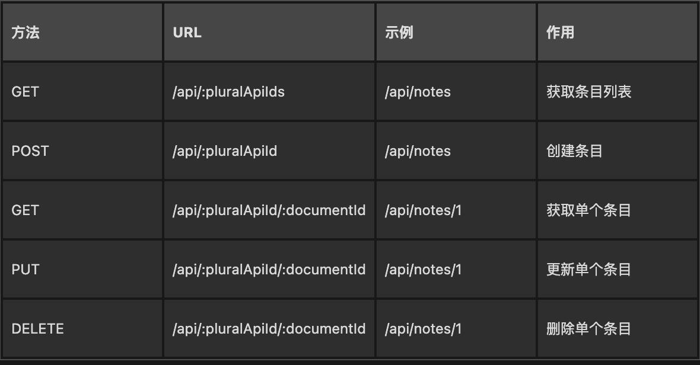

注意这里用到的都是复数 `ID`。如果是 `SINGLE TYPES`，生成的接口会用到单数 `ID`：

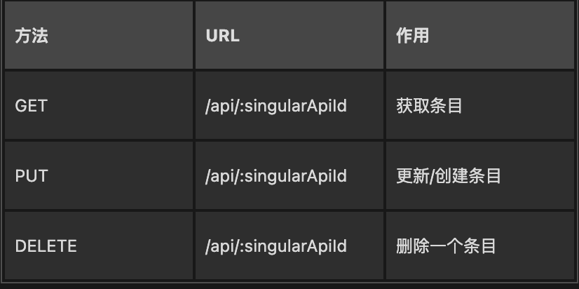

## 生成 token

打开 `Settings -> API Tokens`，点击 `Create new API Token`，生成 `API Token`，该 `Token` 决定了权限范围和使用时间

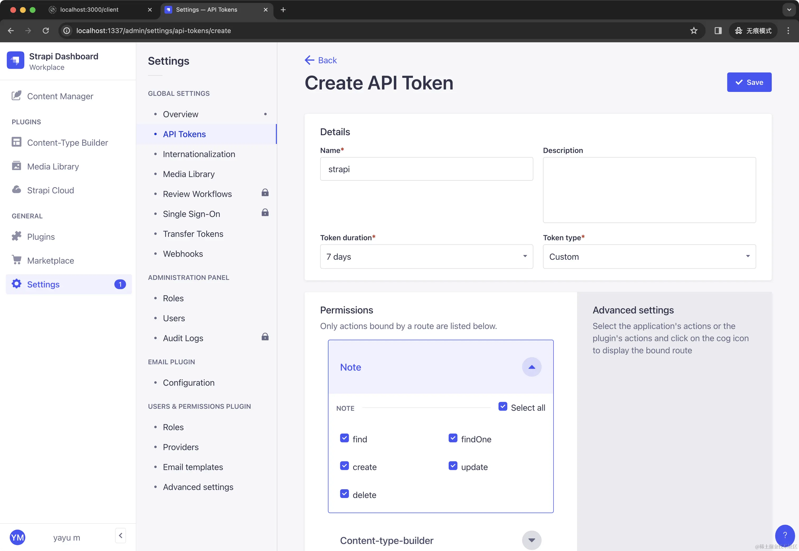

生成之后，获取接口数据的时候就需要带上这个 token：

## 取消授权

那你可能会想：“好麻烦，我调用个接口，还要用 `token`，能不能不用 `token`，至少获取列表和获取条目不需要？”。当然也是可以的，我们点击 `Settings-> Roles`，选择 `Public` 角色进行编辑：

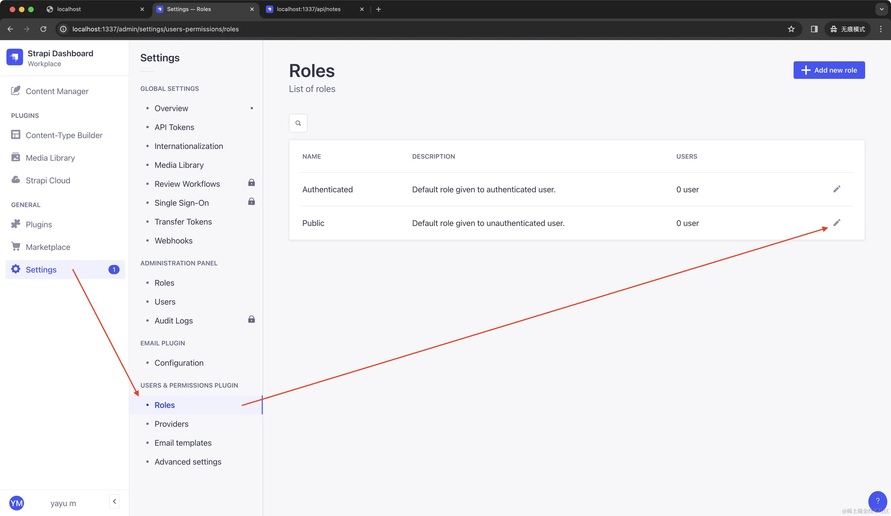

勾选 `Note` 这个集合类型中的 `find` 和 `findOne，表示` `/api/notes` 和 `/api/note/1` 不再需要鉴权。

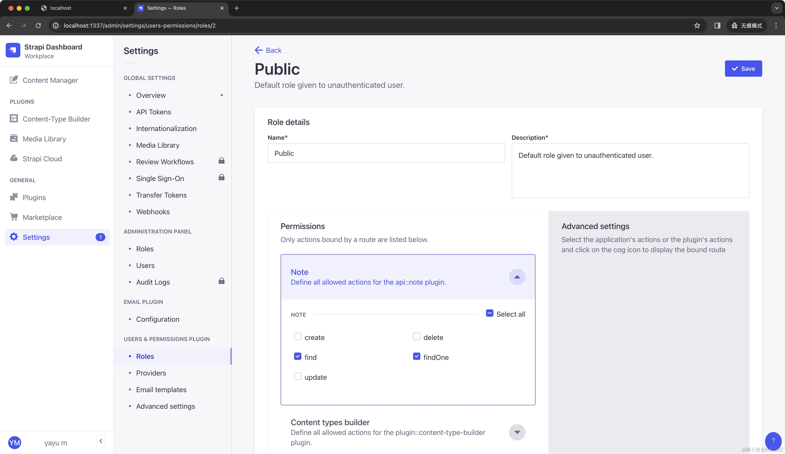

## 图片视频

创建 图片/视频 模型后这里可以知道图片的地址，数据库在 `files` 表里

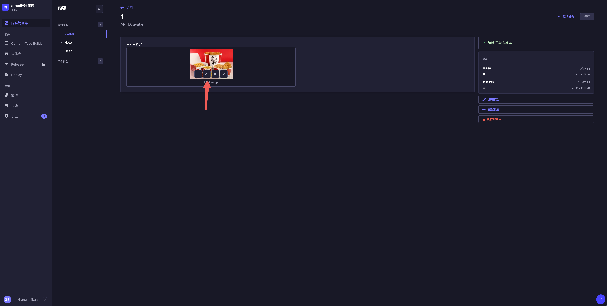
