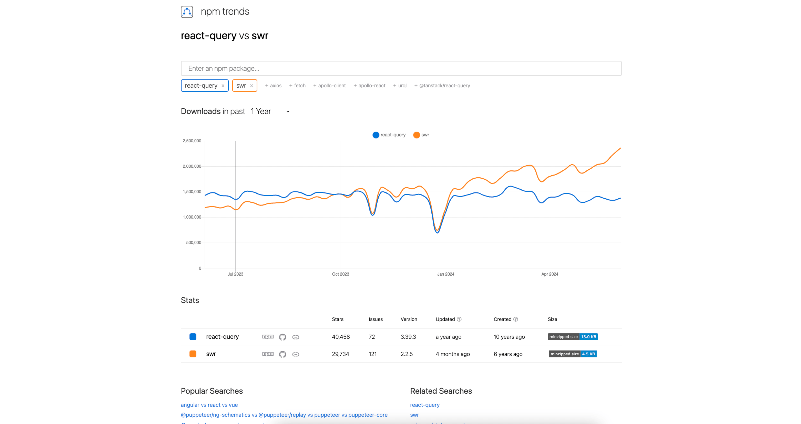

[2023 年了，你为什么还不用 SWR ？](https://juejin.cn/post/7247028435339591740?searchId=2024061016004081622F1C809E2550F019)

`swr` 下载量已经超过了 `react-query`



[api](https://swr.vercel.app/zh-CN/docs/api)、[全局配置](https://swr.vercel.app/zh-CN/docs/global-configuration)

> 如果 fetcher 是全局配置提供的，可以从参数中忽略

```js
const { data, error, isLoading, isValidating, mutate } = useSWR(
  key,
  fetcher,
  options
)
```

基础使用

```js
import useSWR from 'swr'

const fetcher = (url) => fetch(url).then((r) => r.json())

function Profile() {
  const { data, error, isLoading } = useSWR('/api/user/123', fetcher)

  if (error) return <div>failed to load</div>
  if (isLoading) return <div>loading...</div>

  // 渲染数据
  return <div>hello {data.name}!</div>
}
```

- 可全局错误处理
- 自动重新请求（聚焦时重新请求、定期重新请求、重新连接时重新请求）
- [传入参数](https://swr.vercel.app/zh-CN/docs/arguments)，传多个参数、传对象
