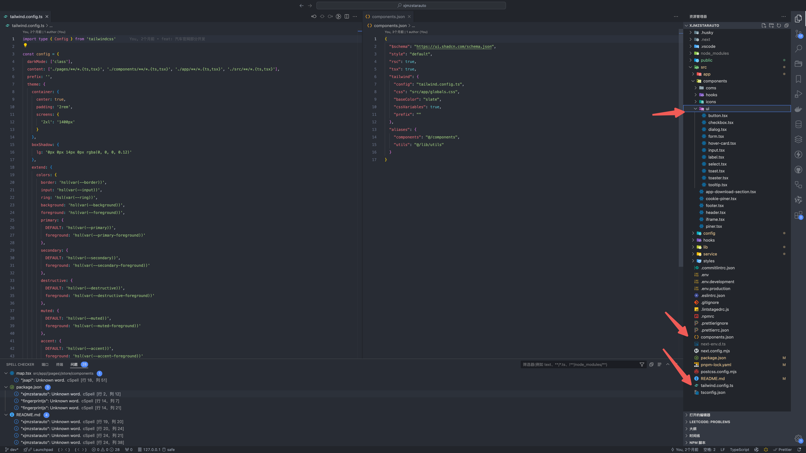

# 优雅的使用 Tailwind

## 怎么解决滥用的[]（&主题切换）

回头看之前写的 `Tailwind` 无数的 `[]`，非常不优雅


#### 配置字体解决字体的[]

配置`theme.extend.fontSize`后，如 `text-[16px]` 应该写成 `text-md`，而不是方括号


```js
fontSize: {
  xs: '1.2rem',
  sm: '1.4rem',
  md: '1.6rem',
  lg: '2.0rem',
  xl: '2.4rem',
  '2xl': '3.6rem',
  '3xl': '4.8rem'
}
```

#### 配置颜色解决颜色的[] (主题切换也是这个功能)

`theme.extend.colors` 配置和 `global.css` 配置结合，`text-[#fff]` 写成 `text-primary`


这里`:root` 中配置 `font-size: 62.5%;`，让 `1rem` 等于 `10px`


再结合 [Next-Theme](https://ui.shadcn.com/docs/dark-mode/next)，可以轻松实现切换主题

同理，别的`[]`也可以这样解决，但是长宽目前还是得`[]`，`unocss`这点就更好，可以不用 `[]`

## 怎么优化 Tailwind 杂乱的排序方式

参考 [官网](https://tailwindcss.com/blog/automatic-class-sorting-with-prettier#how-classes-are-sorted)，`prettier-plugin-tailwindcss` 这个插件可以自动格式化 `Tailwind` 类名排序


## 不用 class 怎么给标签设置类名？

如果项目中渲染一段 `html`，这个时候无法添加类名怎么办？如果项目中有个模块挺多 `<h1>,<h2>,<h3>,<p>` 这样标签怎么办？富文本编辑器场景的时候也有这个问题，一个一个的加类名很麻烦，有个优雅的解决方案！[tailwindcss-typography](https://github.com/tailwindlabs/tailwindcss-typography)


## 怎么复用重复的样式？

对于全局样式，可以使用 `@apply`，可以设置几个常用的布局，如

```css
.margin-center {
  @apply mx-auto my-0;
}

.flex-center {
  @apply flex items-center justify-center;
}

.absolute-center {
  @apply absolute left-1/2 top-1/2 -translate-x-1/2 -translate-y-1/2;
}
```

也可以用 `export const card = 'border rounded-md p-4'` 全局变量，而不是 `@apply`，这样做到无 `css`

对于单个组件里重复的样式，可以抽离变量

```jsx
let card = `flex bg-pink-200 p-4 rounded-lg`

<div className={card}></div>
<div className={card}></div>
<div className={card}></div>
```

此外还有一个 `@layer`，可以把样式注入到对应层里，避免样式覆盖


## Tailwind 中的选择器也很强大

鼠标悬停 `hover:`、聚焦 `focus:`

表单提交 `required`, `invalid`, `disabled`

选择第一个孩子`first:`，最后一个孩子 `last:`，奇数 `odd:`，偶数 `even:`

父元素悬停触发子元素样式 `group`


## @layer base component utilities

<!-- TODO: -->

```css
@tailwind base;
@tailwind components;
@tailwind utilities;
```

tailwind 是分层的

@layer 抽离到 components 层，但是把这个 button 封装成组件会更好，要不然又会一直想类名了，也还有[其它问题](https://www.tailwindcss.cn/docs/reusing-styles)，请将其用于非常小的、高度可重用的东西，但还是尽量不使用

```jsx
<button class="py-2 px-5 bg-violet-500 text-white font-semibold rounded-full shadow-md hover:bg-violet-700 focus:outline-none focus:ring focus:ring-violet-400 focus:ring-opacity-75">
  Save changes
</button>

<button class="btn-primary">
  Save changes
</button>
```

```css
@tailwind base;
@tailwind components;
@tailwind utilities;

@layer components {
  .btn-primary {
    @apply py-2 px-5 bg-violet-500 text-white font-semibold rounded-full shadow-md hover:bg-violet-700 focus:outline-none focus:ring focus:ring-violet-400 focus:ring-opacity-75;
  }
}
```

## 响应式布局

- 一个方面是需要 UI 考虑更多尺寸，给出适配不同尺寸的设计稿方案
- 重点：使用 `Tailwind` 的媒体查询应该先写小尺寸如 `H5`，再写大尺寸如 `PC`，因为大尺寸会覆盖小尺寸

## clsx/classnames tw-merge cva

首先，`clsx` 是一个打包体积比 `classnames` 更小的替代工具。他的功能与 `classnames` 类似，我们可以用它来组合字符串

## 性能

[just-in-time](https://www.tailwindcss.cn/blog/just-in-time-the-next-generation-of-tailwind-css)，很早开始都是按需生成样式，性能不会差

## [封装思维的小转变，带来极致使用体验](https://mp.weixin.qq.com/s/glr73rMrwqbVmjm6GNLAzA)

这个转变思维让我觉得我的组件变得非常简单。这个思路从 unocss 的传参方式中获得了灵感。例如我们要封装一个 Button 组件。假设该 Button 组件需要支持的情况如下：

语义类型：`normal primary success danger`

组件大小：`small medium large`

实际情况会更多，我们这里只做演示

那么，我们在参数设计上，会很自然的想到这样传参，如下，这是一种比较传统的传参思维

`<Button type="primary" size="lg">he</Button>`

从 unocss 的使用方式上，我获得了一个更简洁的传参思路。那就是把所有的参数类型都设计成布尔型，那么我就可以这样做

```jsx
<Button danger>Danger</Button>
<Button primary sm>Primary SM</Button>
```

在组件的内部封装也很简单，这些属性都被设计成为了布尔型，那么在内部我们是否需要将一段属性加入到元素中，只需要简单判断就可以了

```js
// type: normal 为默认值
const normal = 'bg-gray-100 hover:bg-gray-200'
const _p = primary ? 'bg-blue-500 text-white hover:bg-blue-600' : ''
const _d = danger ? 'bg-red-500 text-white hover:bg-red-600' : ''

内部封装，主要是根据不同的参数拼接 className 的字符串，完整实现如下

export default function Button(props) {
  const {className, primary, danger, sm, lg, success, ...other} = props
  const base = 'rounded-xl border border-transparent font-medium cursor-pointer transition'

  // type
  const normal = 'bg-gray-100 hover:bg-gray-200'
  const _p = primary ? 'bg-blue-500 text-white hover:bg-blue-600' : ''
  const _d = danger ? 'bg-red-500 text-white hover:bg-red-600' : ''
  const _s = success ? 'bg-green-500 text-white hover:bg-green-600' : ''

  // size
  const md = 'text-sm py-2 px-4'
  const _sm = sm ? 'text-xs py-1.5 px-3' : ''
  const _lg = lg ? 'text-lg py-2 px-6' : ''

  const cls = classnames(base, normal, md, _p, _d, _s, _sm, _lg)

  return (
    <button className={cls} {...other}>{props.children}</button>
  )
}
```

封装好之后，直接使用，可以感受一下极简的传参。我现在大爱这种使用方式。并且未来组件封装也准备都往这个方向发展。

```jsx
<Button>Normal</Button>
<Button danger>Danger</Button>
<Button primary>Primary</Button>
<Button success>Success</Button>
```

## Shadcn 封装 Button

```js
import * as React from 'react'
import { Slot } from '@radix-ui/react-slot'
import { cva, type VariantProps } from 'class-variance-authority'

import { cn } from '@/lib/utils'

const buttonVariants = cva(
  'inline-flex items-center justify-center whitespace-nowrap rounded-md text-sm font-medium ring-offset-background transition-colors focus-visible:outline-none focus-visible:ring-2 focus-visible:ring-ring focus-visible:ring-offset-2 disabled:pointer-events-none disabled:opacity-50',
  {
    variants: {
      variant: {
        default: 'bg-primary text-primary-foreground hover:bg-primary/90',
        destructive: 'bg-destructive text-destructive-foreground hover:bg-destructive/90',
        outline: 'border border-input bg-background hover:bg-accent hover:text-accent-foreground',
        secondary: 'bg-secondary text-secondary-foreground hover:bg-secondary/80',
        ghost: 'hover:bg-accent hover:text-accent-foreground',
        link: 'text-primary underline-offset-4 hover:underline'
      },
      size: {
        default: 'h-10 px-4 py-2',
        sm: 'h-9 rounded-md px-3',
        lg: 'h-11 rounded-md px-8',
        icon: 'h-10 w-10'
      }
    },
    defaultVariants: {
      variant: 'default',
      size: 'default'
    }
  }
)

export interface ButtonProps
  extends React.ButtonHTMLAttributes<HTMLButtonElement>,
    VariantProps<typeof buttonVariants> {
  asChild?: boolean
}

const Button = React.forwardRef<HTMLButtonElement, ButtonProps>(
  ({ className, variant, size, asChild = false, ...props }, ref) => {
    const Comp = asChild ? Slot : 'button'
    return <Comp className={cn(buttonVariants({ variant, size, className }))} ref={ref} {...props} />
  }
)
Button.displayName = 'Button'

export { Button, buttonVariants }
```

## js 中支持 tailwind 提示

配置 `vscode` 的 `setting.json`

```json
"tailwindCSS.experimental.classRegex": [
  ["cva\\(([^)]*)\\)", "[\"'`]([^\"'`]*).*?[\"'`]"],
  ["classnames\\(([^)]*)\\)", "[\"'`]([^\"'`]*).*?[\"'`]"],
  ["classNames\\(([^)]*)\\)", "[\"'`]([^\"'`]*).*?[\"'`]"],
  ["clsx\\(([^)]*)\\)", "(?:'|\"|`)([^']*)(?:'|\"|`)"],
  "(?:enter|leave)(?:From|To)?=\\s*(?:\"|')([^(?:\"|')]*)",
  "(?:enter|leave)(?:From|To)?=\\s*(?:\"|'|{`)([^(?:\"|'|`})]*)",
  ":\\s*?[\"'`]([^\"'`]*).*?,",
  ["(?:twMerge|twJoin)\\(([^;]*)[\\);]", "[`'\"`]([^'\"`;]*)[`'\"`]"],
  "tailwind\\('([^)]*)\\')",
  "(?:'|\"|`)([^\"'`]*)(?:'|\"|`)",
  "(?:const|let|var)\\s+[\\w$_][_\\w\\d]*\\s*=\\s*['\\\"](.*?)['\\\"]"
]
```

## tailwind 的设计

看到了一篇很不错的文章，`https://mp.weixin.qq.com/s/EGJ7h010NiW4RenL1an6fA`，看完后会发现 tailwind 的设计原来是这样，`0.25rem` 原来是回退值

## refactoringui

[refactoringui](https://www.refactoringui.com/) 这本书是 tailwind 作者写的，我的领导买了原版，可以[掘金私信我](https://juejin.cn/user/3378167164966920)，如果你喜欢 tailwind，可以免费分享给你。

## 思考 tailwind & shadcn

先区分组件和 UI，组件是更底层的，比如一个 button，而 UI 是由一个活多个组件组成的，是 UI 的上层封装，所以 shadcn 生成的目录才是这样子`components/组件` `components/ui/底层UI`



再细想一下，我们自己的页面的组件也可能写在了 `components` 里，如果是 `antd` 组件库会这样吗？肯定不会，因为 `antd` 它的组件在 `node_modules` 里，而 shadcn 是 `headless` 的，支持我们随意修改样式。但没有与我们自定义的组件分离。甚至 tailwind.config.js 也是如此，我们的预设和 shadcn 的预设都混合到了一起！

所以好一点的做法，应该设置一下`components.json`，抽离 `shadcn` 的配置
