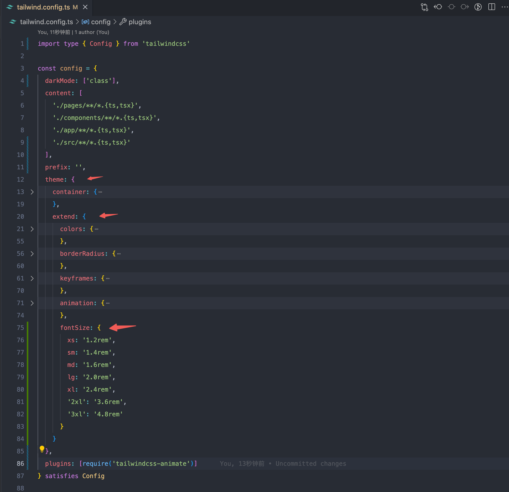
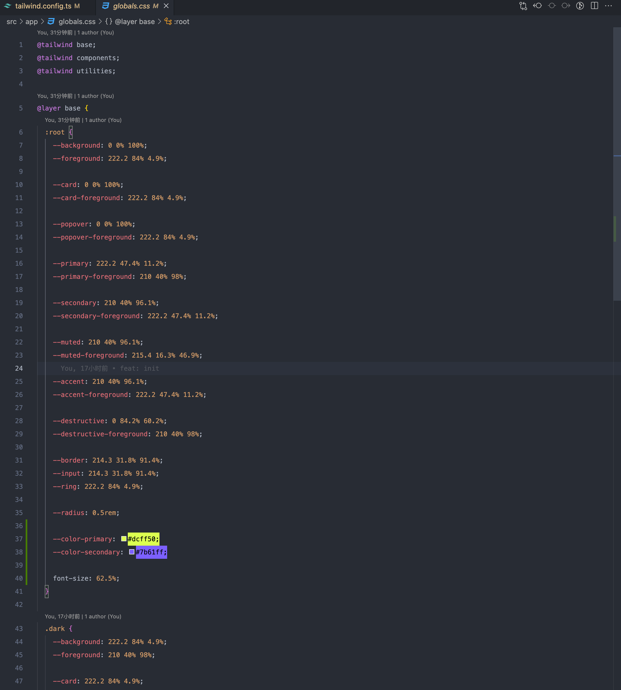

## 怎么解决滥用的[]（&主题切换）

回头看之前写的 `Tailwind` 无数的 `[]`，非常不优雅


#### 配置字体解决字体的[]

配置`theme.extend.fontSize`后，如 `text-[16px]` 应该写成 `text-md`，而不是方括号



```js
fontSize: {
  xs: '1.2rem',
  sm: '1.4rem',
  md: '1.6rem',
  lg: '2.0rem',
  xl: '2.4rem',
  '2xl': '3.6rem',
  '3xl': '4.8rem'
}
```

#### 配置颜色解决颜色的[] (主题切换也是这个功能)

`theme.extend.colors` 配置和 `global.css` 配置结合，`text-[#fff]` 写成 `text-primary`


这里`:root` 中配置 `font-size: 62.5%;`，让 `1rem` 等于 `10px`



再结合 [Next-Theme](https://ui.shadcn.com/docs/dark-mode/next)，可以轻松实现切换主题

同理，别的`[]`也可以这样解决，但是长宽目前还是得`[]`，`unocss`这点就更好，可以不用 `[]`

## 怎么优化 Tailwind 杂乱的排序方式

参考 [官网](https://tailwindcss.com/blog/automatic-class-sorting-with-prettier#how-classes-are-sorted)，`prettier-plugin-tailwindcss` 这个插件可以自动格式化 `Tailwind` 类名排序


## 不用 class 怎么给标签设置类名？

如果项目中渲染一段 `html`，这个时候无法添加类名怎么办？如果项目中有个模块挺多 `<h1>,<h2>,<h3>,<p>` 这样标签怎么办？富文本编辑器场景的时候也有这个问题，一个一个的加类名很麻烦，有个优雅的解决方案！[tailwindcss-typography](https://github.com/tailwindlabs/tailwindcss-typography)


## 怎么复用重复的样式？

复用样式 `@apply`，可以设置几个常用的布局，如

```css
.margin-center {
  @apply mx-auto my-0;
}

.flex-center {
  @apply flex items-center justify-center;
}

.absolute-center {
  @apply absolute left-1/2 top-1/2 -translate-x-1/2 -translate-y-1/2;
}
```

此外还有一个 `@layer`，可以把样式注入到应到层里，避免样式覆盖


## Tailwind 中的选择器也很强大

鼠标悬停 `hover:`、聚焦 `focus:`

表单提交 `required`, `invalid`, `disabled`

选择第一个孩子`first:`，最后一个孩子 `last:`，奇数 `odd:`，偶数 `even:`

父元素悬停触发子元素样式 `group`


## 响应式布局

vw

## clsx 解决类名冲突 cva tailwind-animate classnames

group

## 性能

https://www.tailwindcss.cn/blog/just-in-time-the-next-generation-of-tailwind-css

## 动态计算 vw

## QAQ

- 如何在 TS 中提示字符串 Tailwind 类名?
