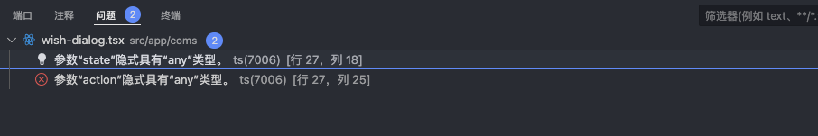
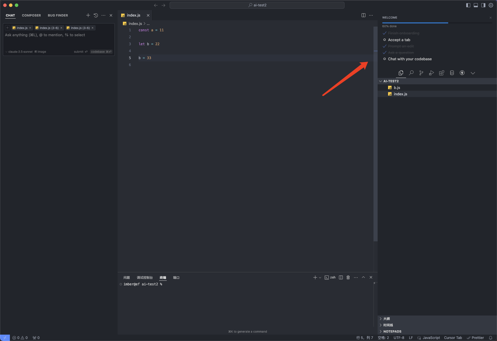
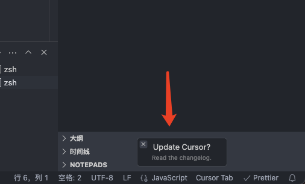
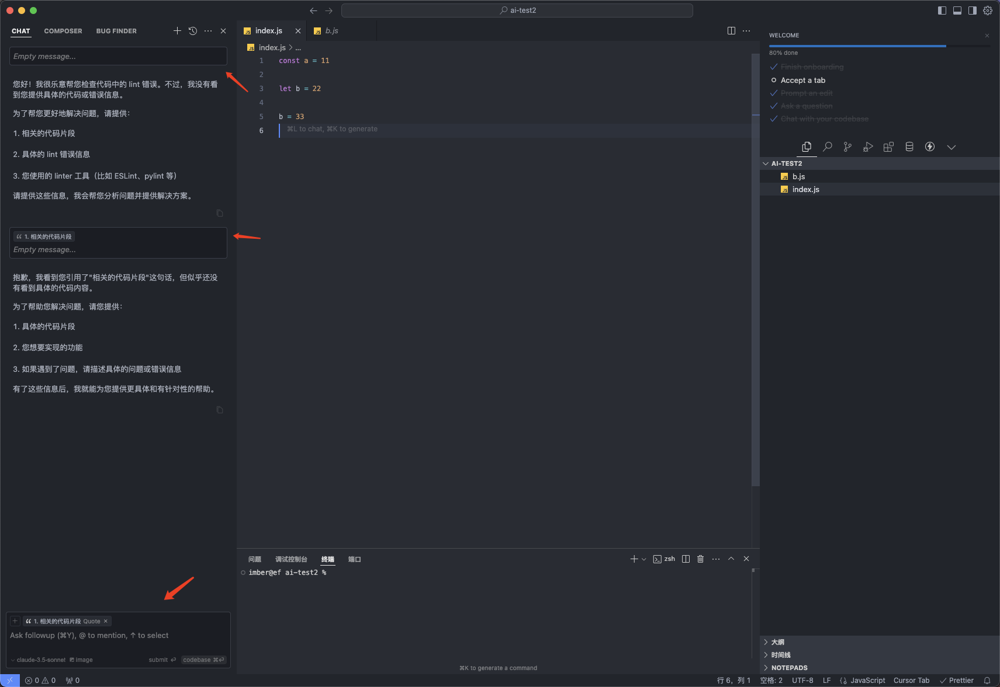
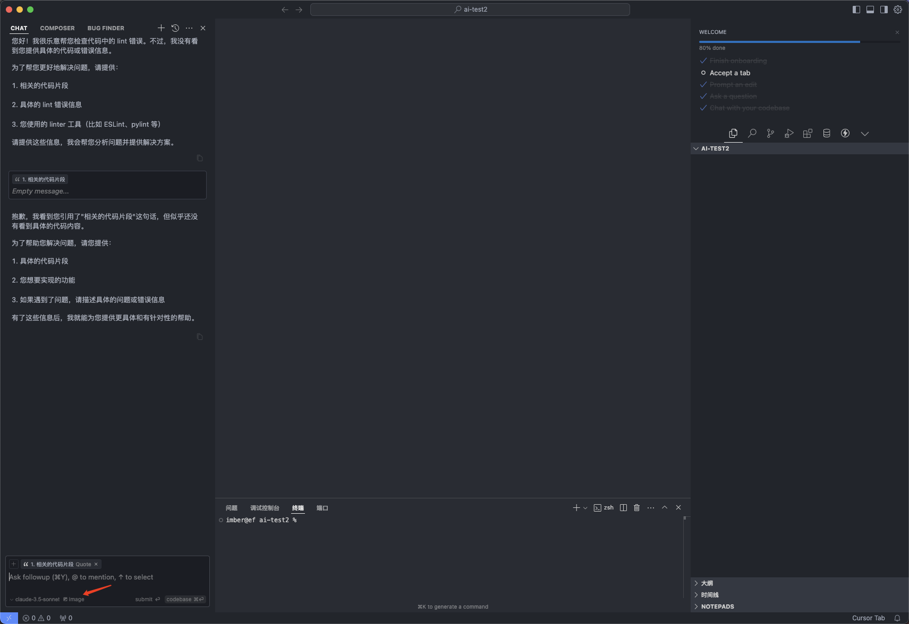
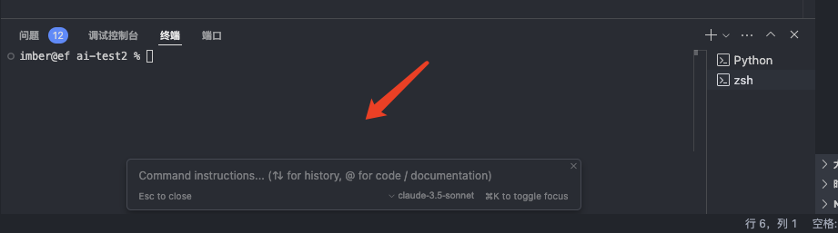
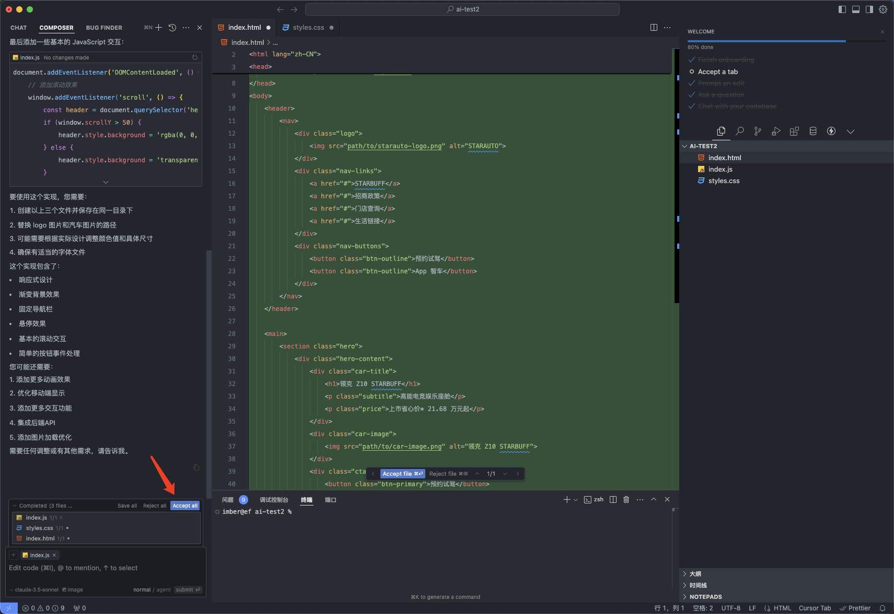
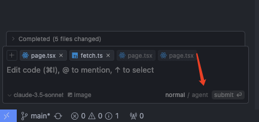

## Copilot

vscode 更新后，这里有个 copilot 小图标

点击小图标左侧出现一个弹层

翻译一下，可以看到最主要功能，这个有个最重要的是 Edits 功能，chat 功能和普通 ai 一样，就是聊天方式

然后点击弹层里的 Use Copilot for free，就会下载好 vscode 插件

#### 聊天功能 chat

1. 对当前工作区中的文件提出问题
2. 说明活动编辑器中代码的工作原理
3. 对现有代码进行更改
4. 在活动编辑器中查看所选代码
5. 为所选代码生成单元测试
6. 对所选代码中的问题提出修复建议
7. 工作区中的新文件或项目的基架代码
8. 创建新 Jupyter Notebook
9. 查找你的查询的相关代码
10. 针对测试失败建议修补程序
11. 询问有关 VS Code 的问题
12. 为工作区搜索生成查询参数
13. 询问如何在终端中执行某项操作
14. 解释终端中刚刚发生的情况

核心的功能就是它可以很方便的读取上下文，可以输入#号或者点击文件按钮都可以添加上下文

输入/可以唤起上面的对应命令，这里我使用一个/fix，可以看到它给出来了问题，也就是 const 不能重新赋值

还有一个@功能，就有点像平时@谁一样，目前看就@github，@terminal 不过感觉用得会挺少

因为和 vscode 深度集成，还有一些小功能，比如可以直接让命令复制到终端

另外还有语音功能，这个因为没耳机，所以没试，不过看起来挺有意思的

#### 编辑功能 edit 🔥

这个就是 Ai 程序员，可以通过对话的方式，帮你写出代码，然后写出的代码可以接受或者放弃，同时也支持选上下文功能，快捷键`command + shift + i`

#### 编辑器内聊天

同编辑功能一样，但是可以选中某些内容，然后快捷键 `command + i`，直接在编辑器里聊天，也能改动代码

#### 终端内聊天

同理，也是，光标选中终端，然后快捷键 `command + i`

终端的这里，还可以右键问题，然后让 copilot 修复

#### 免费版本的限制

可以看到[免费版本](https://github.com/features/copilot/plans?cft=copilot_li.features_copilot)是有一些限制的：回复限制为每月 2000 次代码完成和 50 条聊天消息。

支持的编辑器

## cursor

cursor 也有上限，但还没遇到

先从它[官网](https://www.cursor.com/)下载安装，打开后它和 vscode 基本一摸一样，甚至插件也一样，性能也是一样好，要挑点问题的话，我觉得是布局有一点点不一样，然后我用的 vscode 主题色和 cursor 显示出来的有点小差异

它这里的 welcome 很人性化，把核心功能放在这里，触发过就打勾，等你都触发完成后，可以关掉这个 welcome 碳层

它可能因为版本，页面有所不同，注意右下角要点击更新

#### 聊天功能

聊天快捷键`command + l`，代码应用可以这里点两下

有多个聊天框，在不同上下文聊天

聊天和编辑都可以上传图片，可以上传一张图片，然后 ai 帮忙根据这张图写代码

同理 command + k 可以终端 chat

还有一些@这种命令符和 copilot 差不多，就不说了

#### 编辑功能 Composer

在 Cursor 里，ai 写代码叫 Composer

edit 快捷键`command + i`

#### agent 🔥

新版的 cursor 可以选择 agent 功能 可以理解全局上下文，去一点一点的查你的 prompt，然后做出修改，很有用的功能

## 总结

目前看，就 cursor 支持图片这个点更好，然后 copilot 支持语音，都是些小细节，总体差不多

## 思考

AI 功能虽然强大，但它的作用其实和我们描述问题的能力成正比（当然还得有解决问题的能力，一定的经验等等），当遇到复杂的问题的时候，还是需要自己理清思路，明白问题，再描述给 AI 才能做得更好
