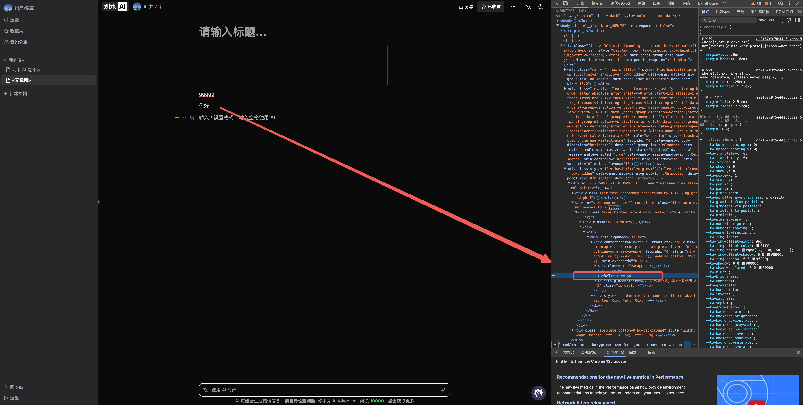
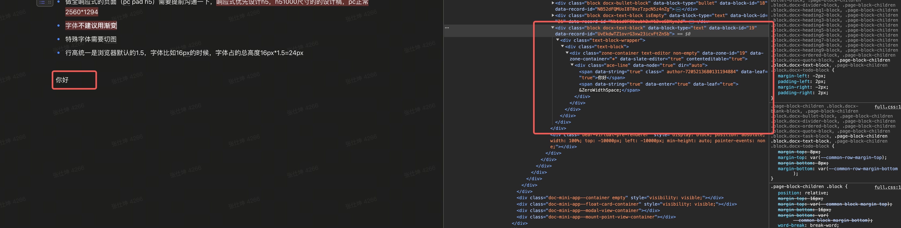

## Tiptap

tip 做协同的后台 node 项目，[hocuspocus](https://github.com/ueberdosis/hocuspocus)

要看它的 [demo](https://templates.tiptap.dev/fNPphqrHKC)，需要注册它的 [cloud](https://cloud.tiptap.dev/login)，找到[项目模版](https://cloud.tiptap.dev/react-templates)，然后拿到 [token](https://cloud.tiptap.dev/pro-extensions)，放到项目的 .npmrc

## 编辑器难点

编辑器难点，复杂的自定义组件，当我们只操作选中的组件的时候，tiptap 封装了很多方法，可以很快速的实现
，但有时候不只操作当前选中的组件，比如分栏组件，还要考虑如何新增列，是均分还是怎样

还有自定义复杂编辑器插件的时候， view 视图层和 model 数据层同步也比较复杂

## 浏览器插件

有一个谷歌浏览器插件，[prosemirror-dev-toolkit](https://chromewebstore.google.com/detail/prosemirror-developer-too/gkgbmhfgcpfnogoeclbaiencdjkefonj?hl=zh-CN&utm_source=ext_sidebar)，它会识别到 prosemirror 编辑器，并在右下角出现按钮，可以让我们清楚的看到编辑器结构，还可以看到文档插入位置方面的信息

## 编辑器的 DOM 层级

另外 tiptap 的 dom 结构很少，比如一段文本，它只有 1 层 dom 结构，对比过飞书，语雀，会发现居然有 6 层

飞书：

tiptap:

