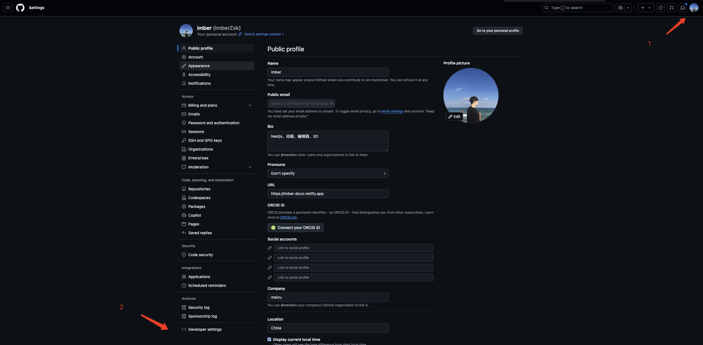

## github 图床

github 设置 `token`




上传图片到对应仓库，并且使用 `jsdelivr` 来做 `cdn`

```ts
/** 上传图片到 GitHub */
export async function uploadImageToGitHub(file: File) {
  const token = '我的token'
  const owner = 'imberZsk'
  const repo = 'images'
  const path = `products/${Date.now()}-${file.name}`

  // 将文件转换为 base64
  const reader = new FileReader()
  const base64Content = await new Promise<string>((resolve) => {
    reader.onload = (e) => {
      const base64 = (e.target?.result as string)?.split(',')[1]
      resolve(base64)
    }
    reader.readAsDataURL(file)
  })

  try {
    const response = await fetch(
      `https://api.github.com/repos/${owner}/${repo}/contents/${path}`,
      {
        method: 'PUT',
        headers: {
          Authorization: `Bearer ${token}`,
          'Content-Type': 'application/json'
        },
        body: JSON.stringify({
          message: `Upload product image: ${file.name}`,
          content: base64Content
        })
      }
    )

    if (!response.ok) {
      throw new Error('Failed to upload image to GitHub')
    }

    const data = await response.json()
    // 使用 jsDelivr CDN URL
    const cdnUrl = `https://cdn.jsdelivr.net/gh/${owner}/${repo}/${path}`
    console.log(cdnUrl)
    return cdnUrl
  } catch (error) {
    console.error('Error uploading image to GitHub:', error)
    throw error
  }
}
```
