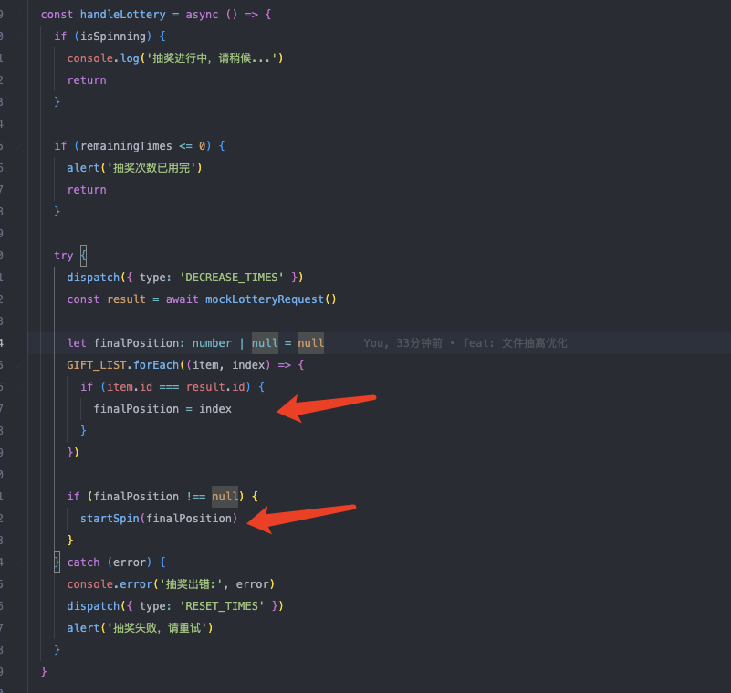

## 抽奖逻辑

偷下 juejin 的年度人气作者投票抽奖的图


## 核心逻辑

> 下面为伪代码

其实点击抽奖的时候，就调用了接口知道了中奖信息，看到的前面转几圈其实是前端效果

另外这些奖品都对应着一个奖品 ID，当调用抽奖接口的时候会返回一个奖品 ID，然后转圈，最后落到这个中奖 ID 的奖品上

奖品数据像这样，中奖后就是返回中奖的一个对象

```js
export const GIFT_LIST = [
  { id: 100, img: gift1, name: '奖品1' },
  { id: 101, img: gift2, name: '奖品2' },
  { id: 102, img: gift3, name: '奖品3' },
  { id: 103, img: gift4, name: '奖品4' },
  { id: 104, img: gift4, name: '奖品5' },
  { id: 105, img: gift6, name: '奖品6' },
  { id: 106, img: gift7, name: '奖品7' },
  { id: 107, img: gift8, name: '奖品8' },
  { id: 108, img: gift9, name: '奖品9' }
]
```

所以关键逻辑在于转圈

点击抽奖，里面的核心逻辑是找到中奖奖品的最后停留位置 finalPosition，然后转圈，finalPosition 可以通过 ID 匹配位置获得



转圈逻辑，需要自定义一个路径，因为转盘不是顺序的，是逆时针，且中间是个按钮

```js
export const LOTTERY_PATH = [0, 1, 2, 5, 8, 7, 6, 3]
```

根据自定义的 path 和 finalPosition 能得到自定义路径 finalPathIndex，才是真正停留中奖地方

```js
const finalPathIndex = LOTTERY_PATH.findIndex((pos) => pos === finalPosition)
```

转圈其实就是递归，需要一个变量记录每次到哪儿了 currentIndex，然后取余可以匹配到抽奖位置

```js
let currentIndex = 0

const spin = () => {
  dispatch({
    type: 'SET_POSITION',
    payload: LOTTERY_PATH[currentIndex % LOTTERY_PATH.length]
  })

  currentIndex++
}
```

然后根据 currentIndex 和 totalRounds 判断中奖和判断是否在前三圈（快），还是在最后一圈（慢）的位置

```js
const startSpin = useCallback(
  (finalPosition: number) => {
    if (isSpinning) return

    dispatch({ type: 'START_SPIN' })
    let currentIndex = 0
    const { INITIAL_SPEED, SLOW_DOWN_FACTOR, ROUNDS, RESULT_DELAY } =
      ANIMATION_CONFIG
    const totalRounds = ROUNDS * LOTTERY_PATH.length

    const finalPathIndex = LOTTERY_PATH.findIndex(
      (pos) => pos === finalPosition
    )

    if (finalPathIndex === -1) return

    const totalSteps = totalRounds + finalPathIndex

    const spin = () => {
      dispatch({
        type: 'SET_POSITION',
        payload: LOTTERY_PATH[currentIndex % LOTTERY_PATH.length]
      })

      currentIndex++

      // 中奖前
      if (currentIndex <= totalSteps) {
        // 慢点转圈
        let timeout = INITIAL_SPEED

        // 最后一圈，快点转圈
        if (currentIndex > totalRounds - LOTTERY_PATH.length) {
          timeout +=
            (currentIndex - (totalRounds - LOTTERY_PATH.length)) *
            SLOW_DOWN_FACTOR
        }

        // 递归
        setTimeout(spin, timeout)
      }
      // 中奖
      else {
        const winningGift = GIFT_LIST[finalPosition]

        // 中奖结束改变isSpinning
        dispatch({ type: 'END_SPIN', payload: winningGift })

        // 中奖后延迟提示
        setTimeout(() => {
          alert(`恭喜您获得: ${winningGift.name}`)
        }, RESULT_DELAY)
      }
    }

    setTimeout(spin, INITIAL_SPEED)
  },
  [isSpinning]
)
```

## 总结

怎么前几圈保持一样的速度，但在最后一圈降低速度？

- 递归，动态的设置 timeout 时间

又怎么保证转圈后落到中奖奖品上？

- 找到当前的 currentIndex 和总的 totalSteps 做比较，相同的时候就是中奖的时候，转圈停留的时候

## 源码

这是[私有仓库](https://github.com/imberZsk/plays/tree/main/007%E6%8A%BD%E5%A5%96%E7%BB%84%E4%BB%B6)，如果有需要，可以在[掘金私信](https://juejin.cn/user/3378167164966920)
