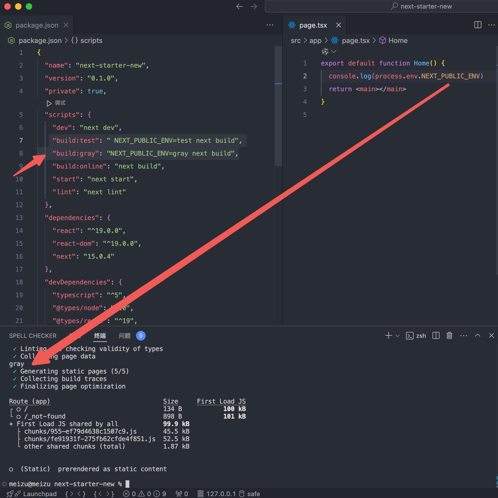

## Nextjs 的一些技巧

1. `shadcn` 的组件默认会在顶部加 `use client`，但是在没有用客户端组件的时候，应该把它删掉更合理


2. `shadcn` 的目录结构的思想：分为 `ui` 和组件，`ui` 是最底层的，比如一个 `button`，组件是由 `ui` 组合而成的，比如 `header`，带功能 ui 的也是组件，比如 `login-button` 表示说登录 `button`

3. 当遇到 `mouse` 事件切换 `ui` 的时候，可以考虑使用 `tailwind` 的 `group` 切换类名，来减少客户端渲染

4. 在服务端组件中获取路由参数，`params` 参数 和 `searchParams` 参数由于 `next` 直接注入到服务端页面组件了，可以直接获取，但是没有注入 `pathname`，但是可以用 [`next/headers`](https://nextjs.org/docs/app/api-reference/functions/headers) 间接获取，也可以组件下沉，把服务端组件传入客户端组件，调用客户端 usePathname


比如判断微信环境

```jsx
import { headers } from 'next/headers'

const headersList = headers()

const ua = headersList.get('user-agent')?.toLowerCase()

const isWeChat = (ua: string | undefined) => {
  return ua?.includes('micromessenger')
}

const inWeChat = isWeChat(ua)
```

5. 用静态导出功能给外部人员访问

配置 next.config.js

```js
output: 'export',
assetPrefix: '../', //cdn前缀 访问静态资源的前缀
```

需要删除打包后的`html`里的`crossorigin=""`

6. 减少客户端组件，抽离客户端组件，并且一个组件里可以写多个函数，。。。。

## 踩坑

1. `Image` 组件和 `HtmlCanvas` 截图有些问题，在 `safari` 浏览器上截图失败
2. 使用`output: 'export',`静态导出功能时，要把 `Link` 标签改为原生的 `a` 标签

## 区分环境

不是区分本地 dev 和 build，这个好区分，这个直接使用 `progress.NODE_ENV` 区分，但是如果都是 build 怎么办，比如要实现 scripts 里面的 `build:test`，`build:gray`

```js
 "build:test": " NEXT_PUBLIC_ENV=test next build",
 "build:gray": "NEXT_PUBLIC_ENV=gray next build",
```

然后页面用 `process.env.NEXT_PUBLIC_ENV` 获取



## 思考？

Image 组件的 width 和 height 如果遇到响应式，不确定宽高的情况咋办

width 和 height 和图片真实宽高无关，所以只有比例关系有用
