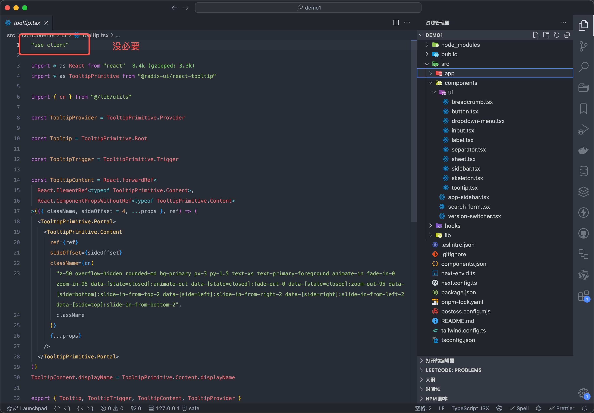
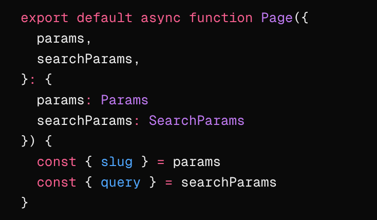

## Nextjs 的一些技巧

1. `shadcn` 的组件默认会在顶部加 `use client`，但是在没有用客户端组件的时候，应该把它删掉更合理

2. `shadcn` 的目录结构的思想：分为 `ui` 和组件，`ui` 是最底层的，比如一个 `button`，组件是由 `ui` 组合而成的，比如 `header`，带功能 ui 的也是组件，比如 `login-button` 表示说登录 `button`

3. 当遇到 `mouse` 事件切换 `ui` 的时候，可以考虑使用 `tailwind` 的 `group` 切换类名，来减少客户端渲染

4. 在服务端组件中获取路由参数，`params` 参数 和 `searchParams` 参数由于 `next` 直接注入到服务端页面组件了，可以直接获取，但是没有注入 `pathname`，但是可以用 [`next/headers`](https://nextjs.org/docs/app/api-reference/functions/headers) 间接获取

## 思考？

Image 组件的 width 和 height 如果遇到响应式，不确定宽高的情况咋办
