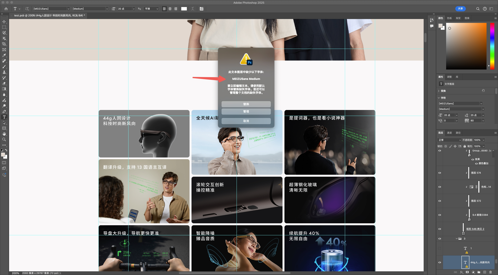

## 淘宝买个破解版

https://www.yuque.com/u37186489/tgrg5b/fycck0a8qcbsiqqp

## 基础

1. 快捷键 h，抓手工具
2. command - 和 command + 放大缩小
3. 撤销、cv 这些跟平常一样
4. command + shift + s 保存一份新文件，避免改到原文件

## 字体

字体工具快捷键 t，后面发现用蓝湖自动标注就好了

首先可能设计师用了特殊的字体，所以我要一份字体，但是安装后得重启电脑重新打开 ps 才行

#### 字体大小

测量文字大小和字重，快接键 t，然后选中文字，字体大小就是这个 20 点

#### 字重

对于字重，可能是用了字体的原因，这里的 Regular 表示 400，Medium 表示 500

#### 颜色

## 背景颜色

吸管工具，快捷键 i，然后直接右键拷贝颜色

## 图片

裁剪工具，快捷键 c

想要在蓝湖上有切图，需要选中图层，然后紧贴元素切图

## 插件

蓝湖 PS 插件`https://lanhuapp.com/ps`

新版本好像无法安装，需要下载个安装器：`https://support.lanhuapp.com/503e/9784/c057`，下载好了在增效工具这里

然后设置好，直接上传，但是上传的文件，没有切图，且不好选中内容，需要合并图层

command 选中多个图层，然后 command + e 合并图层

