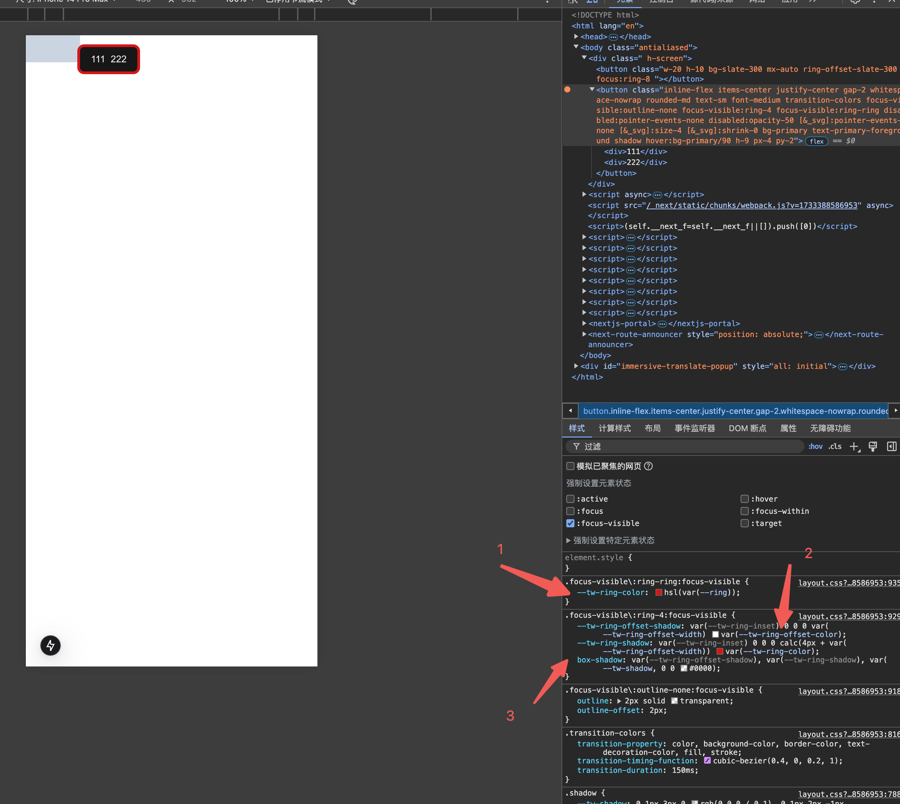
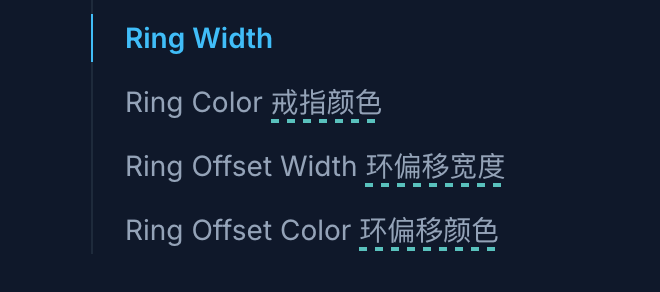
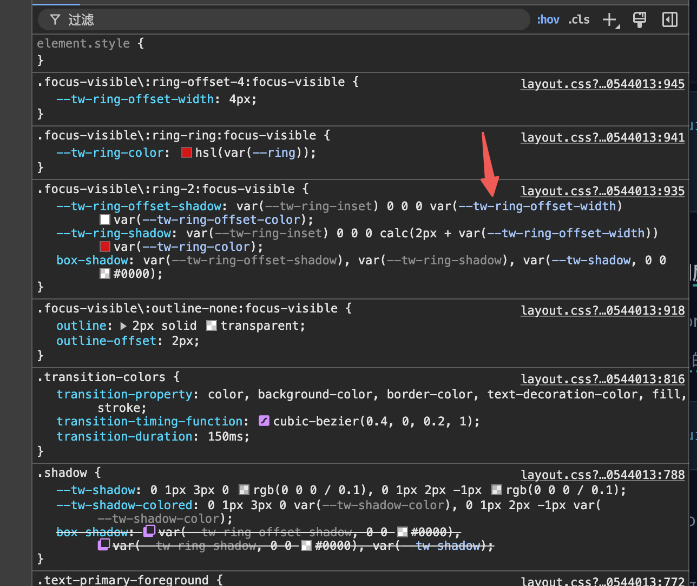
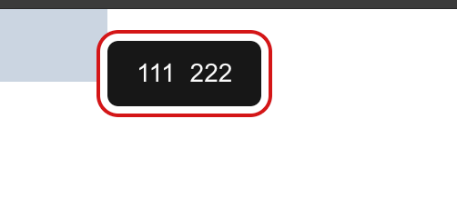
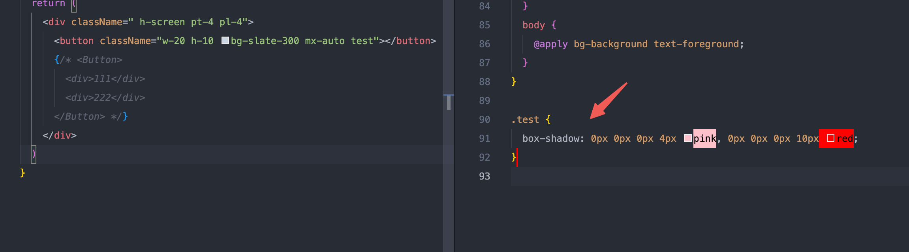
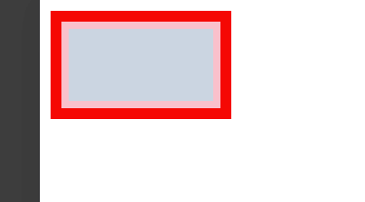
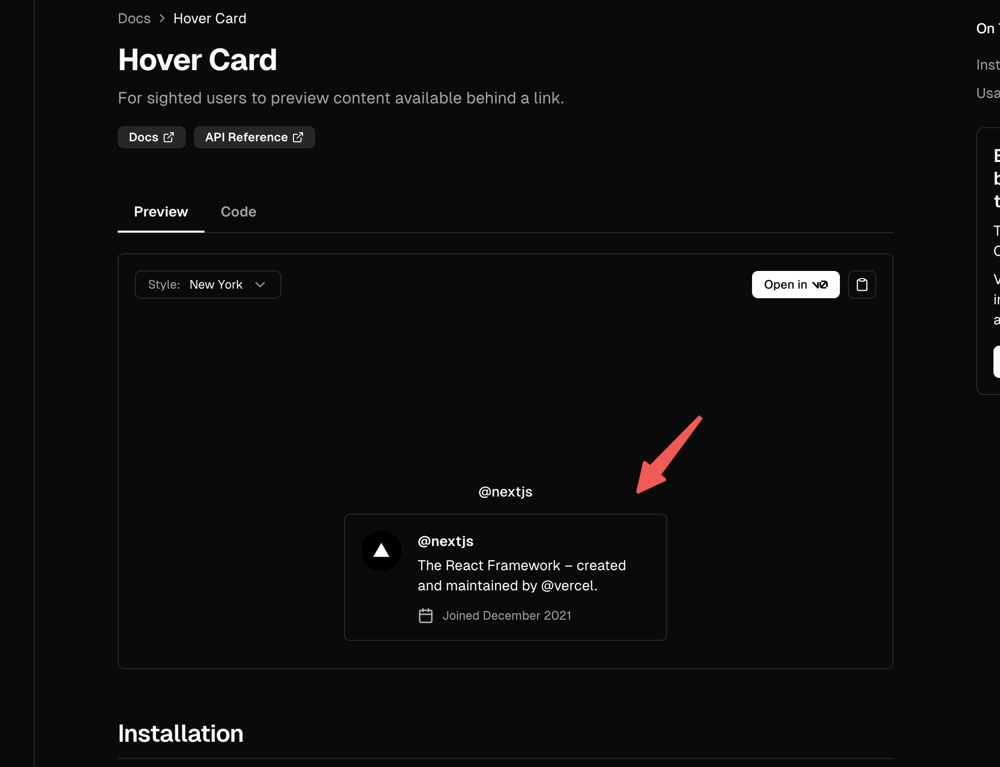
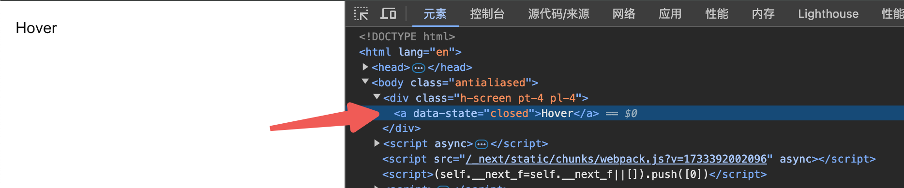
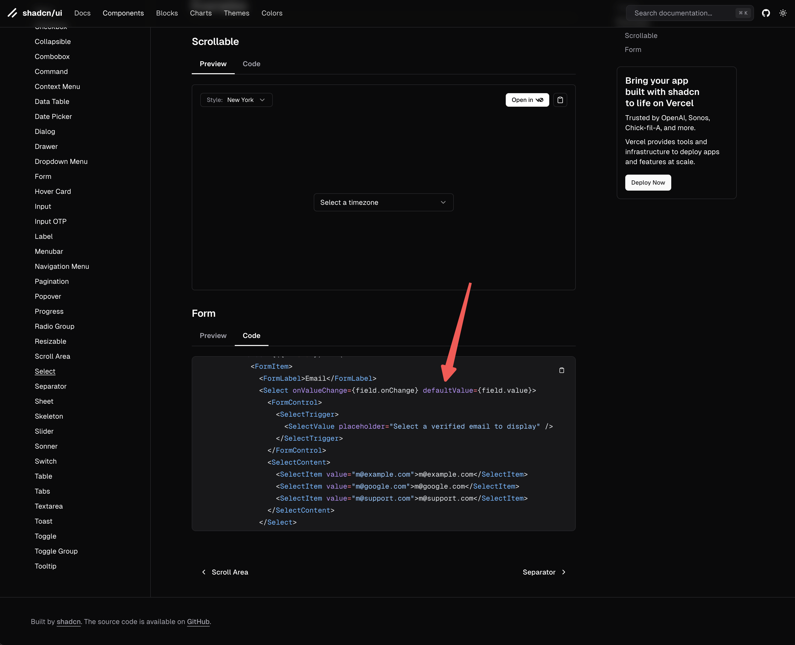

## 不常见的 tailwind 样式 ring & focus-visible

这个 shadcn 封装的按钮的一部分代码，`'focus-visible:outline-none focus-visible:ring-2 focus-visible:ring-ring'`，这里有两个不常见的属性，focus-visible:和 ring

`focus-visible` 这个属性就像是显式的 focus，但键盘选中它可以触发，查了一下屏幕阅读器也可以，但这块好像是给盲人用的，不太了解

`ring` 和阴影相关，看这个阴影就感觉是不太优雅，如下：



它和 border 一样，但不会占据位置，属性也和 border 一个意思



先看看 shadow，这是它的取值，`box-shadow: h-offset v-offset blur-radius spread-radius color;`

- h-offset：水平偏移量，正值向右，负值向左。
- v-offset：垂直偏移量，正值向下，负值向上。
- blur-radius：模糊半径，值越大，阴影越模糊。可选参数，默认为 0。
- spread-radius：扩展半径，正值会使阴影变大，负值会使阴影变小。可选参数，默认为 0。
- color：阴影的颜色。可选参数，默认为黑色。

ring 和第四个和第五个值相关，ring-2 就表示 spread-radius 为 2px，ring-ring 就表示预设在 global.css 里的 ring 颜色

还有一个 offset，如 focus-visible:ring-offset-4，也就是中间的间隔，它其实在中间层设置了一个阴影为白色，还让再外面再设置一个我们看到的颜色





这种是多个阴影的写法，比如上面的 offset，我们用普通 css 如下：

```css
.test {
  box-shadow: 0px 0px 0px 4px pink, 0px 0px 0px 10px red;
}
```





## 动画

这是一个鼠标放上去卡片悬停的组件，会发现它的逻辑跟 tailwind 类名有关，好像它是怎么做的动画



这是类名

```css
'duration-100 data-[state=open]:animate-in data-[state=closed]:animate-out data-[state=closed]:fade-out-0 data-[state=open]:fade-in-0 data-[state=closed]:zoom-out-95 data-[state=open]:zoom-in-95 data-[side=bottom]:slide-in-from-top-2 data-[side=left]:slide-in-from-right-2 data-[side=right]:slide-in-from-left-2 data-[side=top]:slide-in-from-bottom-2'
```

这是它用的插件，如果在 tailwind.config.ts 中注释掉这个插件，就没有 fade in/out 效果了。

```js
plugins: [require('tailwindcss-animate')]
```

可以看到元素身上有个 data-state 属性，这个属性的值是 close 和 open，也就是说，主要是切换的 open 和 close 两个状态。



所以说其实主要的就是 `tailwindcss-animate`，如果要想自己设置动画，就可以自己查阅[tailwindcss-animate](https://github.com/jamiebuilds/tailwindcss-animate) 设置想要的动画值

## 表单

首先，踩过 Select 组件的一个坑，这里 `Select` 标签上没有写 `value = {field.value}`，受控组件应该设置 `value` 的，如果后面要 `form.setValue` 就会失败，所以应该补上



再来看看表单的写法

```tsx
'use client'

import { zodResolver } from '@hookform/resolvers/zod'
import { useForm } from 'react-hook-form'
import { z } from 'zod'

import { Button } from '@/components/ui/button'
import {
  Form,
  FormControl,
  FormDescription,
  FormField,
  FormItem,
  FormLabel,
  FormMessage
} from '@/components/ui/form'
import { Input } from '@/components/ui/input'
import {
  Select,
  SelectContent,
  SelectItem,
  SelectTrigger,
  SelectValue
} from '@/components/ui/select'
import Link from 'next/link'

const formSchema = z.object({
  username: z.string().min(2, {
    message: 'Username must be at least 2 characters.'
  }),
  email: z
    .string({
      required_error: 'Please select an email to display.'
    })
    .email()
})

export function ProfileForm() {
  const form = useForm<z.infer<typeof formSchema>>({
    resolver: zodResolver(formSchema),
    defaultValues: {
      username: '',
      email: ''
    }
  })

  function onSubmit(values: z.infer<typeof formSchema>) {
    console.log(values)
  }

  return (
    <Form {...form}>
      <form onSubmit={form.handleSubmit(onSubmit)} className="space-y-8">
        <FormField
          control={form.control}
          name="username"
          render={({ field }) => (
            <FormItem>
              <FormLabel>Username</FormLabel>
              <FormControl>
                <Input placeholder="shadcn" {...field} />
              </FormControl>
              <FormDescription>
                This is your public display name.
              </FormDescription>
              <FormMessage />
            </FormItem>
          )}
        />

        <FormField
          control={form.control}
          name="email"
          render={({ field }) => (
            <FormItem>
              <FormLabel>Email</FormLabel>
              <Select onValueChange={field.onChange} value={field.value}>
                <FormControl>
                  <SelectTrigger>
                    <SelectValue placeholder="Select a verified email to display" />
                  </SelectTrigger>
                </FormControl>
                <SelectContent>
                  <SelectItem value={'value'}>name</SelectItem>
                </SelectContent>
              </Select>
              <FormDescription>
                You can manage email addresses in your{' '}
                <Link href="/examples/forms">email settings</Link>.
              </FormDescription>
              <FormMessage />
            </FormItem>
          )}
        />
        <Button type="submit">Submit</Button>
      </form>
    </Form>
  )
}

export default ProfileForm
```

[zod](https://zod.dev/) 做校验，好处是 typescript 支持很好，浏览器端和 Node 端都支持等，用到再查吧，这里有写过用正则校验，布尔值

```js
const FormSchema = z.object({
  phone: z
    .string()
    .min(1, { message: '请输入手机号码' })
    .regex(/^1[3-9]\d{9}$/, { message: '请输入11位有效手机号码' }),
  vcode: z
    .string()
    .min(1, { message: '请输入验证码' })
    .regex(/^\d{6}$/, { message: '验证码必须是6位数字' }),
  province: z.string().min(1, { message: '请选择省份' }),
  city: z.string().min(1, { message: '请选择城市' }),
  storeCode: z.string().min(1, { message: '请选择门店' }),
  privacyPolicy: z.boolean().refine((data) => data === true, {
    message: '请先阅读隐私政策'
  })
})
```

[react-hook-form](https://react-hook-form.com/) 做表单，这里的 mode 为 onBlur 很实用，失去焦点也能触发校验

```tsx
const form = useForm<z.infer<typeof FormSchema>>({
  resolver: zodResolver(FormSchema),
  defaultValues: {
    phone: '',
    vcode: '',
    province: '',
    city: '',
    storeCode: '',
    privacyPolicy: false
  },
  mode: 'onBlur' // 改变验证触发时机
})
```

另外就是一些固定写法了，想了一下没必要深入研究

## 总结

1. 对 shadcn 的理解：它是组件集合：它不是一个组件库，是一个可复用的组件集合，没有预先设计好的，固定的样式和行为
2. 优势有亮点：一个是 headless，灵活控制样式，自定义程度高，第二个是 增量使用，性能更好
