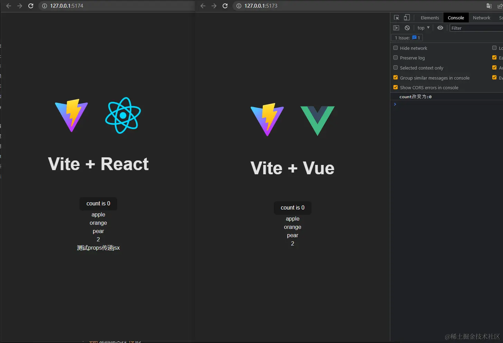

## 前言

个人认为框架的初衷是带给开发者更好的开发体验，更快的性能，更简单的操作。

React 相对于 Vue 是比较自由的，React API 比 Vue API 少一些，更贴近原生 js,这也意味着 React 一个项目可能有多种写法，统一项目规范很重要。

`vue3`和`react18`都是最新的框架版本，两者虽然底层原理和思想不同，但是更多的是相同之处，比如都是声明式的，一般多用于`spa`，都用`hooks`来逻辑复用等等

## 用 vite 初始化 vue3 和 react18 项目

> pnpm create vite

然后删除无用的代码之后，再改造成同样功能的 HelloWorld 组件，这个组件做如下事情：

- 定义数据`count`，点击按钮可以是`count+1`，页面也会响应式改变；

<!---->

- 还有一个监听数据改变，在控制台打印改变的数据；

<!---->

- 有一个数组`['apple', 'orange', 'pear']`，用于列表渲染到页面。

<!--  -->

接下来开始找不同，找区别，对比出 vue 和 react 的差异

## 不同点 1：react 使用更加灵活

> 这里 vue3 其实也支持 JSX，但是用的还是比较少，所以也可以提一下

- 因为 react 使用`JSX`可以当作变量，所以完全可以把模板中的代码的代码抽离出去
- `JSX`还可以当作`props`传递，可以省略比如`slot`这样的概念
- `JSX`是直接支持`TS`的
- 对于`vue2`来说，`options api`需要到固定位置写逻辑，也是没有`react`灵活

## 不同点 2：vue3 更智能的依赖收集

- **vue3**在模板中的数据可以被模板自动查询，而 react 需要手动调用`useState`定义数据和修改数据的方法
- **vue3**比如`watchEffect/computed`是可以自动寻找依赖的，而 reac 比如`useEffect/useMemo/useCallBack`的第二个参数数组需要写上依赖的数据

## 不同点 3：vue3 和 react 优化手段不同

- `vue`是以组件为颗粒度的，可以精准的找到需要更新的地方，组件拆分细一点，就可以达到一定优化效果
- 而`react`是对比差异来更新的，而且父组件更新，子组件默认也会更新，所以`react`更新手段一个方法就是浅比较，判断父组件更新的时候，子组件是否要更新，从而跳过子组件更新
- vue 使用 template 模版语法，限制死了只能写规定的东西，它有个好处能静态编译优化，而 jsx 其实就是 js 的变种无法做静态编译优化，同理如果你 vue3 使用 jsx 也就失去了静态编译优化

## React 最佳实践

- 避免传递不必要的的 props，props 应该只传子组件使用的部分，不要整个数据都传递防止占用内存过多

- 不能使用`arr.length&&<Component />`，0 虽然为假值，但仍然会被渲染，应该写成`arr.length > 0&&<Component />`

- 可能你在老项目中容易看到`data&&data.map()`，但现在项目可以使用可选链`data?.map()`

- 用 hooks 复用逻辑，把方法提取出去，在你等 jsx 里只需要 `const {xxx} = useXXX()`，然后渲染 xxx 就好了，也就是在 jsx 中应该看到不多的 js 代码

- 利用`useReducer和context`来集中管理状态，且尽量少使用 state，state 改变导致页面刷新消耗性能，但复杂一点的时候不太好管理，这个时候再用状态管理

- 遇到嵌套过多的情况，考虑用 children 来组装

> 加上一点自己的理解，可以说 vue 是自动挡，react 是手动挡
