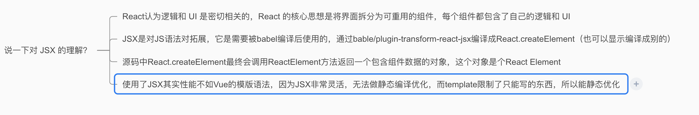

## 深入理解 JSX

#### JSX 简介

`JSX` 并不是只能被编译为 `React.createElement`

你可以通过`@babel/plugin-transform-react-jsx` 插件显式告诉 `Babel` 编译时需要将 `JSX` 编译为什么函数的调用（默认为 `React.createElement`）

`React.createElement` 最终会调用 `ReactElement` 方法返回一个包含组件数据的对象，该对象有个参数`$$typeof: REACT_ELEMENT_TYPE` 标记了该对象是个 `React Element`

所有 `JSX` 在运行时的返回结果（即 `React.createElement()`的返回值）都是 `React Element`

```js
export function createElement(type, config, children) {
  let propName

  const props = {}

  let key = null
  let ref = null
  let self = null
  let source = null

  if (config != null) {
    // 将 config 处理后赋值给 props
    // ...省略
  }

  const childrenLength = arguments.length - 2
  // 处理 children，会被赋值给props.children
  // ...省略

  // 处理 defaultProps
  // ...省略

  return ReactElement(
    type,
    key,
    ref,
    self,
    source,
    ReactCurrentOwner.current,
    props
  )
}

const ReactElement = function (type, key, ref, self, source, owner, props) {
  const element = {
    // 标记这是个 React Element
    $$typeof: REACT_ELEMENT_TYPE,

    type: type,
    key: key,
    ref: ref,
    props: props,
    _owner: owner
  }

  return element
}
```

## React Component

## JSX 与 Fiber 节点

`JSX` 是一种描述当前组件内容的数据结构，他不包含组件 `schedule`、`reconcile`、`render` 所需的相关信息

所以，在组件 mount 时，`Reconciler 根据 JSX 描述的组件内容生成组件对应的 Fiber 节点`。

在 `update 时，Reconciler 将 JSX 与 Fiber 节点保存的数据对比，生成组件对应的 Fiber 节点，并根据对比结果为 Fiber 节点打上标记`

## 总结

#### 说一下对 JSX 的理解？

`React` 认为逻辑和 `UI` 是密切相关的，React 的核心思想是将界面拆分为可重用的组件，每个组件都包含了自己的逻辑和 UI

`JSX` 是对 `JS` 语法对拓展，它是需要被 `babel` 编译后使用的，通过 `bable/plugin-transform-react-jsx` 编译成 `React.createElement`（也可以显示编译成别的）

源码中 `React.createElement` 最终会调用 `ReactElement` 方法返回一个包含组件数据的对象，这个对象是个 `React Element`
使用了 `JSX` 其实性能不如 `Vue` 的模版语法，因为 `JSX` 非常灵活，无法做静态编译优化，而 `template` 限制了只能写的东西，所以能静态优化


