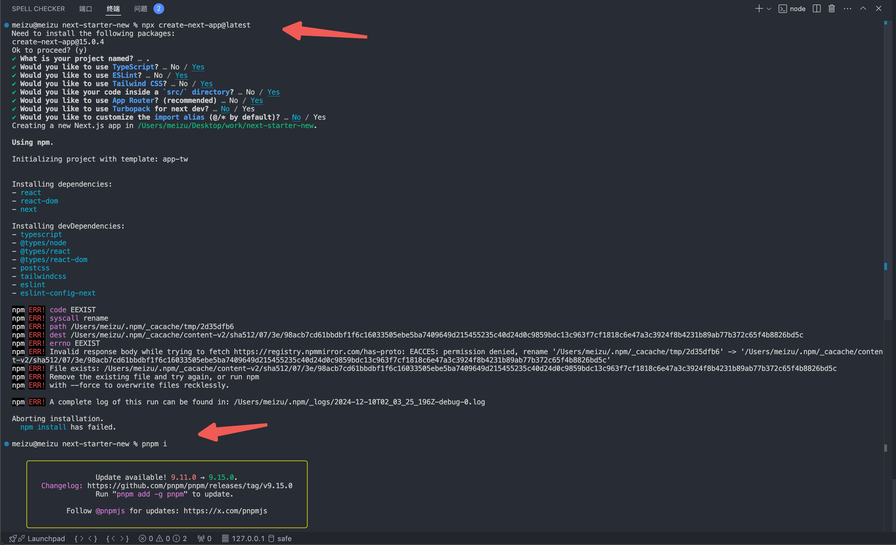

## next15 项目初始化

next15 更新，重新做一个架子，再熟悉一下项目初始化的流程。

## 初始化

首先用官方脚手架初始化，但下载依赖的时候可能是我之前有缓存报错了，可以 `sudo npm cache clean --force` 清除缓存，默认是 npm 管理的，也可以手动 `pnpm i` 下载依赖

配置使用默认的，官方脚手架没升级 `eslint`，咋也不管

然后就是把原有的字体，和 page 里面的没用的代码删掉

##

发现这些 node_modules 目录什么的都看不懂，还是得写写包熟悉一下

https://nextjs.org/docs/app/api-reference/config/eslint#with-prettier
